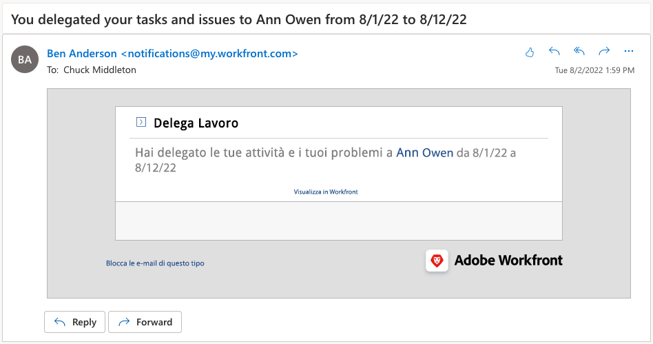

# Delega attività, problemi e approvazioni

Scopri come delegare le approvazioni per progetti, attività, problemi e schede orario a un altro utente di Workfront. Scopri anche come delegare le assegnazioni di attività e problemi.

## Delega approvazioni

Scopri come delegare le approvazioni per progetti, attività, problemi e schede orario a un altro utente.

Questo video illustra come:

* Assegnare le approvazioni a un altro utente
* Terminare il periodo di delega
* Trova approvazioni delegate

>[!VIDEO](https://video.tv.adobe.com/v/336094/?quality=12&learn=on)

<!---
learn more URLS
Delegate approval request
--->

## Delegare le assegnazioni di attività e problemi

Puoi delegare le attività e i problemi che ti vengono assegnati ad altri utenti quando prevedi di uscire dall&#39;ufficio.

### Abilitare la delega di assegnazioni di attività e problemi

Prima di poter essere utilizzata, la delega di attività e problemi deve essere abilitata da un amministratore di gruppo o di sistema. Questa operazione viene eseguita in [!UICONTROL Configurazione > Preferenze progetto > Attività e problemi > Delega]. Abilitando questa opzione, tutti gli utenti con una licenza Revisione o superiore potranno delegare le attività e i problemi loro assegnati.

![Schermata che mostra [!UICONTROL Configurazione] preferenze per la delega](assets/delegation-1.png)

### Come delegare le assegnazioni di attività e problemi

Accedi a [!UICONTROL Home] e fai clic su [!UICONTROL Delega], quindi specifica l’utente a cui stai delegando tutte le attività assegnate e l’intervallo di date. È possibile designare qualsiasi utente con una licenza Revisione o superiore.

![Schermata che mostra la scheda Delega in [!UICONTROL Home]](assets/delegation-2.png)

### Come stabilire se un&#39;attività o un problema è stato delegato

Puoi vedere quando attività o problemi sono stati delegati in [!UICONTROL Home] o nella vista attività o problema.

![Schermata che mostra l’assegnazione dell’attività delegata in [!UICONTROL Home]](assets/delegation-4.png)

### Notifiche e-mail applicabili al lavoro delegato

L&#39;amministratore di sistema o di gruppo può abilitare le notifiche e-mail che ti avviseranno quando hai delegato le tue attività e i tuoi problemi e quando le attività e i problemi di qualcuno sono stati delegati a te.

![Schermata che mostra [!UICONTROL Configurazione] opzioni di notifica e-mail per la delega](assets/delegation-5.png)

