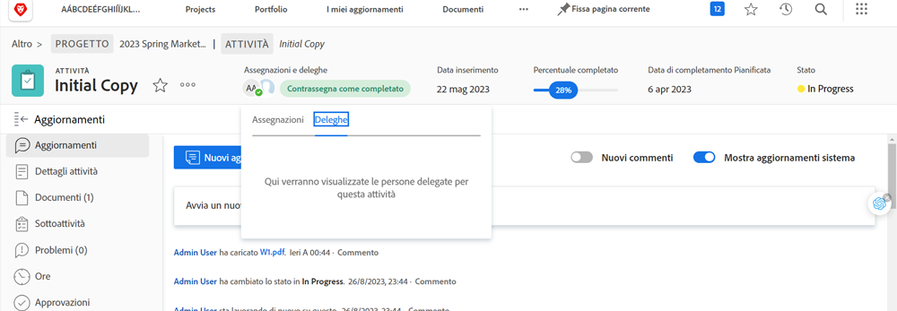

# Delega di attività, problemi e approvazioni

Scopri come delegare le approvazioni di progetti, attività, problemi e timestamp a un altro utente Workfront. Scopri anche come delegare le assegnazioni di attività ed emissioni.

## Delega approvazioni

Scopri come delegare le approvazioni di progetti, attività, problemi e timestamp a un altro utente.

Questo video illustra come:

* Assegnare le approvazioni a un altro utente
* Termina il periodo di delega
* Trova approvazioni delegate

>[!VIDEO](https://video.tv.adobe.com/v/336094/?quality=12)

<!---
learn more URLS
Delegate approval request
--->

## Delega delle assegnazioni di attività ed emissioni

Puoi delegare le attività e i problemi assegnati ad altri utenti quando intendi uscire dall&#39;ufficio.

### Come abilitare l&#39;attività e rilasciare la delega dell&#39;assegnazione

Prima di poter essere utilizzato, la delega delle attività e dei problemi deve essere abilitata da un amministratore di gruppo o di sistema. Questa operazione viene eseguita in [!UICONTROL Configurazione > Preferenze progetto > Attività e problemi > Delega]. L’abilitazione di questa opzione consente a tutti gli utenti con una licenza di revisione o superiore di delegare le attività e i problemi assegnati.

![Schermata mostrata [!UICONTROL Configurazione] preferenze per la delega](assets/delegation-1.png)

### Come delegare le assegnazioni di attività ed emissioni

Passa a [!UICONTROL Pagina principale] e fai clic su [!UICONTROL Delega], quindi specifica l’utente a cui stai delegando tutte le attività assegnate e l’intervallo di date. È possibile designare qualsiasi utente con una licenza di revisione o superiore.

![Schermata che mostra la scheda della delega in [!UICONTROL Pagina principale]](assets/delegation-2.png)

### Come stabilire se un&#39;attività o un problema è stato delegato

Puoi vedere quando sono stati delegati attività o problemi in [!UICONTROL Pagina principale] o nella visualizzazione attività o problema.

![Schermata che mostra l’assegnazione di un’attività delegata in [!UICONTROL Pagina principale]](assets/delegation-4.png)

### Notifiche e-mail relative al lavoro delegato

Il gruppo o l’amministratore di sistema può abilitare le notifiche e-mail che ti informeranno quando hai delegato le tue attività e i tuoi problemi e quando ti sono stati delegati i compiti e i problemi di un utente.

![Schermata mostrata [!UICONTROL Configurazione] opzioni di notifica e-mail per la delega](assets/delegation-5.png)

