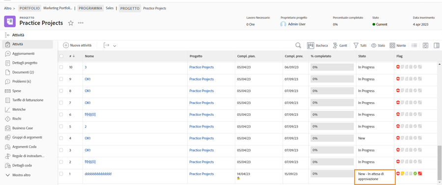

# Completare le approvazioni

Le approvazioni di attività e problemi fanno parte di molti flussi di lavoro. Tuttavia, le approvazioni non risolte possono impedire di impostare lo stato del progetto su Completato.

Il giorno [!UICONTROL Attività] del progetto, seleziona una [!UICONTROL Visualizza] che include [!UICONTROL Stato] colonna. Una rapida occhiata giù quella colonna mostrerà se c&#39;è un&#39;approvazione incompleta su un&#39;attività con il &quot;[!UICONTROL -approvazione in sospeso]&quot; dopo il nome dello stato.

Puoi scegliere tra diverse opzioni:

* **Completa l&#39;approvazione —** Ciò potrebbe significare ricordare ad altri la mancata approvazione. Esegui questa operazione con un aggiornamento tramite [!DNL Workfront]. A seconda del [!DNL Workfront] autorizzazioni, potresti essere in grado di completare l’approvazione autonomamente.
* **Rimuovi l&#39;approvazione —** Se l&#39;approvazione non è necessaria, potrebbe essere più semplice eliminarla. La tua capacità di farlo dipende dalla tua [!DNL Workfront] autorizzazioni.
* **Cambia stato —** Seleziona uno stato a cui non è allegata un&#39;approvazione. Assicurati solo che lo stato sia Completo.

Se l&#39;organizzazione utilizza i problemi per tenere traccia di problemi, ordini di modifica o altri eventi durante i progetti, eseguire le stesse operazioni in [!UICONTROL Problemi] del progetto.
