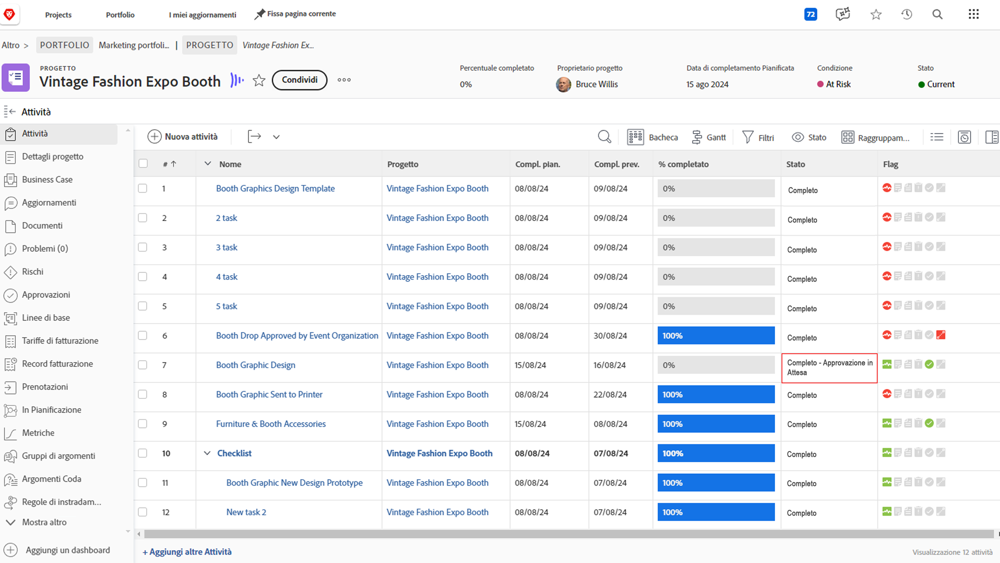
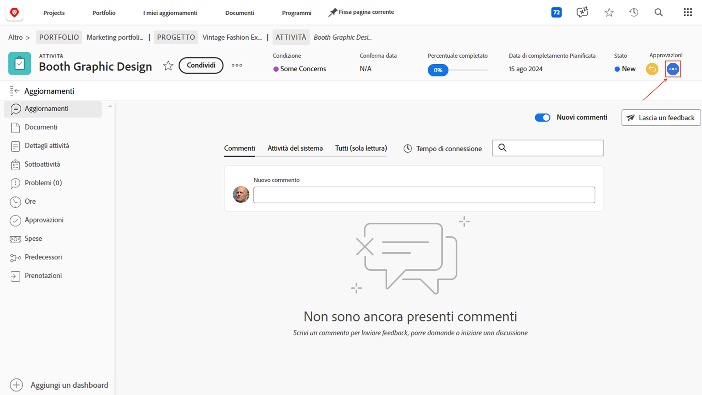
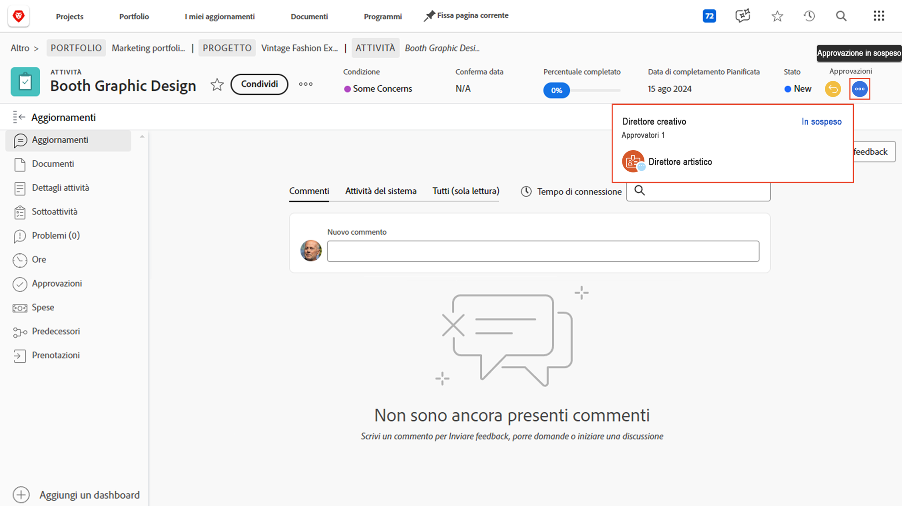
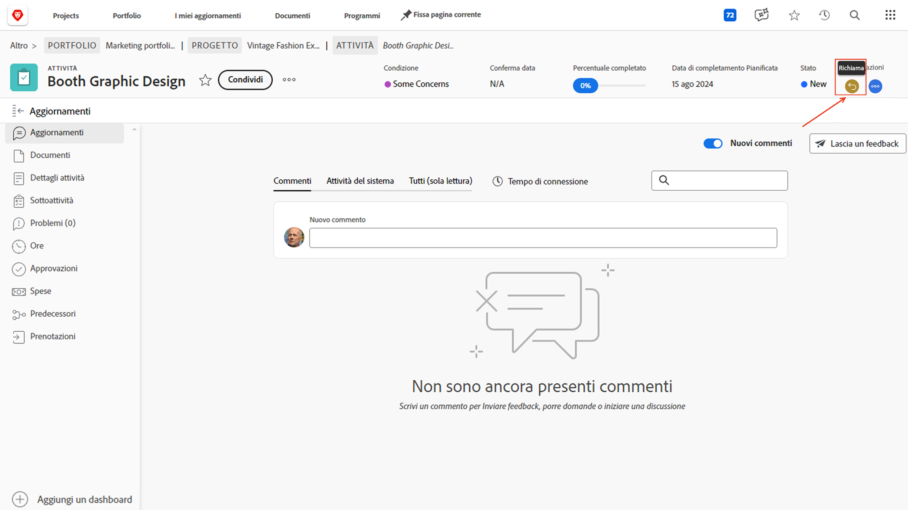
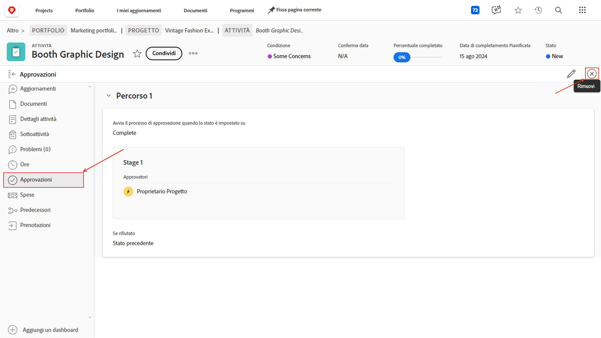

# Completare le approvazioni

Le approvazioni di attività e problemi fanno parte di molti progetti. Ma le approvazioni non risolte ti impediranno di impostare lo stato del progetto su Completato.

Ecco come trovarli e come gestirli.

Nella sezione [!UICONTROL Attività] del progetto, seleziona una [!UICONTROL Visualizzazione] che include la colonna [!UICONTROL Stato], ad esempio la visualizzazione [!UICONTROL Stato]. Una rapida occhiata in basso in quella colonna mostrerà se c&#39;è un&#39;approvazione incompleta su un&#39;attività con le parole &quot;[!UICONTROL - Pending Approval]&quot; dopo il nome dello stato.

Quando trovi un&#39;attività che è ancora in attesa di approvazione, puoi scegliere tra due opzioni:

## Completa l’approvazione

Ciò potrebbe significare ricordare alla persona a cui è stata assegnata l’approvazione in sospeso. Per vedere chi è assegnato come approvatore, apri l’attività e fai clic sul menu a tre punti nell’area approvazioni.

Verrà visualizzata una casella che mostra l&#39;approvatore assegnato.

## Rimuovi l’approvazione

Se l&#39;approvazione non è necessaria, è possibile rimuoverla. Per farlo, devi prima richiamare l’approvazione. Fare clic sul pulsante [!UICONTROL Richiama] nell&#39;area approvazioni. In questo modo lo stato torna allo stato precedente e sarà possibile rimuovere il processo di approvazione.

Ora fai clic sulla scheda [!UICONTROL Approvazioni] a sinistra, quindi sul pulsante [!UICONTROL Rimuovi] in alto a destra.

## Gestione delle approvazioni dei problemi

Se l’organizzazione tiene traccia dei problemi, degli ordini di modifica o di altri eventi durante i progetti, segui la stessa procedura della sezione [!UICONTROL Problemi] del progetto.
