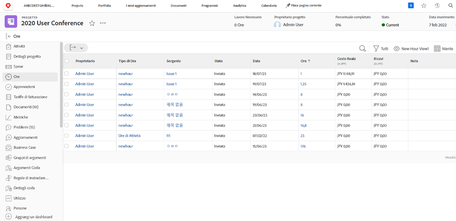

# Registra e rivedi le ore

Se la registrazione delle ore effettivamente lavorate fa parte del flusso di lavoro dell’organizzazione, puoi rivedere tali ore nel [!UICONTROL Ore] (selezionala dal menu del pannello a sinistra) sul progetto. Vengono visualizzate tutte le ore registrate per le singole attività e il progetto stesso. Puoi anche registrare le ore da questa pagina.

>[!NOTE]
>
>La tua organizzazione potrebbe chiederti di approvare le ore tramite [!DNL Workfront] schede orario. Verifica con il tuo interno [!DNL Workfront] per vedere quale processo utilizzare.

<!---
learn more url
Log time
--->
