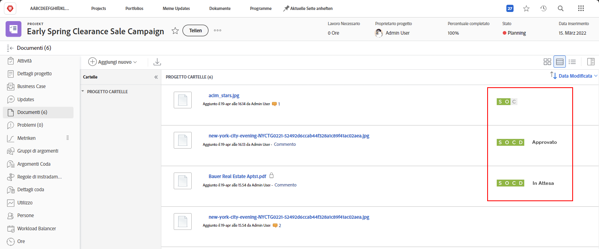
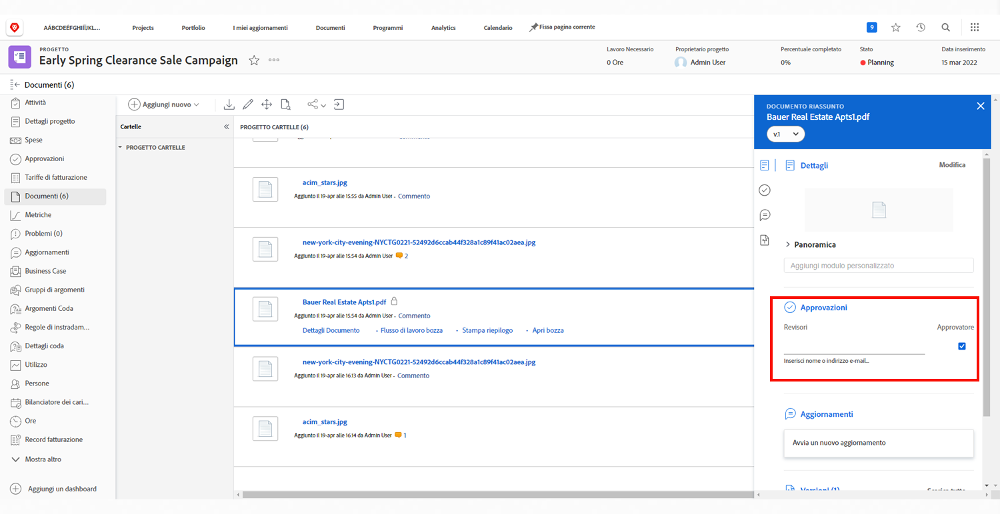

# Caricare le risorse

Prima di chiudere un [!DNL Workfront] progetto, assicurati che tutti i file rilevanti siano allegati al [!UICONTROL Documenti] sezione. Carica questi elementi come documento o bozza, in base alle linee guida aziendali.

Potrebbe essere necessario caricare il documento o la bozza come versione di un file esistente.

Se la tua organizzazione utilizza approvazioni della bozza, assicurati che tutte queste siano completate con un rapido sguardo alle icone di avanzamento.

Se l&#39;organizzazione utilizza le approvazioni dei documenti, selezionare ogni elemento nell&#39;elenco e controllare i dettagli del documento per verificare se le approvazioni sono state completate.

<!---
learn more urls
Create proofs
Add new documents to Workfront
--->
