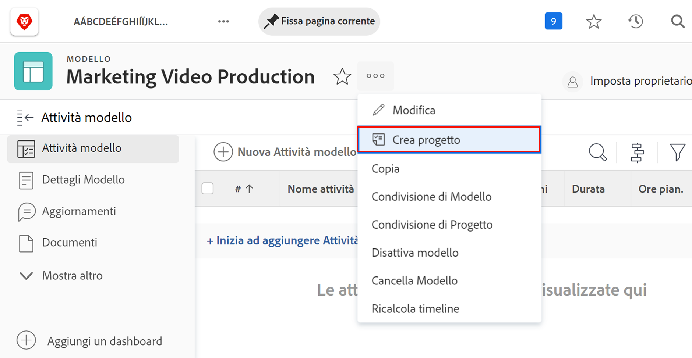
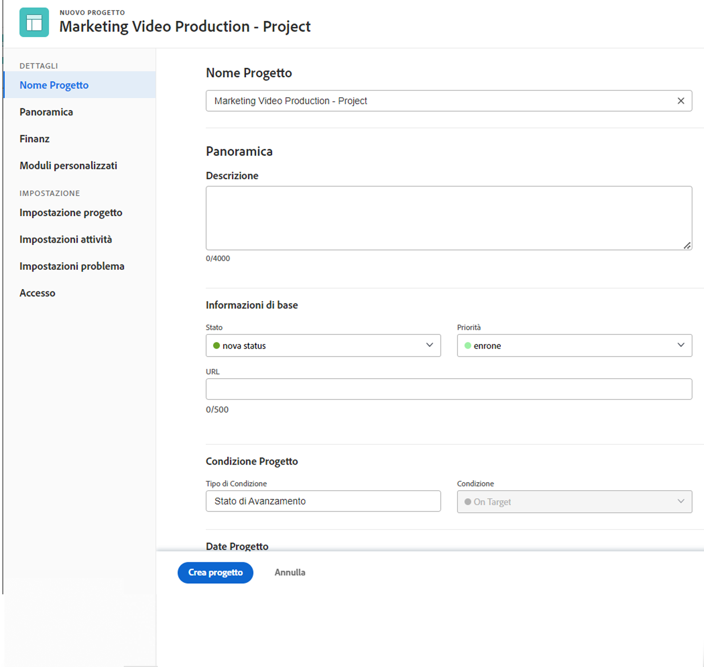
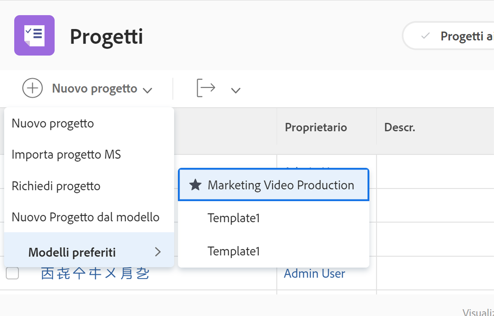

# Creare un progetto direttamente da un modello

Se lavori su un modello e devi creare un progetto utilizzandolo, fai clic sul menu a 3 punti accanto al nome del modello. Quindi seleziona Crea progetto.

La finestra dei dettagli consente di apportare modifiche alle impostazioni del nuovo progetto.

>[!NOTE]
>
>Per creare un progetto utilizzando questo metodo, è necessario accedere all’area Modelli di Workfront. Se non riesci ad accedere ai modelli, puoi comunque utilizzare un modello per creare un progetto dall’area Progetti o durante la conversione di un problema/attività.

>[!TIP]
>
>Se esiste un modello che usi frequentemente, aggiungilo ai preferiti! Il modello viene visualizzato nel menu Nuovo progetto, oltre a essere visualizzato nel menu Preferiti nella barra di navigazione.

