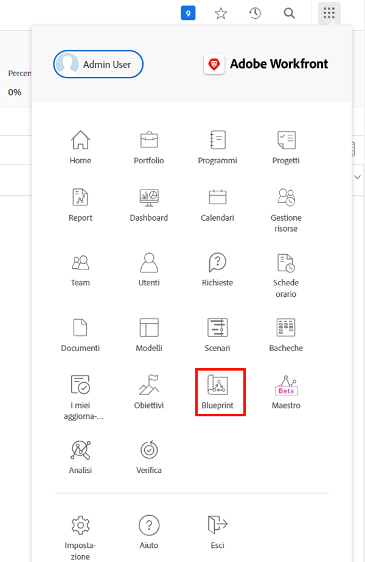
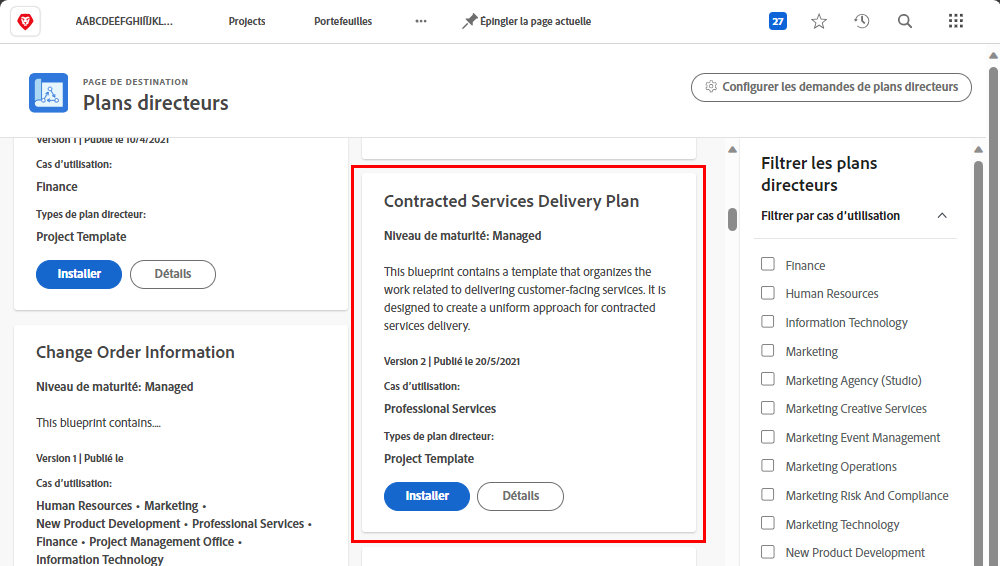
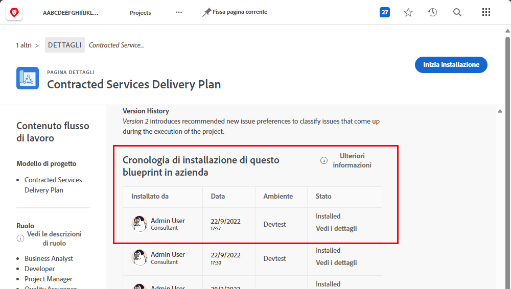
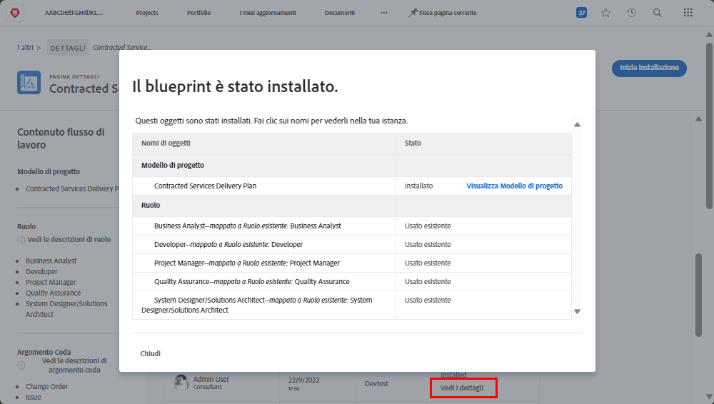

# Creare un modello di progetto e informazioni sui [!UICONTROL Blueprint]

Impara a creare un modello di progetto da zero e da un progetto esistente e capisci come [!UICONTROL Blueprint] possono darti accesso a un mondo di modelli di progetto utili creati dagli esperti di Workfront.

## Creare un modello di progetto

In questo video scoprirai come:

* Creare un modello da zero
* Creare un modello da un progetto esistente

>[!VIDEO](https://video.tv.adobe.com/v/335210/?quality=12&learn=on)

## Modelli creati con [!UICONTROL Blueprint]

Gli utenti di Workfront possono utilizzare [!UICONTROL Blueprint] per contribuire a creare modelli di progetto. Questa funzionalità, situata nel menu principale, ti consente di accedere a modelli predefiniti e pronti all’uso destinati a un reparto e a un livello di maturità specifico. Questi modelli forniscono agli utenti un vantaggio nella creazione ripetibile dei progetti e aiutano a mantenere la coerenza tra progetti con un ambito simile.

Qualsiasi utente con licenza può sfogliare l’elenco dei blueprint disponibili in Workfront. Non è possibile applicare un blueprint direttamente durante la creazione di un nuovo progetto (ad esempio convertendo un’attività o una richiesta in un progetto). Una differenza fondamentale tra un progetto e un modello di progetto è che un progetto viene utilizzato per creare un modello, mentre un modello viene utilizzato per creare un progetto. **Per poter creare il modello corrispondente, il blueprint deve essere installato da un amministratore di sistema.**

Se trovi un progetto che sembra interessante, puoi fare clic su **[!UICONTROL Dettagli]** per ottenere ulteriori informazioni.

La schermata [!UICONTROL Dettagli] spiega di più sul blueprint, inclusa la cronologia dell’installazione se il blueprint è stato installato.

Se il blueprint è stato installato, è possibile fare clic su **[!UICONTROL Visualizza dettagli]** per ottenere collegamenti al modello creato e a qualsiasi altro oggetto creato per supportare il modello.

Se il blueprint non è ancora stato installato, puoi richiederlo all’amministratore di sistema.

## Tutorial consigliati su questo argomento

* [Creare un progetto direttamente da un modello](/help/manage-work/create-and-manage-project-templates/create-a-project-directly-from-a-template.md)
* [Condividere un modello di progetto](/help/manage-work/create-and-manage-project-templates/share-a-project-template.md)
* [Copia un progetto esistente](/help/manage-work/manage-projects/copy-an-existing-project.md)
* [Disattivare un modello di progetto](/help/manage-work/create-and-manage-project-templates/deactivate-a-project-template.md)
* [Modificare il team di progetto in un modello di progetto](/help/manage-work/create-and-manage-project-templates/edit-the-project-team-in-a-project-template.md)
