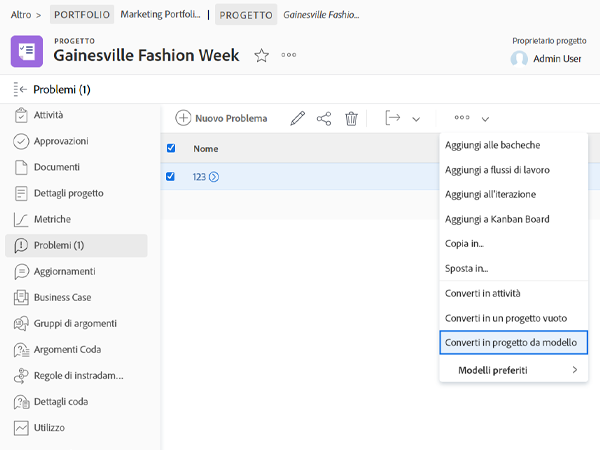

# Convertire i problemi in altri elementi di lavoro

## Convertire un problema in un’attività

Un problema può essere abbastanza significativo da richiedere che il tempo e lo sforzo necessari per risolverlo siano contabilizzati nella tempistica del progetto e che vengano assegnate le risorse appropriate. In questo caso, il problema può essere convertito in un’attività.

![Un&#39;immagine del [!UICONTROL Converti in attività] opzione di un problema in [!UICONTROL Workfront].](assets/15-convert-issue-to-task-menu-option.png)

1. Accedi a [!UICONTROL Problemi] sezione del progetto o dell’attività a cui è connesso il problema. In alternativa, puoi individuare il problema in un rapporto a cui hai accesso.
1. Fai clic sul nome del problema per aprirlo.
1. Dal menu a 3 punti a destra del nome del problema, seleziona **[!UICONTROL Converti in attività]**.
1. Compila il [!UICONTROL Converti in attività] modulo. Per iniziare, assegnare un nome e una descrizione alla nuova attività.
1. Se la nuova attività deve far parte di un progetto diverso, immettere il nome del progetto.
1. In [!UICONTROL Opzioni] , seleziona le caselle per mantenere il problema originale, consentire l’accesso alla nuova attività e mantenere la data di completamento. Segui il flusso di lavoro della tua organizzazione quando effettui queste selezioni. Allega un modulo personalizzato se desideri trasferire i dati del modulo personalizzato dal problema all’attività. (Tutti i campi presenti sia nel modulo del problema che nel modulo delle attività verranno trasferiti automaticamente al modulo delle attività.)
1. Compila il modulo personalizzato, se ne è allegato uno.
1. Clic **[!UICONTROL Converti in attività]** per terminare.

![Un&#39;immagine del [!UICONTROL Converti in attività] forma di un problema in [!UICONTROL Workfront].](assets/16-convert-to-task-options.png)

A seconda della [!DNL Workfront] impostazioni di sistema, è possibile che sia possibile modificare le impostazioni nella sezione Opzioni durante la conversione dell&#39;attività. Queste opzioni hanno effetto sia sul problema originale che sulla nuova attività.

* **&quot;Mantieni il problema originale e collegane la risoluzione a questa attività&quot;** mantiene il problema originale e le relative informazioni (ore, documenti, ecc.). Quando questa opzione è selezionata, al termine dell’attività il problema verrà contrassegnato come risolto. Se questa opzione non è selezionata, il problema originale verrà eliminato al completamento dell&#39;attività. Questo può influenzare il modo in cui la tua organizzazione tiene traccia e segnala i problemi.
* Il **&quot;Consenti a (nome utente) di accedere a questa attività&quot;** consente alla persona che ha creato il problema di accedere a questa nuova attività.
* Il **&quot;Mantieni la data di completamento pianificata del problema&quot;** consente di mantenere la data di completamento pianificata già impostata sul problema. In questo modo il vincolo attività viene impostato su [!UICONTROL Finire non Dopo di]. Se la casella è deselezionata, le date dell&#39;attività verranno impostate come se fosse stata creata una nuova attività all&#39;interno del progetto.

La nuova attività viene posizionata in fondo all&#39;elenco delle attività del progetto. Spostare l&#39;attività nella posizione desiderata, assegnare un utente o un team al lavoro, aggiungere ore e durata pianificate e così via.

>[!NOTE]
>
>Non è possibile aggiungere problemi alla sequenza temporale del progetto, poiché rappresentano &quot;lavoro non pianificato&quot;. La timeline del progetto è per &quot;lavoro pianificato&quot;, ovvero attività.

## Convertire un problema in un progetto

Vi sono casi in cui un problema non può essere risolto affrontandolo direttamente o convertendolo in un compito, perché il processo di risoluzione del problema deve essere coordinato in modo più approfondito. In questo caso, puoi convertire il problema in un progetto.

1. Passare alla sezione Problemi del progetto o dell&#39;attività a cui è connesso il problema. In alternativa, puoi individuare il problema in un rapporto a cui hai accesso.
1. Fai clic sul nome del problema per aprirlo.
1. Fai clic sul menu con tre punti a destra del nome del problema per esporre il menu Altro.
1. Quindi seleziona se desideri creare un nuovo progetto completamente vuoto o se utilizzi un modello di progetto, che precompilerà le informazioni sull’attività e sulla timeline.
1. Compila le informazioni nella finestra Converti in progetto, a partire dal nome del progetto.
1. Compila altri dettagli del progetto in base alle esigenze del team o dell’organizzazione.
1. Nella sezione Opzioni, seleziona le caselle per mantenere il problema originale e consentire l’accesso al nuovo progetto. Segui il flusso di lavoro della tua organizzazione quando effettui queste selezioni.
1. Compila il modulo personalizzato, se ne è allegato uno. Allega un modulo personalizzato se desideri trasferire i dati del modulo personalizzato dal problema al progetto. (Tutti i campi presenti sia nel modulo del problema che nel modulo del progetto verranno trasferiti automaticamente al modulo del progetto.)
1. Clic **Converti in progetto** per terminare.

I campi dei dettagli del progetto visualizzati nella finestra Converti in progetto dipendono dal metodo utilizzato per creare il progetto. Se hai utilizzato l’opzione Converti in progetto da modello, nel menu a sinistra troverai ulteriori informazioni.

>[!NOTE]
>
>Alcune sezioni, come la sezione Opzioni, anche se visibili, potrebbero non essere accessibili a seconda delle impostazioni di sistema di Workfront della tua organizzazione.

* Fai clic su &quot;**Mantieni il problema originale e collegane la risoluzione a questo progetto**&quot;. Questa opzione mantiene il problema originale e le informazioni correlate (ore, documenti, ecc.). Quando il nuovo progetto è completato, il problema viene contrassegnato come risolto. Se questa opzione non è selezionata, il problema originale verrà eliminato al completamento del progetto. Questo può influenzare il modo in cui la tua organizzazione tiene traccia e segnala i problemi.
* La &quot;**Consenti a (nome utente) di accedere a questo progetto** L’opzione &quot; consente alla persona che ha creato il problema di accedere al progetto in fase di creazione.

## Gestisci informazioni durante il processo di conversione

<!-- Need link to wf one doc article below 

To learn about what information transfers when you convert an issue to a task or project, we recommend you read through the conversion considerations in the article, Convert issues. This lists what information is kept when converting issues and what isn’t. Workfront recommends you become familiar with these considerations so you don’t lose important information when converting issues to tasks or projects.

-->

Il trasferimento dei dati del modulo personalizzato richiede:

* Più copie dello stesso modulo personalizzato: una per il problema e una per l’attività o il progetto. I campi di questi moduli personalizzati devono corrispondere esattamente, in modo che le informazioni possano essere trasferite da un modulo personalizzato all’altro.

* Oppure un singolo modulo personalizzato in cui vengono selezionati gli oggetti problema, attività e/o progetto. Utilizzando questo metodo è sufficiente creare e gestire i campi personalizzati in un unico modulo personalizzato. Si tratta di un miglioramento recente ed è molto più semplice avere più copie dello stesso modulo, ma entrambi i metodi funzioneranno.

<!-- Need link to wf one doc article below

Learn more in the article, Transfer custom form data to a larger work item.

-->

<!-- Pro tips graphic -->

Se si include un modulo personalizzato in un modello di progetto, questo verrà assegnato automaticamente quando il modello viene selezionato nel processo di conversione.

<!-- Learn more graphic and documentation article links 

* Convert issues
* Transfer custom form data to a larger work item
* Overview of resolving and resolvable objects
* Understanding resolving and resolvable objects
* Unlink issues from their resolvable objects

-->

## Convertire un problema in un&#39;attività o un progetto da qualsiasi elenco di problemi

Per aumentare l’efficienza del lavoro e facilitare la conversione dei problemi in un ambiente in rapida evoluzione, puoi convertire un problema in un’attività o un progetto da qualsiasi elenco di problemi in un progetto, un rapporto o una dashboard. Seleziona un problema e fai clic sul menu a 3 punti visualizzato.

