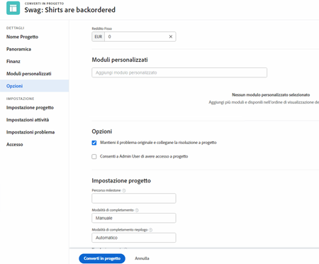
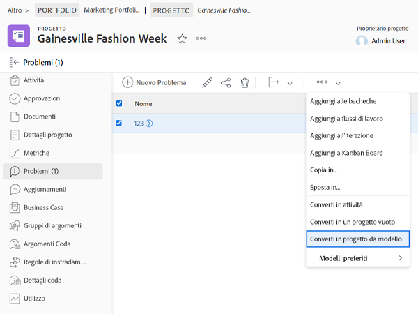

# Convertire un problema/richiesta in un progetto

Questo video illustra come:

* Esaminare le informazioni fornite con la richiesta
* Seleziona il modello di progetto appropriato
* Completa la conversione da richiesta a progetto

>[!VIDEO](https://video.tv.adobe.com/v/340343/?quality=12&learn=on)

## Cosa devi sapere su [!UICONTROL Opzioni] sezione

Il [!UICONTROL Opzioni] possono essere nascosti dall&#39;amministratore di sistema se si desidera utilizzare i valori predefiniti impostati. Se il [!UICONTROL Opzioni] La sezione non viene visualizzata, in questo caso il significato delle opzioni:

**Mantieni il problema originale e collegane la risoluzione a questo progetto**

Se questa opzione è selezionata, il problema originale verrà contrassegnato come risolto al completamento del progetto. Se questa opzione è **non** Se questa opzione è selezionata, il problema originale verrà eliminato al momento della creazione del progetto.

**Consenti a (nome utente) di accedere a questo progetto**

Se questa opzione è selezionata, alla persona che ha effettuato la richiesta (o per conto di chi è stata effettuata la richiesta) verranno automaticamente assegnati i diritti di accesso al nuovo progetto una volta creato. Se questa opzione è **non** selezionato, non riceveranno automaticamente alcun diritto.

## Gestisci informazioni durante il processo di conversione

Il trasferimento dei dati del modulo personalizzato richiede:

* Più copie dello stesso modulo personalizzato: una per il problema e una per l’attività o il progetto. I campi di questi moduli personalizzati devono corrispondere esattamente, in modo che le informazioni possano essere trasferite da un modulo personalizzato all’altro.

* È possibile utilizzare un singolo modulo personalizzato in cui vengono selezionati tutti gli oggetti problema, attività e/o progetto. Utilizzando questo metodo è sufficiente creare e gestire i campi personalizzati in un unico modulo personalizzato. Questo è molto più semplice che avere più copie dello stesso modulo, ma entrambi i metodi funzioneranno.

Se si include un modulo personalizzato in un modello di progetto, questo verrà assegnato automaticamente quando il modello viene selezionato nel processo di conversione.

## Convertire un problema in un&#39;attività o un progetto da qualsiasi elenco di problemi

Per aumentare l’efficienza del lavoro e facilitare la conversione dei problemi in un ambiente in rapida evoluzione, puoi convertire un problema in un’attività o un progetto da qualsiasi elenco di problemi in un progetto, un rapporto o una dashboard. Seleziona un problema e fai clic sul menu a 3 punti visualizzato.

