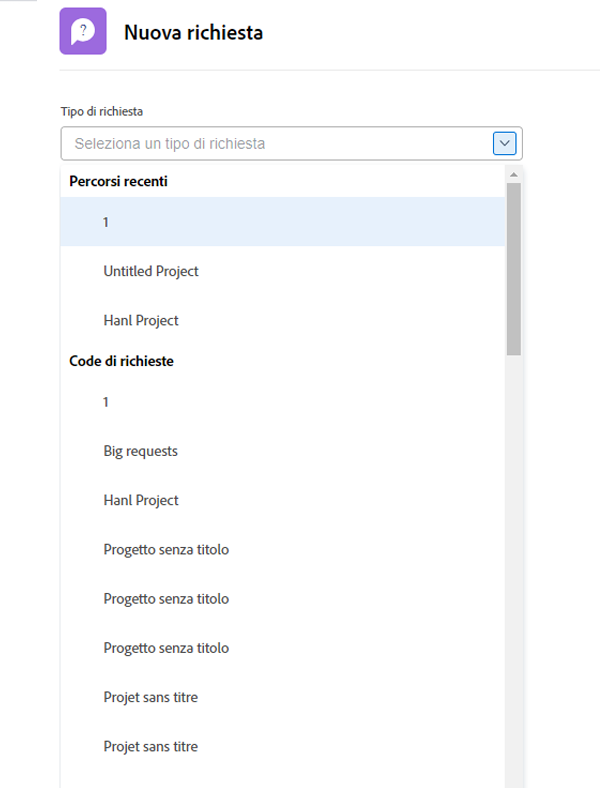
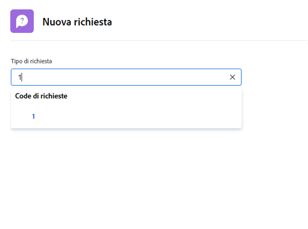
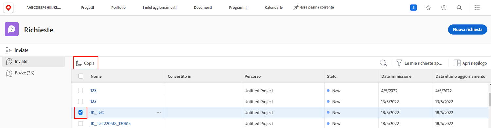
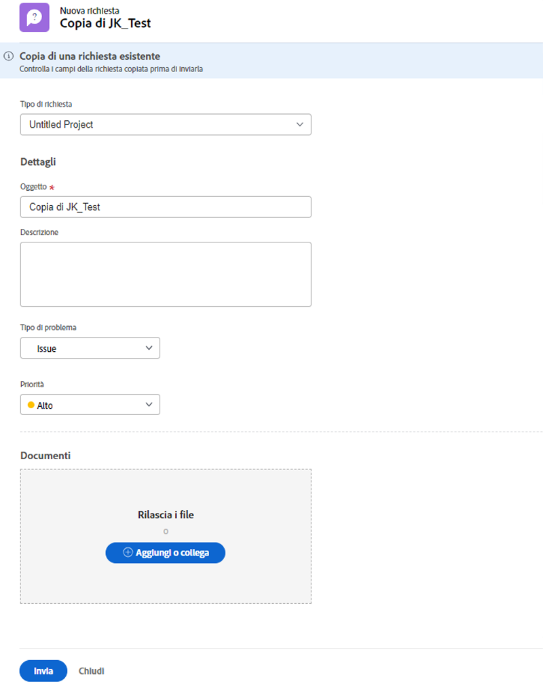

# Fai una richiesta

In molte organizzazioni, il primo passo per avviare un nuovo progetto, sviluppare un nuovo prodotto o creare un risultato finale consiste nel fare una richiesta in [!DNL Workfront]. Puoi tenere traccia dell’avanzamento della richiesta e fornire informazioni aggiuntive quando necessario.

Questo video illustra come:

* Passa all’area della richiesta
* Fai una richiesta
* Visualizzare le richieste inviate
* Trovare una bozza di una richiesta

>[!VIDEO](https://video.tv.adobe.com/v/336092/?quality=12)

## Accedere ai percorsi della coda di richieste in modo rapido e semplice

Quando si fa clic su in [!UICONTROL Tipo di richiesta] , gli ultimi tre percorsi di richiesta inviati di recente vengono visualizzati automaticamente nella parte superiore dell’elenco. Seleziona un’opzione per archiviare un’altra richiesta nella stessa coda.

Nella parte inferiore dell’elenco sono presenti tutte le code di richieste a cui hai accesso. Se non sai quale coda utilizzare per la richiesta, utilizza la ricerca per parola chiave per trovare rapidamente e facilmente quella necessaria.

Quando si digitano le parole chiave, [!DNL Workfront] visualizza le corrispondenze in modo da poter trovare il percorso della coda richieste che soddisfa le tue esigenze. Ad esempio, per richiedere un post di social media, inizia a digitare &quot;social media&quot; in [!UICONTROL Tipo di richiesta] e l’elenco viene aggiornato in modo dinamico per mostrare tutte le corrispondenze.

Selezionare l&#39;opzione desiderata, compilare il modulo di richiesta e inviare la richiesta.

## Copiare una richiesta inviata per effettuare una nuova richiesta

Quando invii spesso lo stesso tipo di richiesta, la creazione di ogni nuova richiesta e la compilazione delle stesse informazioni richiede molto tempo. Accelera il processo copiando una richiesta esistente, modificando solo le informazioni da aggiornare e inviandole come nuova richiesta.

1. Fare clic su Richieste nel menu principale.
1. Accertati di trovarti nella sezione Inviato selezionando il menu del pannello a sinistra.
1. Trova e seleziona la richiesta da copiare. Puoi copiare una sola richiesta alla volta.
1. Fai clic sull’icona Copia e invia come nuovo nella parte superiore sinistra dell’elenco delle richieste.
1. Viene visualizzata la finestra Nuova richiesta con il campo Oggetto evidenziato, in modo da poter denominare la nuova richiesta.
1. Se necessario, aggiorna altre informazioni nella richiesta.
1. Fai clic su Invia per terminare.
1. La richiesta copiata viene inviata come nuova richiesta e viene visualizzata nell’elenco Inviato.

È possibile copiare una richiesta inviata in precedenza, ma non una bozza di richiesta. Puoi copiare una richiesta inviata da un altro utente, purché tu disponga dell’accesso di visualizzazione alla richiesta.

<!---
Learn more
Requests area overview
Create and submit Workfront requests
Guides
Make a work request
--->
