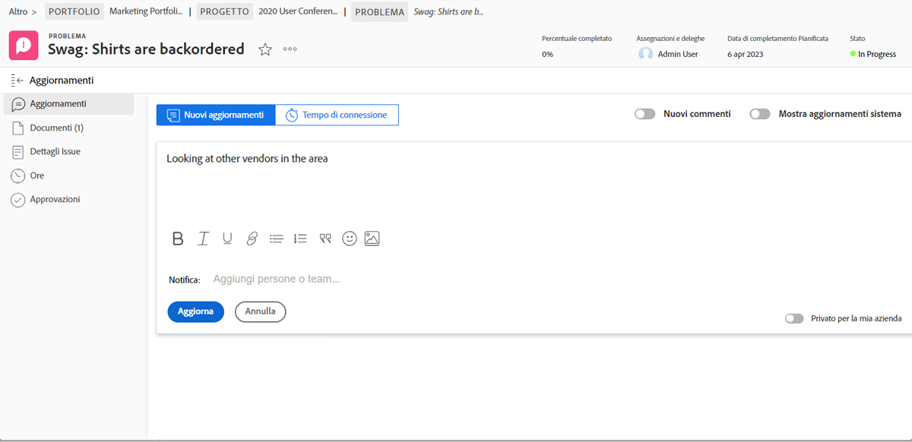
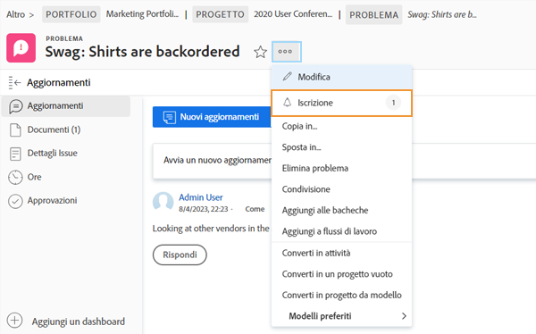
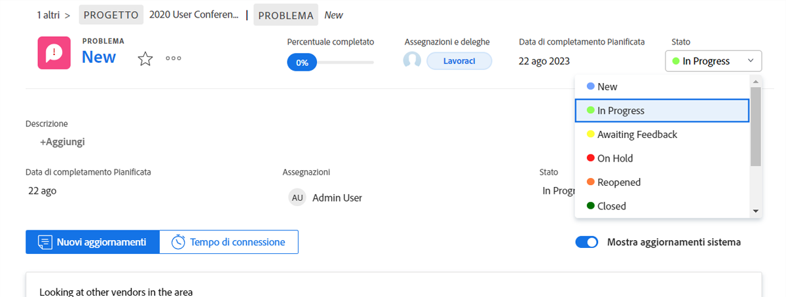
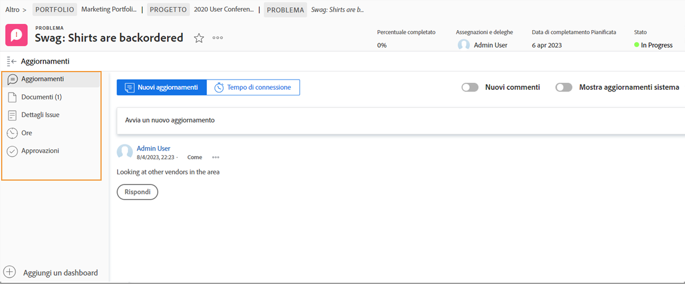

# Gestione delle assegnazioni dei problemi

## Assegnare un problema

Registrazione del problema in [!DNL Workfront] è il primo passo per risolvere i problemi che sorgono. Il passaggio successivo consiste nell’assegnare il problema a un singolo utente, a più utenti o a un team, in modo da completare qualsiasi lavoro associato e risolvere il problema.

L&#39;assegnazione di un problema è come l&#39;assegnazione di un&#39;attività: compila [!UICONTROL Assegnazioni] campo . Il problema si presenta quindi nel’ [!UICONTROL Elenco lavori] in [!DNL Workfront] [!UICONTROL Pagina principale]. Se assegnato a un team, viene visualizzato nella [!UICONTROL Richieste del team] della sezione [!UICONTROL Team] pagina.

Tutti i problemi relativi alle attività registrate e al progetto stesso sono accessibili dal [!UICONTROL Problemi] nella pagina del progetto. Questo consente ai project manager, ai pianificatori e ad altri di assegnare rapidamente i problemi relativi al progetto.

Esistono diversi modi per assegnare i problemi in [!DNL Workfront].

* Vai a [!UICONTROL Problema] sezione relativa al progetto o all’attività. Fai clic su [!UICONTROL Assegnazioni] per attivare la modifica in linea, quindi immettere il nome dell&#39;utente, degli utenti o del team che deve completare il lavoro.
È inoltre possibile utilizzare la modifica in linea quando si visualizzano problemi su un [!DNL Workfront] rapporto.

* Fai clic sul nome del problema, su un rapporto o nel **[!UICONTROL Problemi]** sezione del progetto o dell&#39;attività. Quindi fai clic su **[!UICONTROL Assegnazioni]** nell’intestazione, in alto a destra nella finestra. Non dimenticare di fare clic sul pulsante **[!UICONTROL Salva]** dopo aver inserito il nome di un utente o di un team.

![Immagine dell’opzione di modifica in linea quando si fa clic su [!UICONTROL Assegnazioni] campo di un problema](assets/04-issue-assign-issue-list-assignments-field.png)

<!--
Learn more graphic and documentation article links
Assign issues
Edit user assignments for multiple issues
-->

## Ricezione di un&#39;assegnazione di problema

Troverai i problemi che ti sono stati assegnati nel [!UICONTROL Elenco lavori] in [!UICONTROL Pagina principale].

![Immagine di un&#39;assegnazione di un problema nel [!UICONTROL Elenco lavori] in [!UICONTROL Pagina principale]](assets/05-workfront-home-work-list.png)

Utilizza la [!UICONTROL Filtro] menu per limitare l’elenco in modo da visualizzare solo i problemi, se desiderato.

![Un&#39;immagine del [!UICONTROL Filtro] nel menu [!UICONTROL Elenco lavori] in [!UICONTROL Pagina principale]](assets/06-workfront-home-issue-filter.png)

Quando un problema viene assegnato a un team, viene visualizzato nella [!UICONTROL Richieste del team] della sezione [!UICONTROL Team] pagina. Un membro del team può fare clic sul pulsante [!UICONTROL Lavorare] per accettare l&#39;assegnazione o un lead del team può fare clic sul pulsante [!UICONTROL Riassegna] per inviare la richiesta a una persona specifica.

![Un&#39;immagine del [!UICONTROL Richieste del team] della sezione [!UICONTROL Team] page](assets/07-team-page-work-on-it.png)

Anche i problemi assegnati al team vengono visualizzati nella sezione [!UICONTROL Pianificazione] sezione . Questo consente ai lead del team e agli altri utenti di vedere su cosa stanno lavorando i membri del team prima di assegnare il lavoro. Trascina e rilascia la barra dei problemi dal [!UICONTROL Non assegnato] area del calendario di un membro del team per assegnarlo.

![Un&#39;immagine delle assegnazioni del team nel [!UICONTROL Pianificazione] sezione .](assets/08-issue-assignment-team-schedule.png)

A seconda di come la tua organizzazione dispone [!DNL Workfront] configurazione: puoi anche visualizzare i problemi assegnati a te o al tuo team in un rapporto che fa parte di un dashboard.

<!-- Learn more graphic and documentation article links

* Display items in the [!UICONTROL Work List] in the [!UICONTROL Home] area
* Manage work and team requests in the [!UICONTROL Home] area

-->

## Aggiornamento dei progressi relativi ai problemi

Tu e i membri del tuo team potete pubblicare aggiornamenti e ore di accesso ai problemi per fornire visibilità al lavoro svolto e mantenere tutti i partecipanti aggiornati sui progressi del lavoro.

Perché esistono diversi modi per pubblicare gli aggiornamenti in [!DNL Workfront], segui le istruzioni specifiche del tuo team per quanto riguarda il modo consigliato di funzionare con le configurazioni di sistema e i flussi di lavoro.

Aggiornamenti e ore possono essere pubblicati sul problema da [!UICONTROL Pagina principale]. Fai clic su **[!UICONTROL Nuovi aggiornamenti]** per pubblicare un commento.

![Immagine della pubblicazione di un aggiornamento su un problema da [!UICONTROL Pagina principale].](assets/09-workfront-home-update.png)

Quando commenta un problema, puoi indirizzare il messaggio ad altri utenti o team utilizzando la funzione @name , proprio come puoi fare sui social media.

Fai clic sul pulsante **[!UICONTROL Tempo di log]** per registrare le ore lavorate sul problema.

![Immagine dell&#39;ora di registrazione su un problema da [!UICONTROL Pagina principale].](assets/10-workfront-home-log-hours.png)

Oppure puoi aprire il problema (fai clic sul nome) e registrare le informazioni in quel punto.

## Iscriviti a un problema

Chiunque abbia accesso al problema può [!UICONTROL Abbonati] a , che invia loro una notifica ogni volta che viene effettuato un aggiornamento/commento sul problema. Non ricevi notifiche quando vengono registrate ore, lo stato cambia o vengono effettuate altre modifiche.

La sottoscrizione è un ottimo modo per altri membri del team o responsabili di progetto di monitorare il lavoro a cui sono interessati, ma che non sono assegnati o su cui lavorano attivamente.

<!-- Learn more graphic and link to documentation article

* Update or edit a work item in the Home area

-->

## Aggiorna lo stato del problema

Oltre a pubblicare commenti o ore di registrazione, non dimenticare di modificare lo stato del problema per indicare che ci stai lavorando. E poi cambialo di nuovo per indicare che il lavoro è completo.

Modifica lo stato dell’intestazione da [!UICONTROL Pagina principale] o quando hai aperto la pagina del problema.

### Problemi irrisolti

Un problema viene considerato &quot;non risolto&quot; quando lo stato non è stato aggiornato per essere completato o equivalente.

I problemi non risolti impediscono che l’attività associata sia contrassegnata come completata e che lo stato del progetto sia impostato come completato.

<!-- Learn more graphic and documentation article link

* Mark a work item as done in the Home area

-->

## Funzionalità aggiuntive relative ai problemi

La pagina del problema consente di accedere a informazioni e funzionalità aggiuntive necessarie ai membri del team e ai project manager per registrare e gestire correttamente il problema da risolvere.

Oltre a [!UICONTROL Aggiornamenti] e [!UICONTROL Ore], è possibile accedere ad altre informazioni dal menu del pannello a sinistra dopo aver aperto il problema.

* **[!UICONTROL Documenti]**- Carica e rivedi i documenti relativi al problema.
* **[!UICONTROL Dettagli del problema]**- Consente di modificare le informazioni sul problema, ad esempio descrizione, priorità, gravità e data di completamento pianificato.
* **[!UICONTROL Approvazioni]**- Imposta un processo di approvazione a uso singolo per il problema o applica un processo di approvazione globale. Puoi tenere traccia dell’avanzamento dell’approvazione anche in questa sezione.

Trova le opzioni per copiare, eliminare o condividere un problema nel menu a 3 punti a destra del nome del problema.

<!-- Learn more graphic and documentation article links

* Edit issues
* Copy issues
* Share an issue
* Move issues
* Grant access to an issue

-->
