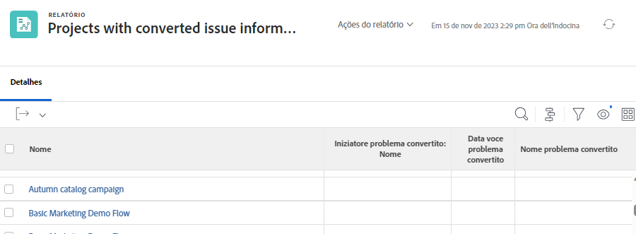

# Report sui problemi

## Centralizzare i problemi creando un rapporto

Molti responsabili del traffico e dei progetti creano un [!UICONTROL Workfront] report personalizzato per centralizzare tutti i problemi in arrivo. In questo modo è facile tenere traccia delle novità e richiede attenzione.

Il report può quindi essere aggiunto a una dashboard, unendo in un’unica dashboard tutto il necessario per svolgere il lavoro [!UICONTROL Workfront] finestra.

![Un&#39;immagine del [!UICONTROL Oggetto risolutivo] colonna di un report di problemi.](assets/18-resolving-object-report.png)

Per visualizzare il nome dell’attività o del progetto a cui è stato convertito il problema, includi &quot;[!UICONTROL Oggetto risolutivo]&quot; nella visualizzazione. A &quot;[!UICONTROL Oggetto risolutivo]&quot; è l’attività o il progetto creato quando si converte un problema. Se un problema non è stato convertito, [!UICONTROL Oggetto risolutivo] il campo sarà vuoto. Questo rapporto consente di vedere rapidamente quali problemi sono già stati convertiti, in modo da non finire con duplicati. Fai clic sul nome dell’oggetto di risoluzione per aprirlo in modo da poter tenere traccia dell’avanzamento del lavoro svolto.

## Mostra le informazioni originali sul problema nei rapporti

Quando un problema viene convertito in un progetto o in un’attività, molti dei dettagli originali del problema possono essere segnalati nei rapporti relativi al progetto o all’attività. Il problema originale è indicato come &quot;[!UICONTROL Problema convertito]&quot;.

Un report di progetto o di attività può visualizzare queste informazioni utilizzando [!UICONTROL Iniziatore problema convertito] insieme a due campi dedicati. È possibile aggiungere queste colonne a una visualizzazione personalizzata senza dover utilizzare la modalità testo:

* [!UICONTROL Data voce problema convertito]
* [!UICONTROL Nome problema convertito]
* [!UICONTROL Iniziatore problema convertito > Nome]

>[!NOTE]
>
>Per istruzioni su come creare una visualizzazione, consulta [Creare una visualizzazione di base](https://experienceleague.adobe.com/docs/workfront-learn/tutorials-workfront/reporting/basic-reporting/create-a-basic-view.html?lang=en).

