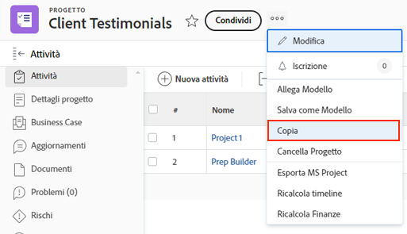

# Copia un progetto esistente

A volte, invece di utilizzare un modello per creare un progetto, è sufficiente copiare un progetto per un altro utilizzo occasionale. A questo scopo, è necessario disporre di una licenza Pianificazione, con accesso Modifica e Crea ai progetti.

Passa al progetto che desideri copiare e fai clic sul menu a 3 punti accanto al nome del progetto. Quindi seleziona Copia.

La finestra Copia progetto consente di modificare il titolo e lo stato, nonché di cancellare una serie di dati associati al progetto, ad esempio assegnazioni, documenti e dati personalizzati.

Se si seleziona Cancella assegnazioni o si imposta lo stato su Pianificazione, il progetto copiato non invierà le notifiche di assegnazione delle attività subito dopo la copia.
