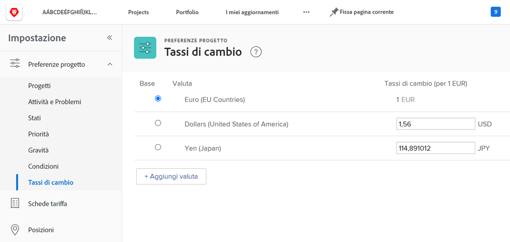
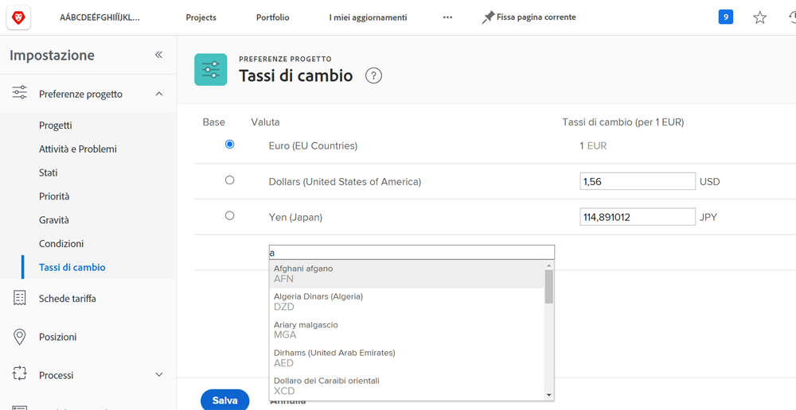

# Imposta tassi di cambio

[!DNL Workfront] supporta valute diverse per le organizzazioni dei clienti che sono multinazionali. I tassi di cambio possono essere utilizzati su progetti e report per riflettere le informazioni finanziarie in valute diverse da tutto il mondo.

I tassi di cambio vengono gestiti dagli amministratori di sistema. È possibile impostare valute aggiuntive in base alle esigenze dell&#39;organizzazione.

[!DNL Workfront]La valuta di base (predefinita) è il dollaro degli Stati Uniti. Questa è la valuta in cui verranno calcolate le informazioni finanziarie per impostazione predefinita, a meno che non venga specificata una valuta diversa in un singolo progetto.

## Imposta valute e tassi di cambio

**Seleziona [!UICONTROL Configurazione] dal menu principale.**

1. Espandi **[!UICONTROL Preferenze progetto]** nel pannello del menu a sinistra.
1. Clic **[!UICONTROL Tassi di cambio]**.
1. Fai clic su **[!UICONTROL Aggiungi valuta]** pulsante.
1. Seleziona la valuta del paese dal menu a discesa.
1. Inserire il tasso di cambio desiderato per la divisa.
1. Se una valuta diversa dal dollaro statunitense [!DNL Workfront] valuta di base (predefinita) del sistema, fai clic sul pulsante accanto al nome della valuta.
1. Clic **[!UICONTROL Salva]** quando sono state aggiunte tutte le valute.

>[!NOTE]
>
>Workfront non aggiorna né tiene traccia dei valori di mercato correnti per i tassi di cambio. Se necessario, gli aggiornamenti devono essere eseguiti manualmente.
