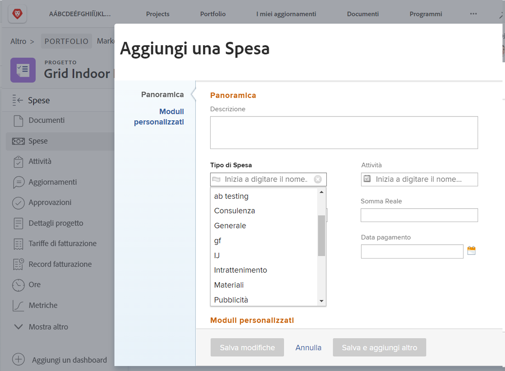

# Imposta i tipi di spesa

Spese in [!DNL Workfront] rappresenta i costi non manodopera associati ai progetti e ad altri lavori. Le spese possono essere, ad esempio, spese di viaggio per visitare un cliente o l’acquisto di forniture necessarie per completare un servizio fotografico. Queste spese devono essere registrate all’interno del progetto, in modo che i costi pianificati e i costi effettivi possano essere calcolati e indicati per qualsiasi progetto.

[!DNL Workfront] dispone di tipi di spesa predefiniti che possono essere utilizzati per l’inserimento delle spese. Non è possibile eliminare o modificare i valori predefiniti, ma è possibile aggiungerne di nuovi.

* Pubblicità
* Consulenza
* Intrattenimento
* Generale
* Materiali
* Stampa
* Spedizione
* Viaggi

Un amministratore di sistema può aggiungere i tipi di spesa necessari per la propria organizzazione. Questi ulteriori tipi di spesa possono essere modificati, nascosti o eliminati per supportare i rapporti finanziari necessari nell&#39;organizzazione.

I project manager, i dirigenti e altri utenti possono generare note spese raggruppando le singole spese per tipo, se necessario, per attività, progetti, programmi o portafogli in [!DNL Workfront]. I dati finanziari del progetto diventano molto più gestibili utilizzando i tipi di spesa.

## Creare un tipo di spesa

**Seleziona [!UICONTROL Configurazione] dal menu principale**

1. Clic **[!UICONTROL Tipi di spesa]** nel menu del pannello sinistro.
1. Fai clic su **[!UICONTROL Nuovo tipo di spesa]** pulsante.
1. Denomina il tipo di spesa.
1. Se necessario, aggiungi una descrizione.
1. Fai clic su **[!UICONTROL Salva]** pulsante.

![Immagine della creazione di un nuovo elemento [!UICONTROL Tipo di Spesa]](assets/setting-up-finances-6.png)

## Utilizzo dei tipi di spesa

Le opzioni di spesa vengono visualizzate nel **[!UICONTROL Tipo di Spesa]** quando gli utenti creano una spesa per un progetto o un’attività in [!DNL Workfront].

