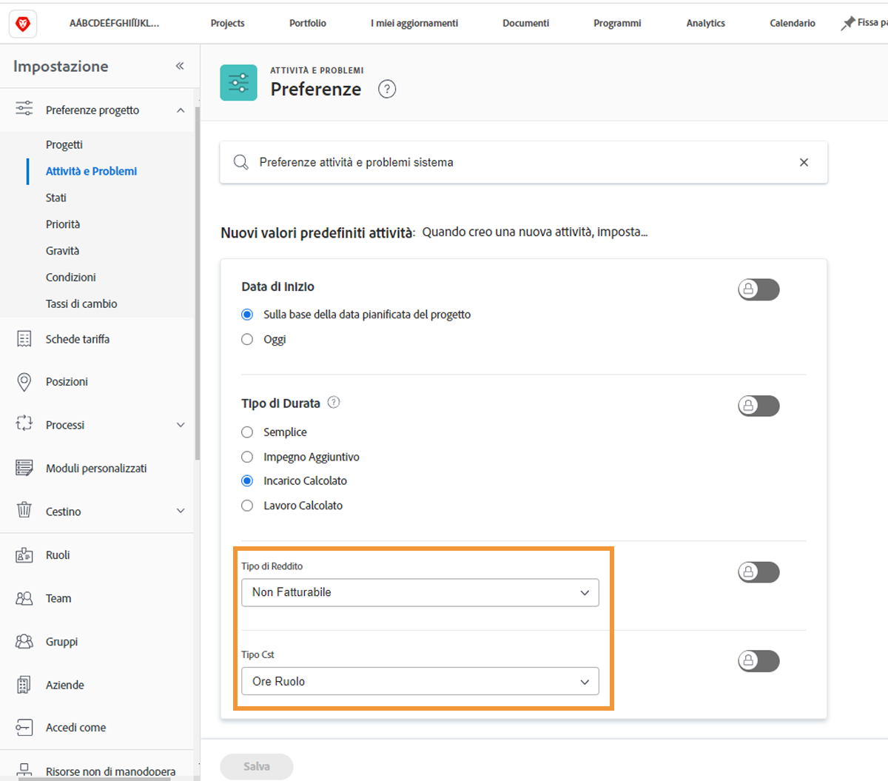

# Impostare i valori predefiniti dei ricavi e dei costi delle attività

Il tipo di ricavo e il tipo di costo vengono utilizzati per calcolare le informazioni finanziarie pianificate ed effettive per un’attività. Le informazioni predefinite per ciascuno di questi tipi possono essere impostate a livello di sistema in modo che si applichino a ogni nuova attività creata. Le informazioni possono essere modificate in singoli progetti o impostate su modelli di progetto.

**Sono disponibili cinque tipi di ricavi predefiniti:**

* Non Fatturabile
* Ore Utente
* Ore Ruolo
* Ore Fisse
* Reddito Fisso

**Sono inoltre disponibili quattro tipi di costo predefiniti:**

* Nessun Costo
* Ore Fisse
* Ore Utente
* Ore Ruolo

>[!NOTE]
>
>Se i tipi di ricavo o di costo sono impostati su Non fatturabile o Nessun costo, le stime dei ricavi e dei costi non vengono generate per l’attività. Pertanto, il lavoro sull’attività non contribuisce ai ricavi o ai costi a livello di progetto.

## Impostare i ricavi e i costi predefiniti

Dal menu principale, seleziona **[!UICONTROL Configurazione]**.

1. Fai clic su **[!UICONTROL Preferenze progetto]** nel menu del pannello a sinistra.
1. Quindi fai clic su **[!UICONTROL Attività e problemi]**.
1. Nella sezione [!UICONTROL Nuova attività predefinita], seleziona il [!UICONTROL Tipo di ricavo] e il [!UICONTROL Tipo di costo] desiderati.
1. Al termine, fai clic su Salva.

