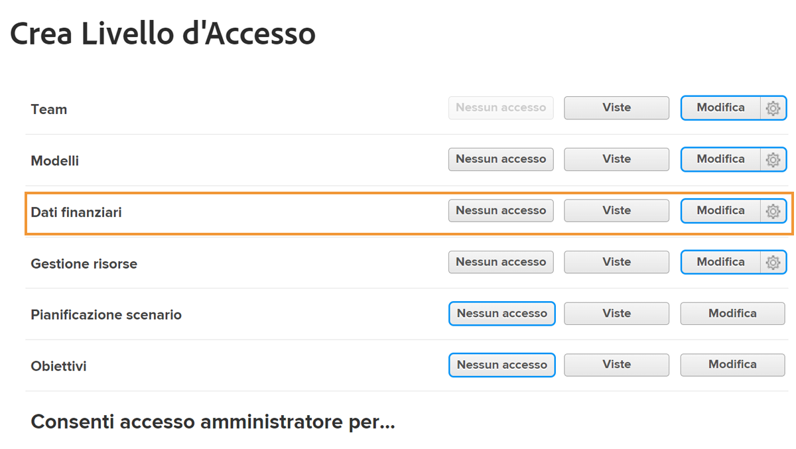
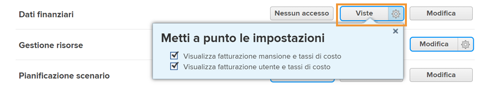

# Informazioni sull’accesso finanziario

Se l’organizzazione acquisisce dati finanziari con [!DNL Workfront], in qualità di amministratore di sistema, è tua responsabilità proteggere e gestire gli utenti che hanno accesso alla visualizzazione e alla modifica di tali informazioni.

Per consentire a un utente di visualizzare o modificare le informazioni finanziarie sono necessari due elementi:

1. I diritti di accesso devono essere abilitati in [!UICONTROL Livello di accesso].
2. L’autorizzazione a utilizzare tali diritti di accesso deve essere concessa oggetto per oggetto.

Ad esempio, a un utente possono essere concessi i diritti per visualizzare i dati finanziari nel proprio livello di accesso, ma può visualizzare solo i dati finanziari su un’attività condivisa con lui e la visualizzazione finanziaria è abilitata nella condivisione di tale attività.

Quindi per un utente con i diritti di [!UICONTROL Livello di accesso] è possibile visualizzare specifici dati su alcuni oggetti e non su altri, a seconda delle opzioni di condivisione individuali di tali oggetti. Tuttavia, nessun utente può visualizzare i dati finanziari su qualsiasi oggetto a meno che non abbia il diritto concesso nel [!UICONTROL Livello di accesso].

## Impostazioni del [!UICONTROL Livello di accesso]

L’accesso generale ai dati finanziari è concesso in primo luogo dal tipo di licenza di [!DNL Workfront].

Le licenze di **[!UICONTROL Pianificazione] possono:**

* Gestire record fatturazione
* Gestire e visualizzare la fatturazione dei ruoli e i tassi di costo
* Gestire e visualizzare la fatturazione utente e le tariffe di costo
* Gestire le spese
* Visualizzare e modificare dati finanziari

Le licenze di **[!UICONTROL Lavoro] possono:**

* Gestire le spese
* Visualizzare dati finanziari

Le licenze di **[!UICONTROL Revisione] possono:**

* Visualizzare dati finanziari

**Le autorizzazioni possono essere modificate dal [!UICONTROL  Livello di accesso]. Le tre opzioni per l’accesso ai dati finanziari sono:**

* [!UICONTROL Nessun accesso]: l’utente non sarà in grado di visualizzare le informazioni finanziarie.
* [!UICONTROL Visualizza]: l’utente può esaminare e condividere le informazioni.
* [!UICONTROL Modifica]: l’utente può creare, modificare, eliminare e condividere le informazioni. (Disponibile solo per una licenza di Pianificazione.)

È importante notare che le opzioni [!UICONTROL Visualizza] e [!UICONTROL Modifica] hanno impostazioni aggiuntive per la licenza di [!UICONTROL Pianificazione]. Fai clic sull’icona a forma di ingranaggio del pulsante [!UICONTROL Visualizza] per queste opzioni:

**[!UICONTROL Visualizza]**

* Visualizza fatturazione mansione e tassi di costo
* Visualizza fatturazione utente e tassi di costo

**[!UICONTROL Modifica]**

Queste due opzioni sono disponibili in [!UICONTROL Modifica], insieme a:

* Modifica fatturazione mansione e tassi di costo
* Modifica fatturazione utente e tassi di costo

>[!NOTE]
>
>Un utente con accesso per aggiungere spese, può anche visualizzare quelle che aggiunge, nonché le spese aggiunte dai suoi referenti diretti.
