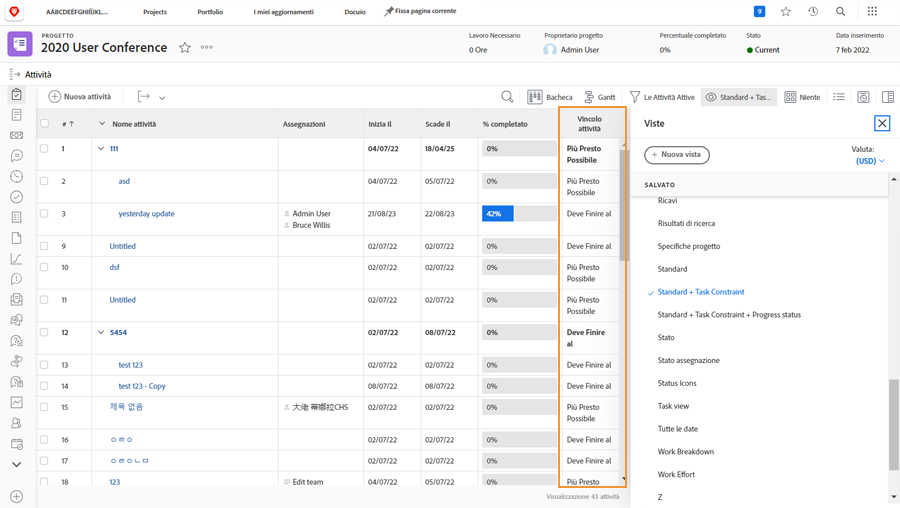

# Tracciare l’avanzamento dalla timeline del progetto

Assicurati che le attività procedano come dovrebbero per rispettare le scadenze del progetto. Durante l’analisi dell’elenco [!UICONTROL Attività], sono disponibili diverse funzioni in [!DNL  Workfront] che consentono di monitorare l’avanzamento e lo stato del lavoro.

## Percentuale completata

La percentuale di completamento di ciascuna attività lavorativa viene talvolta utilizzata per misurare l’avanzamento del lavoro. È importante tenere presente...questo campo deve essere modificato manualmente, poiché rappresenta la stima dell’assegnatario del livello di avanzamento.

>[!TIP]
>
>Sebbene la percentuale di completamento delle attività lavorative debba essere aggiornata manualmente, la percentuale di completamento di un’attività principale viene calcolata da Workfront in base alla percentuale di completamento e alla durata o alle ore pianificate di ciascuna attività secondaria. Ciò significa che otterrai una percentuale di completamento più precisa se suddividi attività di grandi dimensioni in attività secondarie più piccole.

![Elenco attività progetto con colonna [!UICONTROL Percentuale di completamento] ](assets/planner-fund-task-percent-complete.png)

Esistono tre casi in cui la percentuale di completamento cambia automaticamente:

* Quando l’attività [!UICONTROL Stato] è impostata su Completato, la percentuale di completamento diventa 100.
* Se l’attività [!UICONTROL Stato] torna a Nuovo, la percentuale di completamento viene reimpostata su 0.
* In un’attività principale, quando cambia la percentuale di completamento di un’attività secondaria.

## Stato

Includi la colonna[!UICONTROL Stato] in una [!UICONTROL Vista] per vedere rapidamente quali attività sono state avviate, quali sono in corso e quali sono completate. È anche possibile impostare la formattazione condizionale in una [!UICONTROL Vista] per codificare a colori ogni stato, rendendo le informazioni più facili da decifrare.

## Assegnazioni attività

Mentre rivedi il progetto, rivedi le assegnazioni delle attività. Forse il lavoro è rimasto indietro perché l’attività non era stata assegnata a nessuno. O forse la persona assegnata non aveva le giuste competenze per completare l’attività. Aggiungi più persone a un’attività o riassegna le attività per assicurarti che il lavoro venga completato.

## Vincolo attività

A volte i vincoli delle attività vengono modificati e potresti non accorgertene. I vincoli possono influenzare il comportamento della timeline, quindi dovresti assicurarti che siano impostati come desideri.

Crea una vista personalizzata che includa la colonna [!UICONTROL Vincolo attività] per visualizzare queste informazioni nell’elenco delle attività. Se il progetto è stato pianificato da una data di inizio, si desidera che le attività abbiano il vincolo [!UICONTROL Il prima possibile] ([!UICONTROL ASAP]).

Per ulteriori dettagli sui vincoli delle attività consulta[ Comprendere e gestire i tipi di durata e i vincoli delle attività](https://experienceleague.adobe.com/docs/workfront-learn/tutorials-workfront/manage-work/intermediate-projects/understand-and-manage-duration-types-and-task-constraints.html?lang=it).
