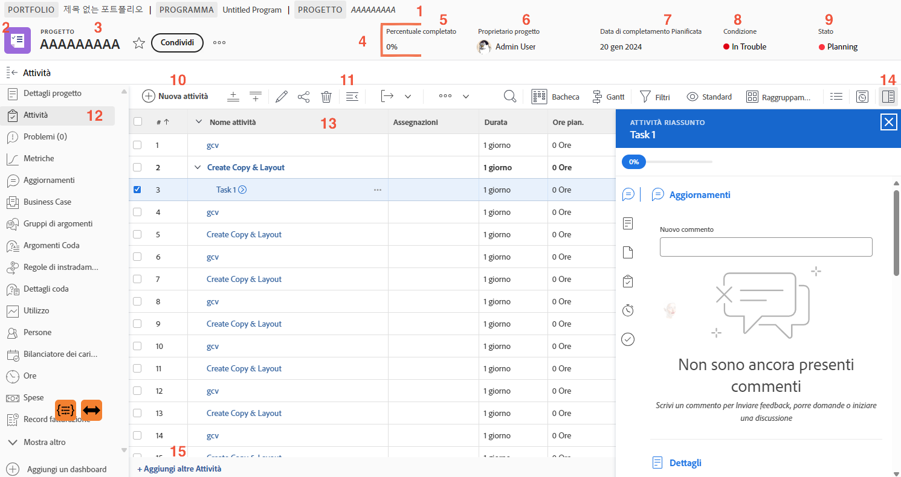

# Usare la pagina del progetto

Questo video fornisce una panoramica della navigazione e della gestione della pagina del progetto in Workfront. &#x200B; Le sue funzionalità principali includono:

* **Intestazione progetto:** Visualizza informazioni essenziali quali la percentuale di completamento, il project manager, la data di completamento pianificata, la condizione del progetto e lo stato. &#x200B; Lo stato consente di tenere traccia della fase del progetto e attiva le notifiche. &#x200B;
* **Navigazione breadcrumb:** mostra la posizione del progetto all&#39;interno del programma e del portfolio dell&#39;organizzazione, con collegamenti selezionabili per facilitarne la navigazione. &#x200B;
* **Preferiti e menu:** I Preferiti iniziano a contrassegnare il progetto per l&#39;accesso rapido, mentre il menu offre opzioni quali la modifica dei dettagli, la copia del progetto e il ricalcolo delle timeline. &#x200B;
* **Elenco attività:** rappresenta i passaggi nel piano del progetto. &#x200B; Utilizza i filtri rapidi per individuare le attività, modificare in linea per apportare modifiche rapide e il pannello di riepilogo delle attività per informazioni dettagliate. &#x200B; Facendo clic sul nome di un’attività si apre la relativa pagina dedicata. &#x200B;
* **Pannello sinistro:** consente di accedere a varie sezioni del progetto, ad esempio dettagli, aggiornamenti e documenti. &#x200B; Il pannello può essere personalizzato dall’amministratore di sistema. &#x200B;
* **Sezione aggiornamenti:** centralizza le comunicazioni sul progetto, consentendo l&#39;assegnazione di tag agli utenti, la risposta ai commenti e la visualizzazione degli aggiornamenti aggregati da attività, problemi e documenti. &#x200B;
* **Sezione documenti:** consente di caricare e gestire file e bozze relativi al progetto. &#x200B; I documenti allegati alle attività vengono aggregati a livello di progetto per un facile accesso. &#x200B;

>[!VIDEO](https://video.tv.adobe.com/v/3449734/?quality=12&learn=on&enablevpops=1&captions=ita)

## Punti chiave da eliminare

* **Panoramica intestazione progetto:** Accedi rapidamente ai dettagli chiave del progetto come percentuale di completamento, project manager, data di scadenza, stato e condizione. &#x200B; Lo stato controlla anche le notifiche e le fasi del flusso di lavoro. &#x200B;
* **Gestione attività:** Utilizza l&#39;elenco delle attività per tenere traccia dei passaggi del progetto, applicare filtri rapidi per trovare le attività e apportare modifiche in linea. &#x200B; Accedere a informazioni dettagliate sull&#39;attività tramite il pannello di riepilogo o la pagina dell&#39;attività. &#x200B;
* **Navigazione breadcrumb:** Naviga nella gerarchia del progetto all&#39;interno dell&#39;organizzazione utilizzando i collegamenti selezionabili nella traccia delle breadcrumb. &#x200B;
* **Aggiornamenti centralizzati:** tutti gli aggiornamenti da attività, problemi e documenti vengono aggregati nella sezione Aggiornamenti del progetto, semplificando la comunicazione e il tracciamento. &#x200B;
* **Organizzazione documento:** Carica e gestisci i file e le bozze relativi al progetto nella sezione documenti, assicurandoti che i documenti pertinenti siano allegati alle attività per una collaborazione semplificata. &#x200B;

## Parti chiave della pagina del progetto

[Fare clic qui](/help/assets/key-parts-of-the-project-page.pdf) per scaricare un PDF di questa pagina.

La pagina del progetto è ricca di funzioni per agevolare la gestione del lavoro. Se desideri un’opzione che non è visibile nell’istanza di [!DNL Workfront], rivolgiti all’amministratore di sistema. Di seguito sono riportate alcune delle funzioni principali della pagina del progetto di cui tenere conto.

1. **Percorso breadcrumb:** naviga all&#39;interno della gerarchia di portfolio e programmi alla base del progetto.
2. **Tipo oggetto:** la visualizzazione del tipo di oggetto sulla pagina di destinazione consente di identificare ciò che si sta esaminando in [!DNL Workfront]. La durata del “progetto” può essere personalizzata dall’amministratore di sistema di [!DNL Workfront].
3. **Nome progetto:** il nome del progetto che stai visualizzando. Fai clic sul nome per modificarlo.
4. **Intestazione progetto:** informazioni standard disponibili su tutte le pagine del progetto.
5. **[!UICONTROL Percentuale di completamento:]** si aggiorna automaticamente, in base alle attività completate nel progetto.
6. **[!UICONTROL Proprietario del progetto]:** nella maggior parte delle organizzazioni, è il project manager. Si tratta della persona responsabile della gestione del progetto in [!DNL Workfront] e della conferma del completamento.
7. **[!UICONTROL Data di completamento pianificata]:** la data di completamento pianificata del progetto viene impostata dal project manager attraverso la timeline del progetto.
8. **[!UICONTROL Condizione]:** la[!UICONTROL &#x200B; condizione] è una rappresentazione visiva dell&#39;avanzamento del progetto. [!DNL Workfront] può configurare automaticamente la [!UICONTROL condizione] in base allo stato di avanzamento delle attività del progetto. In alternativa, la [!UICONTROL condizione] può essere impostata manualmente attraverso i dettagli del progetto.
9. **[!UICONTROL Stato]:** lo [!UICONTROL stato] indica dove si trova il progetto all’interno di un processo, ovvero se è ancora in fase di pianificazione o è in corso, oppure se tutto il lavoro inerente il progetto è stato completato.
10. **[!UICONTROL Nuova attività]:** fai clic su questa opzione per creare una nuova attività nel progetto. L’attività viene generata alla fine dell’elenco.
11. **[!UICONTROL Esporta]:** esporta l’elenco attività o le attività selezionate in un file PDF, foglio di calcolo o file delimitato da tabulazioni.
12. **Menù del pannello a sinistra:** tramite il pannello a sinistra, accedi a diverse informazioni sul progetto. Se hai bisogno di un po’ più di spazio sullo schermo, fai clic sull’icona Attività in alto per comprimere il pannello. Trascina le icone in modo che il loro ordine ti consenta di lavorare in modo efficiente. Le opzioni visualizzate sono impostate dall’amministratore di sistema di [!DNL Workfront].
13. **Elenco attività:** l’elenco delle attività mostra tutte le attività che compongono il piano del progetto. Le informazioni visibili su ciascuna attività sono determinate dalla vista selezionata.
14. **Pannello Riepilogo:** il pannello di riepilogo consente di esaminare rapidamente le informazioni relative all’attività selezionata. Fai clic sull’icona del pannello riepilogo per aprirlo o chiuderlo.
15. **Aggiungi altre attività** Fai clic qui per aggiungere un’altra attività in fondo all’elenco delle attività mediante la modifica in linea.

## Tutorial consigliati su questo argomento

* [Informazioni sulla creazione di un progetto di base](/help/manage-work/projects/understand-basic-project-creation.md)
* [Scopri quattro modi per creare un progetto](/help/manage-work/projects/understand-other-ways-to-create-projects.md)
* [Compilare i dettagli del progetto](/help/manage-work/projects/fill-in-the-project-details.md)

