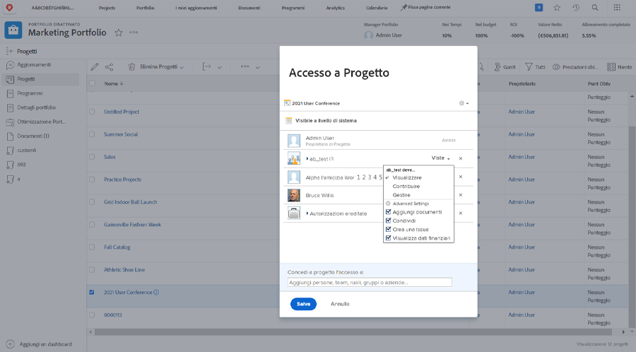

# Condividere un progetto

Fornire visibilità alle parti interessate e ai collaboratori nel progetto è una parte importante della gestione di un progetto.

Assicurati che tutti possano vedere le informazioni di cui hanno bisogno condividendo il progetto. In Workfront, questa operazione viene eseguita con il [!UICONTROL Condividi] opzione . Puoi eseguire questa operazione dal singolo progetto, dal [!UICONTROL Altro] nell&#39;intestazione.

Oppure puoi condividere più progetti contemporaneamente dall’elenco dei progetti nella [!UICONTROL Progetti] selezionando i progetti e facendo clic sul pulsante [!UICONTROL Condividi] pulsante .

La condivisione del progetto consente a tutte le persone coinvolte di visualizzare le informazioni sul progetto quando necessario.

<!---
Learn More Icon
Share permissions on objects
Share a project
--->
