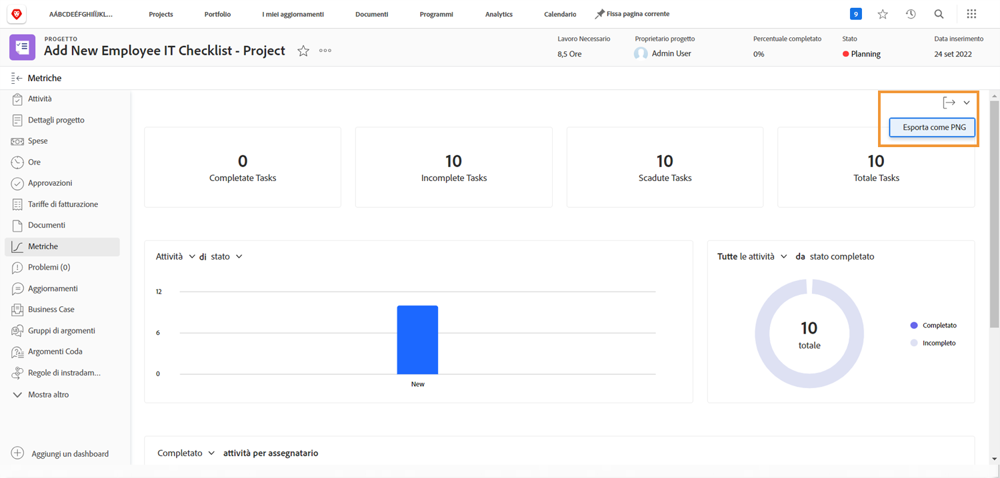

# Tenere traccia dell’avanzamento del lavoro con le metriche del progetto

In questo video scoprirai come:

* accedere ai grafici delle metriche del progetto
* Personalizzare le informazioni nei grafici

>[!VIDEO](https://video.tv.adobe.com/v/336667/?quality=12&learn=on)

Puoi esportare l’intera dashboard delle metriche del progetto come file .png con il pulsante [!UICONTROL Esporta]. In questo modo è facile condividere i dati con altri utenti tramite e-mail o presentazioni.

<!---
Overview of project metrics
--->
