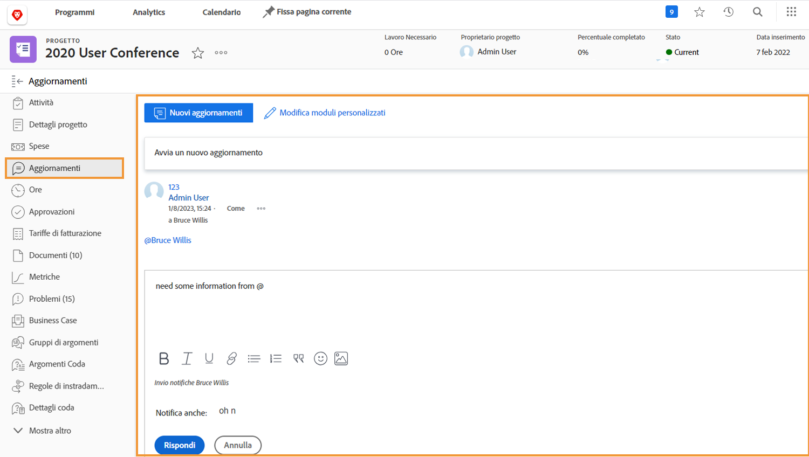

# Comprendere la comunicazione del progetto

Come si dice, il 90% della gestione di un progetto è comunicazione. Comunica con il team di progetto, i tuoi manager e gli interessati del progetto.

Ma quando i team di progetto utilizzano e-mail, messaggistica istantanea, riunioni e note adesive per la comunicazione dei progetti, le informazioni vengono sparse... o peggio, dimenticate. Informazioni sul lavoro del progetto nel [!DNL Workfront] utilizzo degli aggiornamenti.

Poiché i membri del team di progetto stanno lavorando alle assegnazioni, possono eseguire aggiornamenti da [!DNL Workfront] [!UICONTROL Pagina principale] sui compiti loro assegnati.

Aggiornamenti da attività, problemi e documenti fino a livello di progetto [!UICONTROL Aggiornamenti] scheda, per visualizzare le informazioni in modo rapido e semplice.

Poi è possibile rispondere agli aggiornamenti, semplicemente facendo clic sul pulsante . Questo mantiene tutte le conversazioni in un&#39;unica posizione, consentendoti di farvi riferimento in un secondo momento.

<!---
learn more urls
Communicate about work in Home
Subscribe to items in Workfront
Update work
--->
