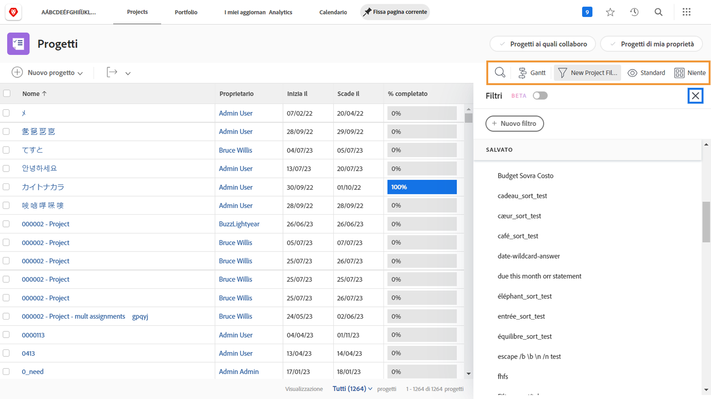
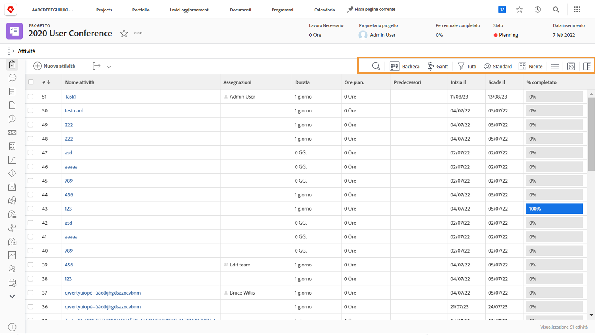

# Visualizzare le informazioni sul progetto

Nella pagina principale [!UICONTROL Progetti] o in un singolo progetto, puoi usare [!UICONTROL Filtri], [!UICONTROL Viste] e [!UICONTROL Raggruppamenti] in modo da visualizzare nell’elenco le informazioni che ti servono.

Nella pagina [!UICONTROL Progetti] trovi un aveduta d’insieme dello stato di avanzamento di tutti i tuoi progetti.

Utilizza i [!UICONTROL Filtri] per limitare l’elenco in base a determinati criteri. Quindi seleziona una [!UICONTROL Vista] per visualizzare le colonne di informazioni pertinenti per i progetti. Infine, seleziona un [!UICONTROL Raggruppamento] per organizzare i progetti in base alle tue esigenze.

Quando ti trovi nella sezione [!UICONTROL Attività] di un progetto, utilizza di nuovo [!UICONTROL Filtri], [!UICONTROL Viste] e [!UICONTROL Raggruppamenti] per monitorare il lavoro in corso. Dal momento che esamini le attività anziché i progetti, le opzioni disponibili sono diverse.

La maggior parte della clientela di [!DNL Workfront] crea viste personalizzate che espongono informazioni su moduli personalizzati e altri campi pertinenti per il lavoro in corso.

## Scopri come creare filtri, viste e raggruppamenti personalizzati

[Creare un filtro di base](https://experienceleague.adobe.com/docs/workfront-learn/tutorials-workfront/reporting/basic-reporting/create-a-basic-filter.html?lang=it)

[Creare una vista di base](https://experienceleague.adobe.com/docs/workfront-learn/tutorials-workfront/reporting/basic-reporting/create-a-basic-view.html?lang=it)

[Creare un raggruppamento di base](https://experienceleague.adobe.com/docs/workfront-learn/tutorials-workfront/reporting/basic-reporting/create-a-basic-grouping.html?lang=it)
