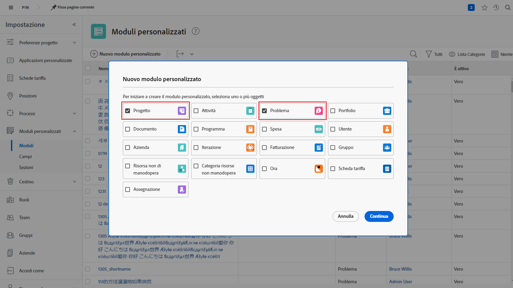
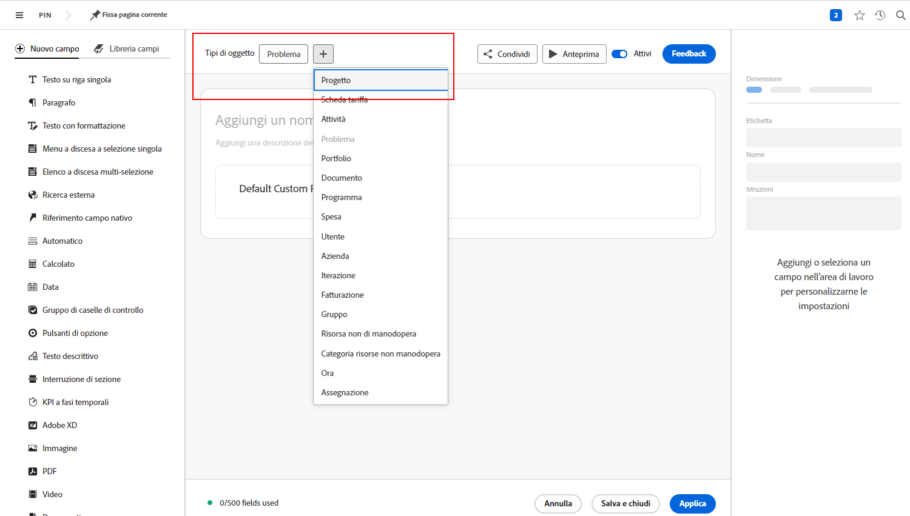

# Risposte alle domande più comuni sulle code di richieste

**Perché vedo una coda di richieste, ma il mio utente non la vede?**

Nella scheda [!UICONTROL Dettagli coda] della tua coda di richieste o nel tuo progetto, assicurati che l’utente soddisfi i criteri del campo “Chi può aggiungere richieste a questa coda?” .

Per ulteriori informazioni, guarda questo video:

>[!VIDEO](https://video.tv.adobe.com/v/3434156/?quality=12&learn=on&enablevpops)

**Ho concesso agli utenti l’accesso alla coda, ma ora possono vedere anche il progetto della coda delle richieste. Perché?**

Nell’elenco “Chi può aggiungere richieste a questa coda?”, se scegli “Persone con accesso in visualizzazione al progetto”, tutti coloro a cui concedi i diritti di visualizzazione per consentire l’utilizzo della coda richieste potranno visualizzare la coda delle richieste anche in un elenco di progetti. Per evitare che si verifichi questa situazione, utilizza l’opzione “Persone nella società del progetto” o “Persone nel gruppo del progetto”.

**Posso trasformare una richiesta in un progetto?**

Sì. Puoi convertire i problemi in attività o progetti in base alle necessità.

Questi tutorial ti illustreranno come:

* [Convertire un problema o una richiesta in un progetto](/help/manage-work/issues-requests/create-a-project-from-a-request.md)

* [Convertire un problema/richiesta in un’attività](/help/manage-work/issues-requests/convert-issues-to-other-work-items.md)

**Dove trovo una coda di richieste per apportarvi modifiche?**

Puoi usare il campo [!UICONTROL Ricerca] nella barra di navigazione opure puoi trovarla elencata nell’area [!UICONTROL Progetti].

Se apri una richiesta dalla coda di richieste, puoi fare clic sul nome del progetto nell’area delle breadcrumb.

**Posso trasferire le informazioni da un modulo personalizzato di una richiesta a un modulo personalizzato di un progetto?**

Sì. Quando crei un modulo personalizzato, seleziona [!UICONTROL Progetto] e [!UICONTROL Problema] come tipi di oggetto. È anche possibile modificare un modulo personalizzato di un progetto in modo includere il tipo di oggetto problema (e viceversa).

Allega il modulo personalizzato alla richiesta. Quando converti la richiesta in un progetto, il modulo personalizzato verrà automaticamente allegato al nuovo progetto e i valori contenuti in tutti i campi verranno visualizzati sia nella richiesta che nei moduli personalizzati del progetto.

**Sto guardando un progetto o un rapporto di attività. Come posso capire da quale richiesta proviene questo oggetto?**

Per aggiungere tali informazioni ai rapporti di progetto e attività, puoi accedere ai campi nelle origini campo **[!UICONTROL Problema convertito]** e il **[!UICONTROL Referente problema convertito]**.

Per ulteriori informazioni, guarda questo video:

>[!VIDEO](https://video.tv.adobe.com/v/3434176/?quality=12&learn=on&enablevpops)

**Qual è il modo migliore per filtrare le code di richieste in un rapporto?**

Se il filtro del progetto include **Coda>>È pubblico>>Uguale a>>Nessuno** il rapporto mostrerà solo i progetti che **NON** sono code di richieste.

Se il filtro del progetto include **Coda>>È pubblico>>Non uguale a>>Nessuno** il rapporto mostrerà solo i progetti che **SONO** code di richieste.

Per ulteriori informazioni, guarda questo video:

>[!VIDEO](https://video.tv.adobe.com/v/3434329/?quality=12&learn=on&enablevpops)

**È una buona idea creare uno stato personalizzato della coda richieste?**

Alcuni clienti creano uno stato personalizzato di Coda richieste che corrisponde a Corrente. Possono quindi eseguire un rapporto contenente tutte le code di richieste oppure escluderle facilmente da un rapporto. Questo metodo ha il vantaggio di essere più semplice rispetto all’uso di **Coda>>È pubblico>>Non uguale a>>Nessuno**, ma presenta anche uno svantaggio, ovvero gli utenti che creano code di richieste potrebbero dimenticarsi di usarlo, in quanto lo stato Corrente è comunque attivo ed è lo stato visibile nella maggior parte del materiale di formazione. Per questo motivo, molti clienti scelgono di non utilizzare uno stato personalizzato di Coda richieste.

Se, tuttavia, stai già utilizzando lo stato Coda richieste nell’organizzazione e vuoi solo avere la certezza che sia utilizzato correttamente (o correggere i casi in cui non lo è), puoi creare il rapporto **Code richieste attive** descritto nel video precedente e modificare il filtro da **Progetto>>Stato equivale a>>Uguale a>>Corrente** a **Progetto>>Stato>>Uguale a>>Corrente**. Verranno visualizzate tutte le code di richieste attive che utilizzano lo stato Corrente anziché lo stato Coda richieste che avrebbero dovuto utilizzare. Seleziona tutti i progetti visualizzati ed esegui una modifica in blocco per cambiare gli stati su Coda richieste.

## Tutorial consigliati su questo argomento

* [Comprendere le code di richieste](/help/manage-work/request-queues/understand-request-queues.md)
* [Creare una coda di richieste](/help/manage-work/request-queues/create-a-request-queue.md)
* [Comprendere le impostazioni per un flusso di richieste](/help/manage-work/request-queues/understand-settings-for-a-flow-request.md)
* [Creare un flusso di richieste](/help/manage-work/request-queues/create-a-request-flow.md)
* [Creare una coda richieste di feedback dell’amministratore di sistema](/help/manage-work/request-queues/create-a-system-admin-feedback-request-queue.md)
