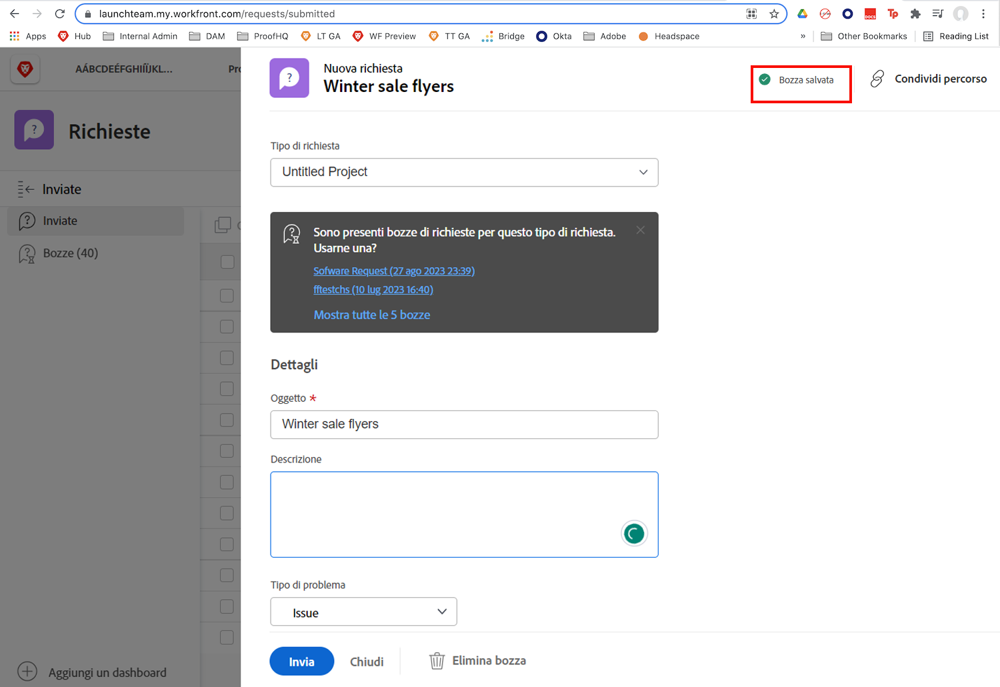
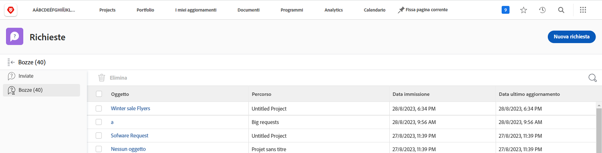

# Comprendere le code di richieste

In questo video scoprirai:

* Come inviare una richiesta tramite una coda richieste di [!DNL  Workfront]
* Struttura delle code di richieste

>[!VIDEO](https://video.tv.adobe.com/v/335220/?quality=12&learn=on)

## Richiedi salvataggio automatico delle bozze

Quando inizi a compilare un modulo di richiesta, [!DNL Workfront] salva automaticamente una bozza dopo aver compilato il campo [!UICONTROL Soggetto]. Ciò significa che non perderai dati se devi uscire dall’area [!UICONTROL Richieste] per eseguire un’altra operazione o se devi sospendere nel bel mezzo della richiesta per raccogliere ulteriori informazioni.

Nella parte superiore della finestra viene visualizzata un’indicazione del salvataggio della bozza. [!DNL Workfront] salva una bozza della richiesta, anche se i campi obbligatori non sono ancora stati compilati.

Quando è tutto pronto per inviare la richiesta, questa sarà disponibile nella scheda [!UICONTROL Bozze]. Fare clic sul nome per aprirla e completare la compilazione del modulo. Quindi fai clic su [!UICONTROL Invia richiesta] al termine.

## Tocca a te

Dedichiamo un minuto alla verifica delle informazioni appena presentate.

**Domanda:** come si effettua una richiesta in Workfront? Elenca i passaggi in ordine.

* Scegli il tipo di richiesta da effettuare
* Fai clic su Invia richiesta
* Compila le informazioni nel modulo
* Fai clic su “Nuova richiesta”
* Passare all’area richieste

**Risposta:** passa all’area richieste > Fai clic su Nuova richiesta > Scegli il tipo di richiesta da creare > Compila le informazioni nel modulo > Fai clic su Invia richiesta

**Domanda:** una richiesta è davvero un ...

**Risposta:** problema

<!---
You can also access request drafts from the [!UICONTROL Select a Request Type] menu at the top of the window. Select an option from the [!UICONTROL Recent Drafts] section, or start a new request by picking a queue from the [!UICONTROL New Requests] section. Fill everything out like normal, then submit the request.

<!---
image
--->

<!---
Let's take a minute to review the information you were just presented.

How do you make a request in Workfront? List the steps in order.
Choose the request type you need to make
Click Submit request
Fill out the information on the form
Click "New Request"
Navigate to the request area

Answer: Navigate to the request area>Click New Request>Choose the request type you need to make>Fill out the information on the form>Click Submit request

A request is really an......

Answer: Issue
--->
