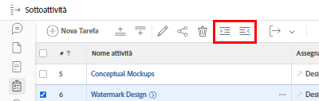
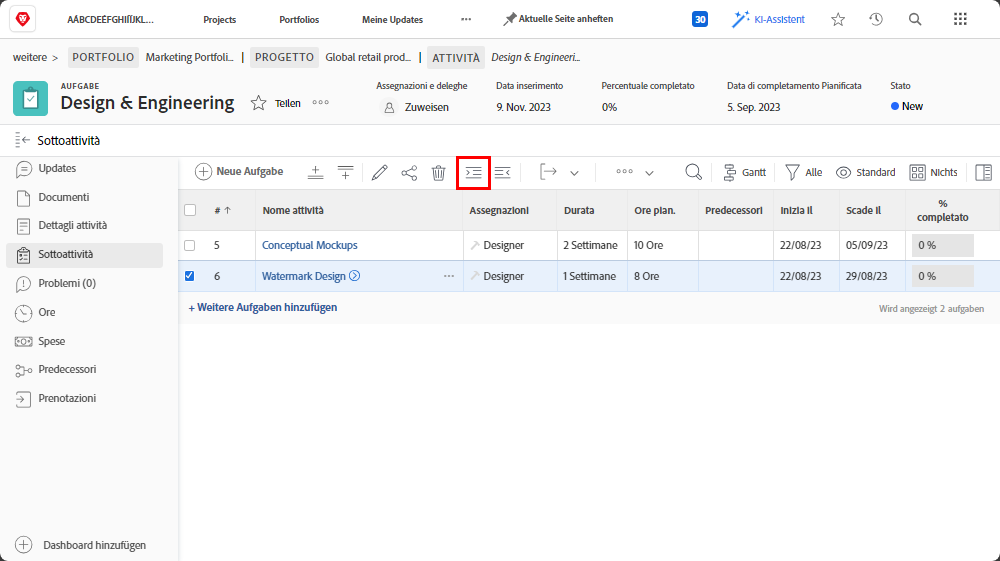
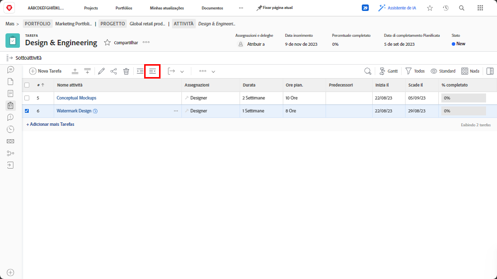

# Comprendere le attività principali e secondarie

In questo video scoprirai:

* Struttura delle attività in un progetto [!DNL Workfront]

>[!VIDEO](https://video.tv.adobe.com/v/335087/?quality=12&learn=on)

## Convertire un’attività in attività secondaria e viceversa

I pulsanti **Rientro** e **Rientro negativo** consentono rispettivamente di convertire un’attività in sottoattività e viceversa.

Seleziona l’attività “[!UICONTROL Watermark Design]” (Grafica filigrana) e fai clic sul pulsante **Rientro**. “[!UICONTROL Watermark Design]” (Grafica filigrana) diventerà un’attività secondaria dell’attività “[!UICONTROL Conceptual Mockups]” (Mockup concettuali) che diventerà quindi un’attività principale.

Seleziona l’attività secondaria “[!UICONTROL Watermark Design]” (Grafica filigrana) e fai clic sul pulsante **Rientro negativo**. “[!UICONTROL Watermark Design]” (Grafica filigrana) diventa un’attività regolare, allo stesso livello di “[!UICONTROL Conceptual Mockups]” (Mockup concettuali).

