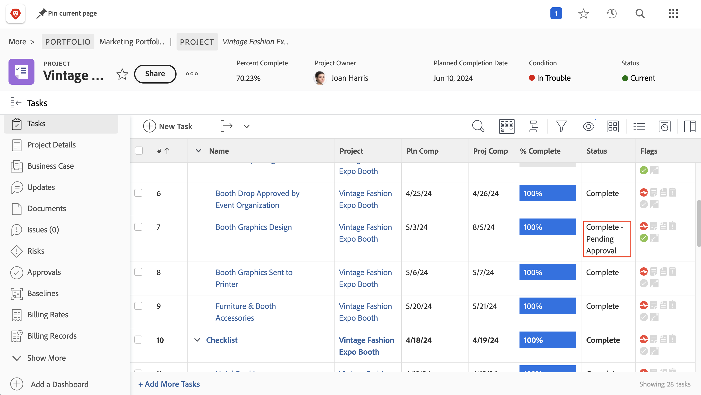
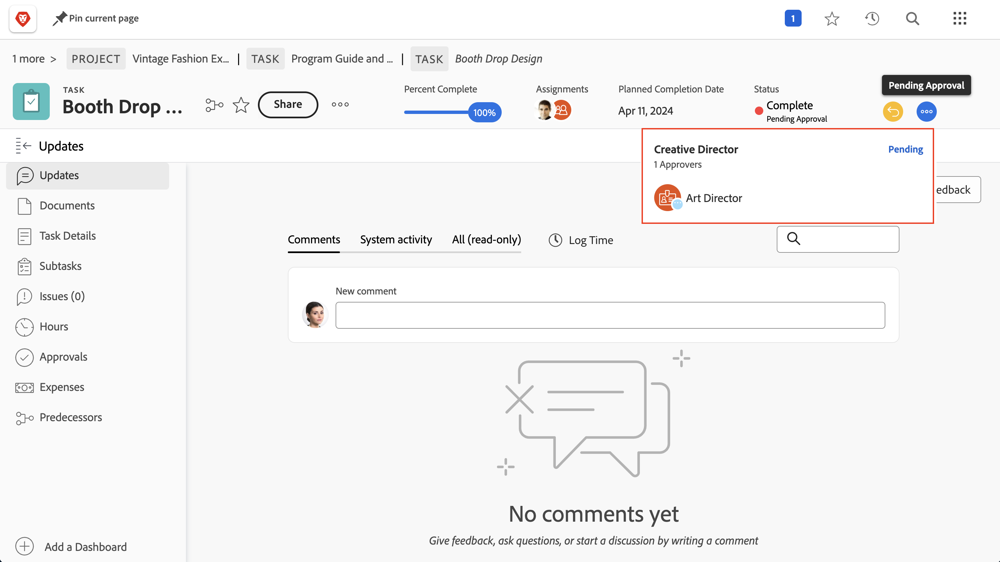
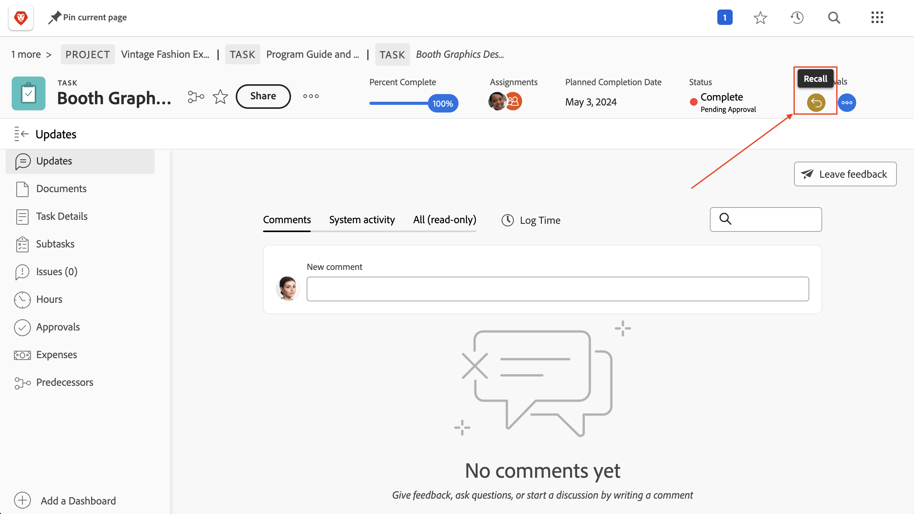

# Completare le approvazioni

Le approvazioni di attività e problemi fanno parte di molti progetti. Ma le approvazioni non risolte ti impediranno di impostare lo stato del progetto su Completato.

Ecco come trovarli e come gestirli.

Nella sezione [!UICONTROL Attività] del progetto, seleziona una [!UICONTROL Vista] che include la colonna [!UICONTROL Stato], ad esempio la vista [!UICONTROL Stato]. Una rapida occhiata alla colonna mostrerà se è presente un’approvazione incompleta su un’attività con “[!UICONTROL - In attesa di approvazione]” dopo il nome dello stato.

Quando trovi un’attività che è ancora in attesa di approvazione, puoi scegliere tra due opzioni:

## Completare l’approvazione

Ciò potrebbe significare ricordare alla persona a cui è stata assegnata l’approvazione in sospeso. Puoi vedere chi è assegnato come approvatore aprendo l’attività e facendo clic sul menu con tre punti nell’area Approvazioni.

Verrà visualizzata una casella che mostra l’approvatore assegnato.

## Rimuovere l’approvazione

Se l’approvazione non è necessaria, è possibile rimuoverla. Per farlo, devi prima richiamare l’approvazione. Fai clic sul pulsante [!UICONTROL Richiama] nell’area Approvazioni. In questo modo lo stato torna allo stato precedente e sarà possibile rimuovere il processo di approvazione.

Ora fai clic sulla scheda [!UICONTROL Approvazioni] a sinistra, quindi sul pulsante [!UICONTROL Rimuovi] in alto a destra.

## Gestione delle approvazioni dei problemi

Se l’organizzazione tiene traccia dei problemi, degli ordini di modifica o di altri eventi durante i progetti, segui la stessa procedura della sezione [!UICONTROL Problemi] del progetto.
