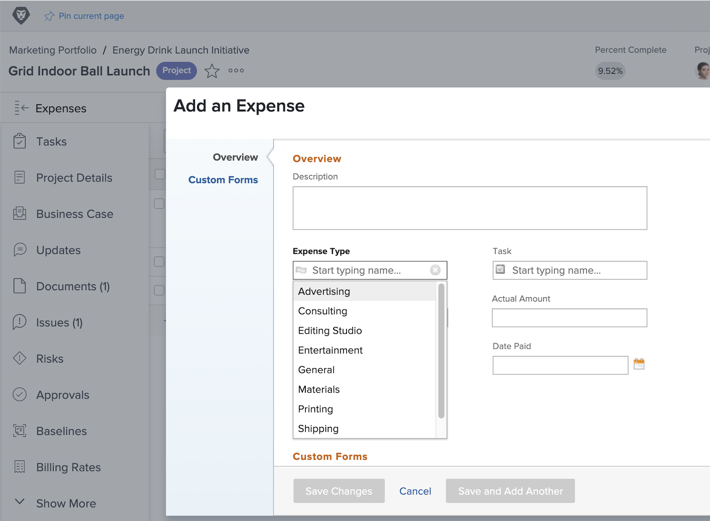

# Impostare i tipi di spesa

Le spese in [!DNL Workfront] rappresentano i costi non di manodopera associati a progetti e altri lavori. Le spese potrebbero essere, ad esempio, le spese di viaggio durante la visita a un cliente o l’acquisto di forniture necessarie per completare un servizio fotografico. Queste spese devono essere registrate all’interno del progetto, in modo che i costi pianificati e i costi effettivi possano essere calcolati e indicati per qualsiasi progetto.

[!DNL Workfront] dispone di tipi di spesa predefiniti che possono essere utilizzati quando si inseriscono le spese. Non è possibile eliminare o modificare i valori predefiniti, ma è possibile aggiungerne di nuovi.

* Pubblicità
* Consulenza
* Intrattenimento
* Generale
* Materiali
* Stampa
* Spedizione
* Viaggi

Un amministratore di sistema può aggiungere i tipi di spesa necessari per la propria organizzazione. Questi ulteriori tipi di spesa possono essere modificati, nascosti o eliminati per supportare i rapporti finanziari necessari nell’organizzazione.

I project manager, i dirigenti e altri possono generare note spese (raggruppando le singole spese per tipo, se lo si desidera) per attività, progetti, programmi o portfolio all’interno di [!DNL Workfront]. I dati finanziari del progetto diventano molto più gestibili utilizzando i tipi di spesa.

## Creare un tipo di spesa

Dal menu principale **,** seleziona [!UICONTROL Configurazione].

1. Fai clic su **[!UICONTROL Tipi di spesa]** nel menu del pannello sinistro.
1. Fai clic sul pulsante **[!UICONTROL Nuovo tipo di spesa]**.
1. Denomina il tipo di spesa.
1. Se necessario, aggiungi una descrizione.
1. Fai clic sul pulsante **[!UICONTROL Salva]**.

![Immagine della creazione di un nuovo [!UICONTROL Tipo di spesa]](assets/setting-up-finances-6.png)

## Utilizzo dei tipi di spesa

Le opzioni di spesa vengono visualizzate nel menu a discesa **[!UICONTROL Tipo di spesa]** quando gli utenti creano una spesa per un progetto o un’attività in [!DNL Workfront].

