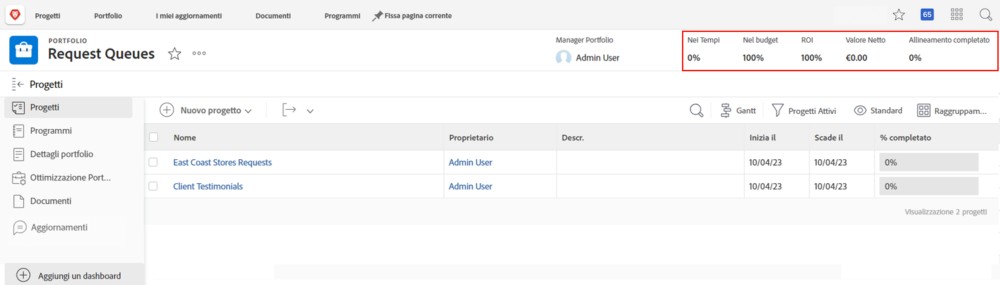
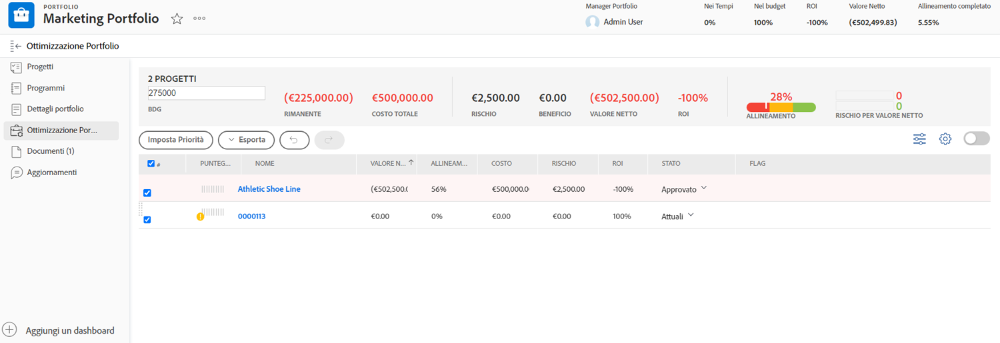

# Panoramica dei portfolio

I manager spesso hanno il difficile compito di capire quali progetti sono più utili per aiutare l’azienda a raggiungere gli scopi e gli obiettivi. Ciò significa giudicare un progetto attuale o potenziale sulla base di criteri importanti per tali obiettivi. Questi criteri possono includere elementi come il numero di risorse necessarie, quanto costerà il progetto rispetto a quanto guadagno porterà e la comprensione dei rischi coinvolti. Grazie a queste informazioni, i manager possono decidere quali progetti realizzare e quando.

Pensare e pianificare progetti non è un compito eccessivamente difficile: è un processo a cui la maggior parte dei manager è abituata. La vera difficoltà arriva quando si confrontano i progetti tra loro. Passare al setaccio un elenco lungo e dettagliato di progetti richiede tempo. È qui che i portfolio in Workfront possono aiutarti.

## Che cos’è un portfolio?

Un portfolio è una raccolta di progetti che vengono completati con le stesse risorse, budget, pianificazione e priorità. Ad esempio, un’agenzia di marketing potrebbe utilizzare un portfolio per raggruppare tutti i progetti di una particolare clientela.

Passai alla sezione **[!UICONTROL Portfolio]** dal [!UICONTROL Menu principale], quindi fai clic sul nome di un portfolio per aprirlo.

Puoi utilizzare il pulsante **[!UICONTROL Nuovo progetto]** per aggiungere facilmente un progetto esistente al portfolio. Oppure puoi creare un nuovo progetto direttamente nel portfolio.

![Immagine del menu a discesa del pulsante [!UICONTROL Nuovo progetto]](assets/01-portfolio-management3.png)

Una volta aggiunti i progetti al portfolio, puoi utilizzare le informazioni di riepilogo nell’intestazione della pagina per ottenere una visualizzazione di alto livello di come questa raccolta di progetti contribuisce, positivamente o negativamente, agli obiettivi generali del portfolio.

Puoi utilizzare lo strumento di ottimizzazione del portafoglio ([!UICONTROL  Ottimizzatore portfolio]) per dare priorità ai progetti in base al valore netto, all’allineamento, ai costi, al rischio e al ROI.

## Accesso ai portfolio

Per lavorare con i portfolio, è necessario che ti venga assegnata una licenza Pianificazione in Workfront e che ti sia assegnato un livello di accesso con le autorizzazioni necessarie per lavorare con i portfolio.

Quando viene creato un portfolio, solo il creatore il manager può accedervi. Puoi concedere ad altri l’accesso al portfolio condividendolo. Ciò dà anche accesso a tutti i programmi e progetti all’interno del portfolio.

Apri il portfolio e fai clic sul menu con tre punti, quindi seleziona **[!UICONTROL Condivisione]**. Aggiungi singoli utenti, team, ruoli, gruppi o aziende che dovrebbero avere accesso. Quindi, determina il tipo di accesso che ciascuno deve avere: gestire o visualizzare.

![Immagine dell’opzione [!UICONTROL Condivisione] in un [!DNL Workfront]portfolio](assets/04-portfolio-management11.png)

<!--
Pro-tips graphic
If a user can't access a specific portfolio, make sure it's shared with them. The Workfront access level determines that a user can access portfolios in general, but sharing makes sure they can see specific portfolios. 
-->

<!--
Learn more graphic and links to documentation articles
* Portfolio overview   
* Create a portfolio 
* Create and manage portfolios 
* Navigate within a portfolio 
* Share a portfolio   
-->
