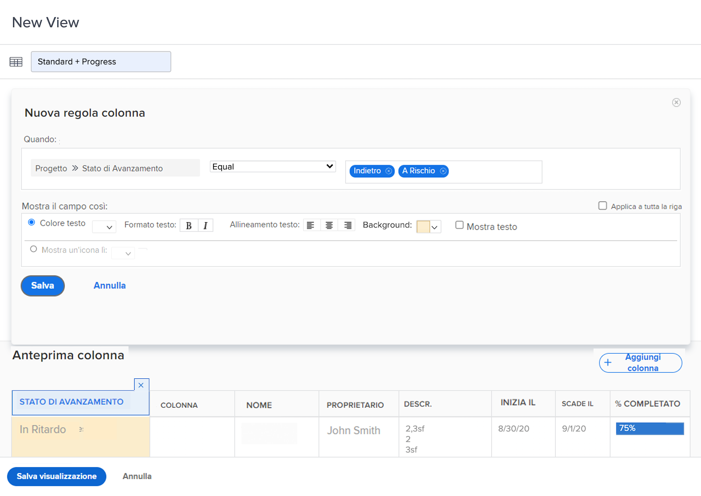

# Aggiungere la formattazione condizionale di base a una vista

La formattazione condizionale viene eseguita creando regole di colonna. Queste consentono di formattare una colonna in modo specifico in base ai criteri impostati.

In questo video scoprirai:

* Cos’è la formattazione condizionale in una vista
* Come creare e modificare la formattazione condizionale

>[!VIDEO](https://video.tv.adobe.com/v/3445449/?quality=12&learn=on&captions=ita)

## Riepilogo formattazione condizionale

Per creare la formattazione condizionale:

1. Scegli la colonna in cui desideri che venga visualizzata la formattazione
1. Decidi in quali condizioni desideri modificare la formattazione
1. Decidi quale tipo di modifica della formattazione funzionerà meglio

   * colore di sfondo
   * colore testo
   * testo sostitutivo
   * mostrare un’icona

## Attività &quot;Aggiungere formattazione condizionale di base a una visualizzazione&quot;

### Attività 1: aggiungere la formattazione condizionale a una visualizzazione

Crea una vista delle attività denominata “Standard + Avanzamento” utilizzando la vista Standard esistente e aggiungendo questa formattazione condizionale alla colonna [!UICONTROL Nome].

1. Aggiungi una regola di colonna che colori di rosso lo sfondo del campo se lo stato di avanzamento dell’attività è In ritardo.
1. Aggiungi una regola di colonna che colori di giallo lo sfondo del campo quando lo stato di avanzamento è Indietro o A rischio.

Questo consente di individuare le attività che presentano dei problemi senza includere nella vista la colonna relativa allo stato di avanzamento.

### Risposta 1

1. In un rapporto di elenco delle attività, passa al menu a discesa **[!UICONTROL Vista]** e seleziona **[!UICONTROL Nuova vista]**.
1. Assegna alla vista il nome “Standard + Avanzamento”
1. Utilizza le colonne predefinite fornite.
1. Seleziona la colonna l[!UICONTROL Nome attività]. Questa è la colonna a cui verrà applicata la formattazione condizionale, in modo che diventi rossa o gialla se lo stato di avanzamento dell’attività non è Nei tempi.
1. Fai clic su **[!UICONTROL Opzioni avanzate]** in alto a destra nella finestra per la creazione del rapporto.
1. Fai clic su **[!UICONTROL Aggiungi una regola per la colonna]**.
1. Per iniziare a creare la regola di colonna, cambia [!UICONTROL Attività] > [!UICONTROL Nome] nella parte superiore della finestra in [!UICONTROL Attività] > [!UICONTROL Stato di avanzamento]. Fai clic solo sull’icona **[!UICONTROL X]** accanto ad [!UICONTROL Attività] > [!UICONTROL Nome] per eliminarlo dal campo.
1. Digita “avanzamento” nel campo, quindi seleziona [!UICONTROL Stato di avanzamento] sotto l’origine del campo [!UICONTROL Attività].
1. Seleziona **[!UICONTROL In ritardo]** nel campo a destra del qualificatore [!UICONTROL Uguale].
1. Scegli uno sfondo rosso nella riga [!UICONTROL Colore testo].
1. Fai clic su **[!UICONTROL Aggiungi regola]** per salvare la regola di colonna.
1. Ora fai nuovamente clic su **[!UICONTROL Aggiungi regola colonna]** per aggiungere un’altra regola.
1. Come prima, elimina [!UICONTROL Attività] > [!UICONTROL Nome] dal campo dei criteri. Sostituiscilo con [!UICONTROL Stato di avanzamento] sotto l’origine del campo [!UICONTROL Attività].
1. Seleziona sia [!UICONTROL A rischio] che [!UICONTROL Indietro] nel campo a destra del qualificatore Uguale.
1. Scegli uno sfondo giallo nella riga [!UICONTROL Colore testo].
1. Fai clic su **[!UICONTROL Aggiungi regola]** per salvare la regola di colonna.
1. Fai clic su **[!UICONTROL Salva vista]** per salvare la vista.
