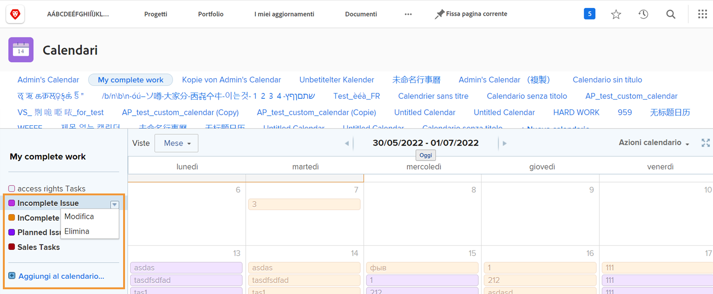

# Comprendere le opzioni di calendario aggiuntive

In questa sezione imparerai come:

* Modificare un raggruppamento di calendari
* Eliminare un raggruppamento di calendari
* Condividere un calendario

## Modificare un raggruppamento di calendari

Per modificare un raggruppamento, passa il cursore del mouse sul nome del calendario. Fai clic sulla freccia rivolta verso il basso visualizzata a destra e seleziona **[!UICONTROL Modifica]**.

## Eliminare un raggruppamento di calendari

Per eliminare un raggruppamento, passa il cursore del mouse sul nome del calendario. Fai clic sulla freccia rivolta verso il basso visualizzata a destra e seleziona **[!UICONTROL Elimina]**.

## Condivisione di un calendario

In qualità di project manager, puoi creare un calendario da condividere con altri, ad esempio project manager, membri del team e così via.

1. Da **[!UICONTROL Menu principale]**, seleziona un **[!UICONTROL Calendari]** area.
1. Seleziona il calendario da condividere.
1. Seleziona **[!UICONTROL Condivisione]** dal **[!UICONTROL Azioni calendario]** menu a discesa.
1. Immetti i nomi degli utenti, ruoli, team, gruppi o aziende con cui desideri condividere il calendario.
1. Seleziona se gli utenti ricevono [!UICONTROL Visualizza] o [!UICONTROL Gestisci] accesso al report del calendario.
1. Fai clic su **[!UICONTROL Salva]**.

Mentre condividi i calendari, puoi prendere nota di alcuni elementi:

* Fai clic sul pulsante **[!UICONTROL icona ingranaggio]** nell&#39;angolo superiore destro della finestra Condivisione per rendere visibile il calendario a livello di sistema o renderlo pubblico agli utenti esterni.
* [!UICONTROL Visualizza] l’accesso consente agli utenti di visualizzare il calendario ma non di modificare i filtri che controllano i raggruppamenti.
* [!UICONTROL Gestisci] l’accesso consente agli utenti di visualizzare il calendario e modificare i filtri che controllano i raggruppamenti.

## Collegamento condiviso

È possibile condividere un calendario con altri [!DNL Workfront] utenti tramite un collegamento privato. Vengono quindi portati direttamente al calendario in [!DNL Workfront].

Puoi eseguire questa operazione dal **[!UICONTROL Azioni calendario]** selezionando **[!UICONTROL Ottieni collegamento condiviso]**. Da qui, fai clic sul pulsante **[!UICONTROL Copia collegamento]** e incolla l’URL in un messaggio e-mail o istantaneo con un altro utente.

![Immagine di un [!UICONTROL Ottieni collegamento condiviso] screen](assets/calendar-3-1.png)
