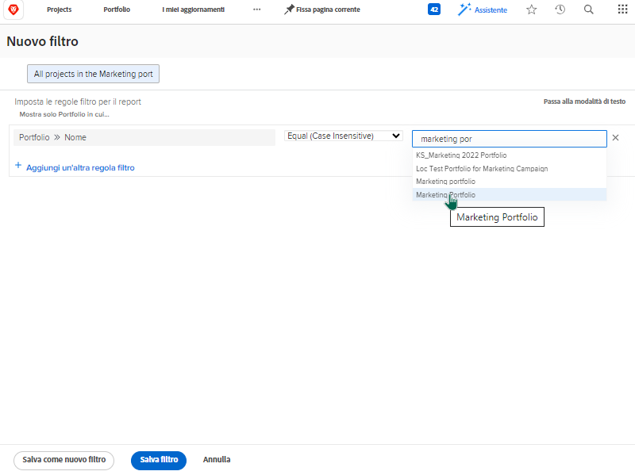
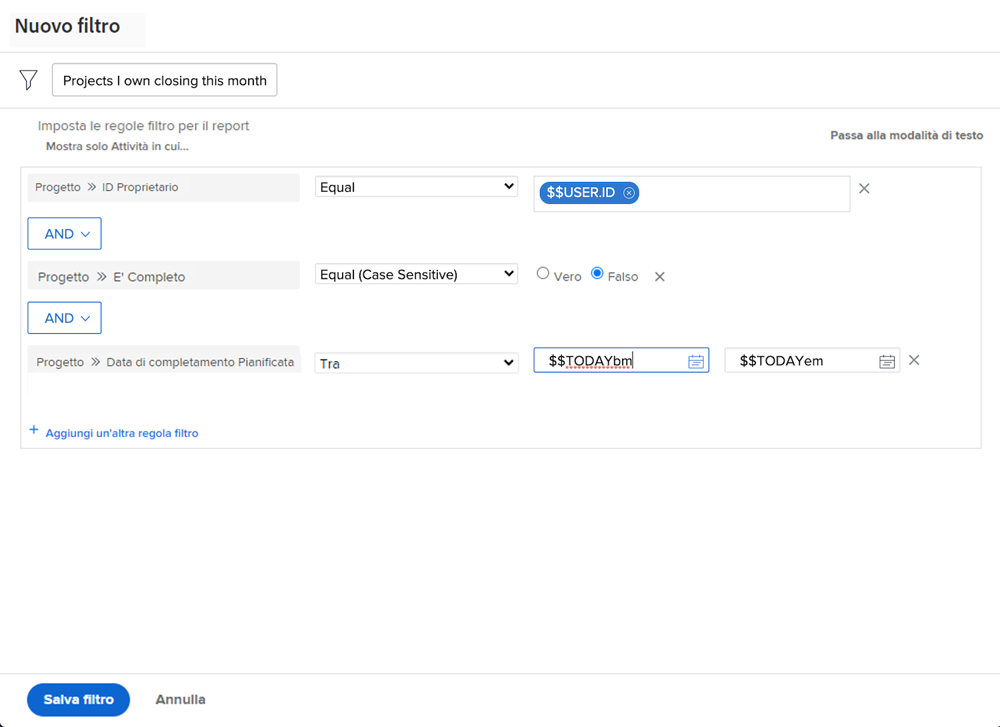

# Creare attività filtro di base

## Attività 1: tutti i progetti nel portfolio marketing

In questa attività creerai un filtro di progetto denominato “Tutti i progetti nel portfolio marketing” nell’esperienza di [!UICONTROL filtro legacy]. Questo mostrerà tutti i progetti nel portfolio denominato “Portfolio marketing”, indipendentemente dal loro stato.

Le istruzioni dettagliate sono riportate di seguito.

### Risposta all’attività 1

1. Passa all’area [!UICONTROL Progetti] dal [!UICONTROL Menu principale]. Viene visualizzato un elenco di progetti.
1. Fai clic sul menu **[!UICONTROL Filtro]** e seleziona [!UICONTROL Filtri legacy].
1. Seleziona **[!UICONTROL Nuovo filtro]**.
1. Denomina il filtro “Tutti i progetti nel Portfolio marketing.”
1. Fai clic su **[!UICONTROL Aggiungi regola filtro]**.
1. Nel campo [!UICONTROL Inizia a digitare il nome del campo], digita “[!UICONTROL Nome portfolio]”. Quindi seleziona [!UICONTROL Nome] nell’origine del campo [!UICONTROL Progetto].
1. Lascia l’operatore [!UICONTROL Uguale] così com’è.
1. Digita “[!UICONTROL marketing]” nel campo [!UICONTROL Inizia a digitare il nome].
1. Seleziona [!UICONTROL Portfolio marketing] supponendo di avere un portfolio con lo stesso nome su cui desideri eseguire il filtro. Diversamente, utilizza semplicemente la funzione di digitazione per trovare il portfolio desiderato.
1. Fai clic su **[!UICONTROL Salva filtro]**.

## Attività 2: progetti di cui sono proprietario in chiusura questo mese

In questo video, creerai un filtro di progetto denominato “Progetti di cui sono Proprietario in chiusura questo mese” nell’esperienza [!UICONTROL Filtro legacy]. Se stai tenendo d’occhio molti progetti, questo filtro può aiutarti a trovare quelli la cui chiusura pianificata è imminente.

Le istruzioni dettagliate sono riportate di seguito.

>[!VIDEO](https://video.tv.adobe.com/v/336807/?quality=12&learn=on&enablevpops)

### Risposta all’attività 2

1. Passa all’area [!UICONTROL Progetti] dal [!UICONTROL Menu principale]. Viene visualizzato un elenco di progetti.
1. Fai clic sul menu **[!UICONTROL Filtro]** e seleziona [!UICONTROL Filtri legacy].
1. Seleziona **[!UICONTROL Nuovo filtro]**.
1. Denomina il filtro “Progetti di cui sono Proprietario in chiusura questo mese”.
1. Fai clic su **[!UICONTROL Aggiungi regola filtro]**.
1. Nel campo [!UICONTROL Inizia a digitare il nome del campo], digita “proprietario”. Quindi seleziona [!UICONTROL ID proprietario] nell’origine del campo [!UICONTROL Progetto].
1. Lascia l’operatore [!UICONTROL Uguale] così com’è.
1. Digita “$$” nel campo [!UICONTROL Inizia a digitare il nome].
1. Seleziona [!UICONTROL $$USER.ID]. Questo è una variabile per l’utente connesso.
1. Fai clic nuovamente su [!UICONTROL Aggiungi regola filtro].
1. Nel campo [!UICONTROL Inizia a digitare il nome del campo], inizia a digitare “È completo”. Quindi seleziona [!UICONTROL È completato] nell’origine del campo Progetto.
1. Lascia l’operatore [!UICONTROL Uguale] così com’è.
1. Seleziona “False”.
1. Fai clic nuovamente su [!UICONTROL Aggiungi regola filtro].
1. Nel campo [!UICONTROL Inizia a digitare il nome del campo], digita “pianificato,” quindi seleziona [!UICONTROL Data di completamento pianificata] nell’origine del campo [!UICONTROL Progetto].
1. Cambia l’operatore [!UICONTROL Uguale] in [!UICONTROL Questo mese].
1. Fai clic su **[!UICONTROL Salva filtro]**.
