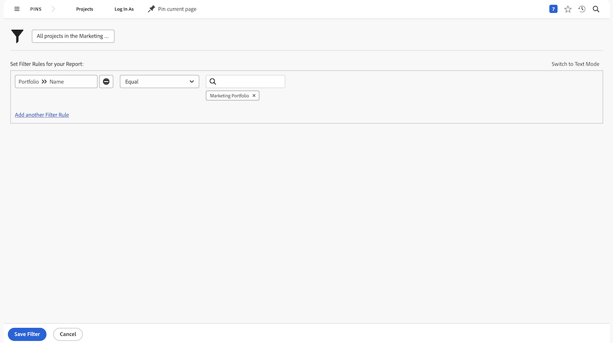

# Creare attività filtro di base

## Attività 1 - Tutti i progetti nel portfolio Marketing

In questa attività creerai un filtro per i progetti denominato &quot;Tutti i progetti nel portfolio Marketing&quot; nel [!UICONTROL Filtro legacy] esperienza. Questo mostra tutti i progetti nel portfolio denominati &quot;Portfolio marketing&quot;, indipendentemente dal loro stato.

Le istruzioni dettagliate sono incluse di seguito.

### Risposta all&#39;attività 1

1. Accedi a [!UICONTROL Progetti] area da [!UICONTROL Menu principale]. Qui viene visualizzato un elenco di progetti.
1. Fai clic su **[!UICONTROL Filtro]** menu e seleziona [!UICONTROL Filtri legacy].
1. Seleziona **[!UICONTROL Nuovo filtro]**.
1. Denomina il filtro &quot;Tutti i progetti nel portfolio Marketing&quot;.
1. Clic **[!UICONTROL Aggiungi regola filtro]**.
1. In [!UICONTROL Inizia a digitare il nome del campo] field, type &quot;[!UICONTROL nome portfolio]&quot;. Quindi seleziona [!UICONTROL Nome] sotto [!UICONTROL Portfolio] origine del campo.
1. Lascia [!UICONTROL Uguale] dell&#39;operatore.
1. Digita &quot;[!UICONTROL marketing]&quot; in [!UICONTROL Inizia a digitare il nome] campo.
1. Seleziona [!UICONTROL Portfolio marketing] supponendo di avere un portfolio con lo stesso nome su cui desideri filtrare. Se non utilizzare semplicemente la funzione di completamento automatico per trovare il portfolio desiderato.
1. Clic **[!UICONTROL Salva filtro]**.

## Attività 2 - Progetti di cui sono proprietario alla chiusura di questo mese

In questo video, creerai un filtro per i progetti denominato &quot;Progetti di cui sono proprietario - Chiusura di questo mese&quot; nel [!UICONTROL Filtro legacy] esperienza. Se stai tenendo d’occhio molti progetti, questo filtro può aiutarti a ingrandire quelli che si prevede di chiudere a breve.

Le istruzioni dettagliate sono incluse di seguito.

>[!VIDEO](https://video.tv.adobe.com/v/336807/?quality=12&learn=on)

### Risposta all&#39;attività 2

1. Accedi a [!UICONTROL Progetti] area da [!UICONTROL Menu principale]. Qui viene visualizzato un elenco di progetti.
1. Fai clic su **[!UICONTROL Filtro]** menu e seleziona [!UICONTROL Filtri legacy].
1. Seleziona **[!UICONTROL Nuovo filtro]**.
1. Denomina il filtro &quot;Progetti di cui sono proprietario durante questo mese&quot;.
1. Clic **[!UICONTROL Aggiungi regola filtro]**.
1. In [!UICONTROL Inizia a digitare il nome del campo] , digitare &quot;owner&quot;. Quindi seleziona [!UICONTROL ID proprietario] sotto [!UICONTROL Progetto] origine del campo.
1. Lascia [!UICONTROL Uguale] dell&#39;operatore.
1. Digita &quot;$$&quot; nel [!UICONTROL Inizia a digitare il nome] campo.
1. Seleziona [!UICONTROL $$USER.ID]. Carattere jolly per l&#39;utente connesso.
1. Clic [!UICONTROL Aggiungi regola filtro] di nuovo.
1. In [!UICONTROL Inizia a digitare il nome del campo] , inizia a digitare &quot;È completo&quot;. Quindi seleziona [!UICONTROL E&#39; Completo] nel campo Origine progetto.
1. Lascia [!UICONTROL Uguale] dell&#39;operatore.
1. Selezionare &quot;False&quot;.
1. Clic [!UICONTROL Aggiungi regola filtro] di nuovo.
1. In [!UICONTROL Inizia a digitare il nome del campo] tipo di campo &quot;scheduled&quot; (pianificato), quindi seleziona [!UICONTROL Data di completamento Pianificata] sotto [!UICONTROL Progetto] origine del campo.
1. Modificare il [!UICONTROL Uguale] operatore a [!UICONTROL Questo mese].
1. Clic **[!UICONTROL Salva filtro]**.
