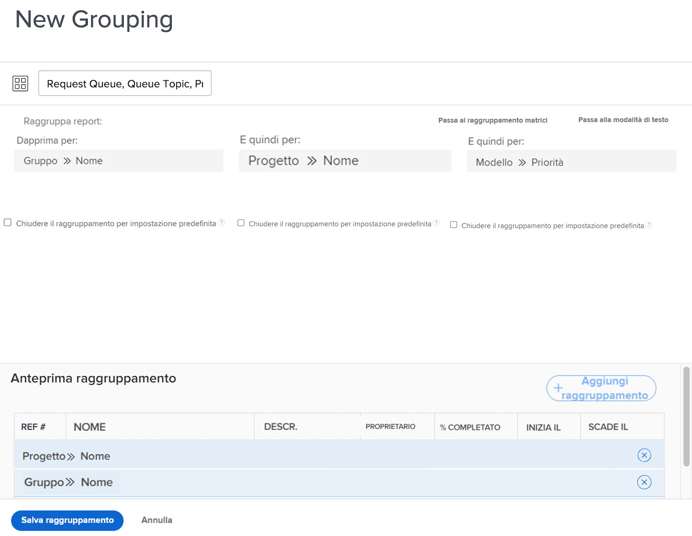

# Creare un raggruppamento di base

In questo video scoprirai:

* Che cos’è un raggruppamento in Workfront
* Come creare un raggruppamento
* E come condividere un raggruppamento con altri utenti di Workfront

>[!VIDEO](https://video.tv.adobe.com/v/335147/?quality=12&learn=on)

## Creare attività di raggruppamento di base

[Fare clic qui](/help/assets/create-basic-grouping-activities.pdf) per scaricare un PDF di questa pagina.

### Attività 1: creare un raggruppamento di base

Crea un raggruppamento di problemi che verrà utilizzato in un rapporto per tenere traccia delle richieste che arrivano attraverso una coda di richieste. Questo raggruppamento renderà più semplice visualizzare tipi simili di problemi/richieste raggruppati in base alla priorità. Denomina il raggruppamento &quot;Coda di richieste, Argomento coda, Priorità&quot;.

Raggruppa il rapporto sui problemi in base a:

1. Il nome della coda di richieste (questo sarà il nome del progetto)
1. L’argomento coda
1. La priorità della richiesta

### Risposta 1

1. In un rapporto con l’elenco dei problemi, passa al menu **[!UICONTROL Raggruppamento]** e seleziona **[!UICONTROL Nuovo raggruppamento]**.
1. Denomina il raggruppamento &quot;Coda di richieste, Argomento coda, Priorità&quot;.
1. Fai clic su **[!UICONTROL Aggiungi raggruppamento]**.
1. Nel campo [!UICONTROL Prima per], digita &quot;nome progetto&quot;, quindi seleziona **[!UICONTROL Nome]** nell&#39;origine del campo Progetto.
1. Fai clic su **[!UICONTROL Aggiungi un altro raggruppamento]**.
1. Nel campo [!UICONTROL And then by], digitare &quot;queue&quot;, quindi selezionare **[!UICONTROL Name]** nell&#39;origine del campo [!UICONTROL Argomento coda].
1. Fai clic su **[!UICONTROL Aggiungi un altro raggruppamento]**.
1. Nel campo [!UICONTROL And then by], digita &quot;priority&quot; quindi seleziona **[!UICONTROL Priority]** nell&#39;origine del campo [!UICONTROL Issue].
1. Fai clic su **[!UICONTROL Salva raggruppamento]**
