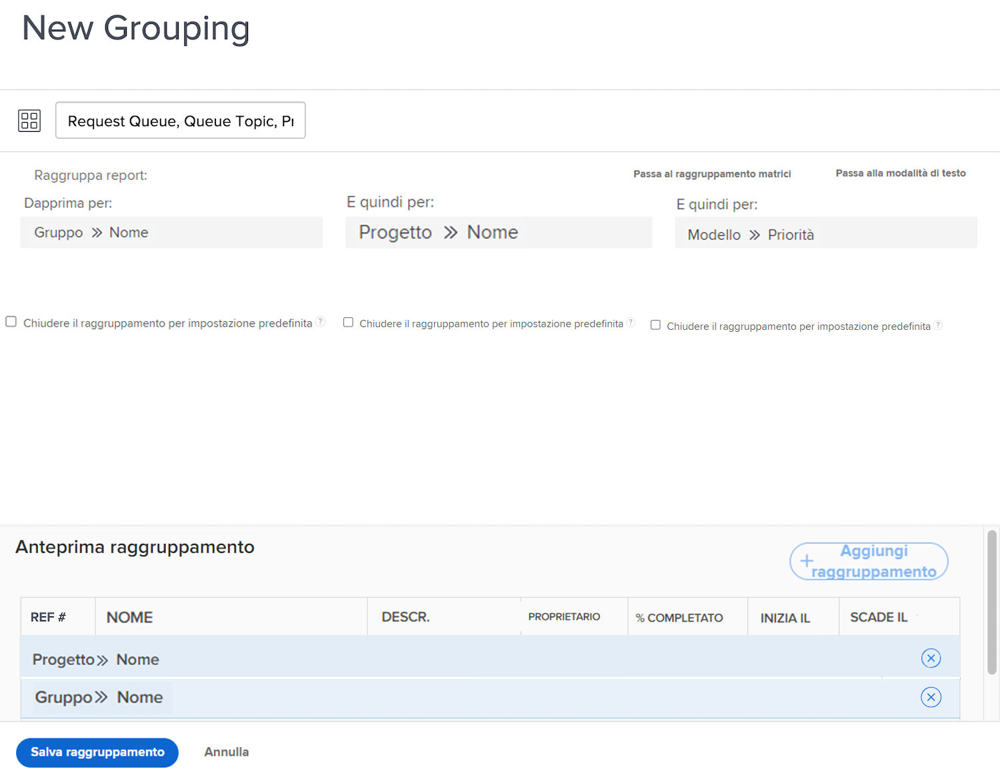

# Creare un raggruppamento di base

Questo video spiega come creare e gestire i raggruppamenti in Workfront per organizzare efficacemente gli elenchi dei progetti. &#x200B; raggruppamenti sono uno dei tre elementi principali di reporting, insieme a filtri e visualizzazioni, e aiutano a organizzare i risultati in base alle informazioni condivise. &#x200B;
Questa esercitazione fornisce passaggi pratici per organizzare gli elenchi dei progetti al fine di semplificare il lavoro e la collaborazione giornalieri. &#x200B;

>[!VIDEO](https://video.tv.adobe.com/v/335147/?quality=12&learn=on&enablevpops=0)

## Concetti chiave

* **Scopo dei raggruppamenti:** i raggruppamenti sono un elemento di reporting chiave in Workfront che organizza gli elenchi dei progetti in base a informazioni condivise, ad esempio date di completamento, portfolio o programmi. &#x200B;
* **Creazione di raggruppamenti:** Puoi creare raggruppamenti personalizzati con un massimo di tre livelli di criteri. &#x200B; Ad esempio, per una migliore organizzazione è possibile raggruppare prima i progetti per portfolio e poi per programma. &#x200B;
* **Modifica e salvataggio dei raggruppamenti:** i raggruppamenti incorporati non possono essere sovrascritti, ma è possibile salvare le modifiche come un nuovo raggruppamento. &#x200B; Raggruppamenti personalizzati devono avere nomi chiari e descrittivi per una facile identificazione. &#x200B;
* **Condivisione di raggruppamenti:** i raggruppamenti possono essere condivisi con altri utenti, con autorizzazioni di visualizzazione predefinite che consentono loro di utilizzare e condividere il raggruppamento, ma non di modificarlo. Le autorizzazioni &quot;&#x200B;Gestisci&quot; consentono la modifica e l’eliminazione. &#x200B;
* **Rimozione dei raggruppamenti:** L&#39;eliminazione di un raggruppamento creato comporta anche la rimozione del raggruppamento dagli elenchi di utenti con cui è stato condiviso. &#x200B; raggruppamenti condivisi vengono visualizzati nella sezione &quot;Condivisi con me&quot; per gli altri utenti. &#x200B;

## Attività &quot;Crea un raggruppamento di base&quot;

### Attività 1: creare un raggruppamento di base

Crea un raggruppamento di problemi che verrà utilizzato in un rapporto per tenere traccia delle richieste che arrivano attraverso una coda di richieste. Questo raggruppamento renderà più semplice visualizzare tipi simili di problemi/richieste raggruppati in base alla priorità. Denomina il raggruppamento &quot;Coda di richieste, Argomento coda, Priorità&quot;.

Raggruppa il rapporto sui problemi in base a:

1. Il nome della coda di richieste (questo sarà il nome del progetto)
1. L’argomento coda
1. La priorità della richiesta

### Risposta 1

1. In un rapporto con l’elenco dei problemi, passa al menu **[!UICONTROL Raggruppamento]** e seleziona **[!UICONTROL Nuovo raggruppamento]**.
1. Denomina il raggruppamento &quot;Coda di richieste, Argomento coda, Priorità&quot;.
1. Fai clic su **[!UICONTROL Aggiungi raggruppamento]**.
1. Nel campo [!UICONTROL Raggruppa per]. digita &quot;nome progetto&quot;, quindi seleziona **[!UICONTROL Nome]** nell&#39;origine del campo Progetto.
1. Fai clic su **[!UICONTROL Aggiungi un altro raggruppamento]**, quindi digita &quot;queue&quot; e seleziona **[!UICONTROL Name]** nell&#39;origine campo [!UICONTROL Argomento coda].
1. Fai clic su **[!UICONTROL Aggiungi un altro raggruppamento]**, quindi digita &quot;priority&quot; e seleziona **[!UICONTROL Priority]** nell&#39;origine campo [!UICONTROL Issue].
1. Fai clic su **[!UICONTROL Salva raggruppamento]**
