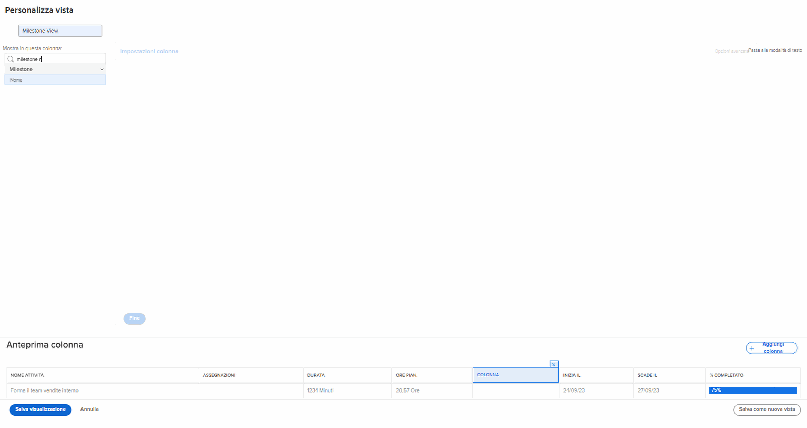
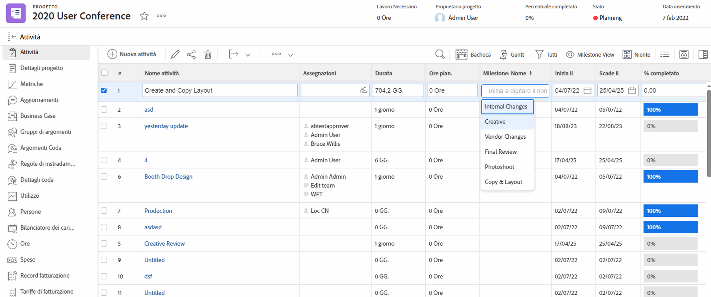
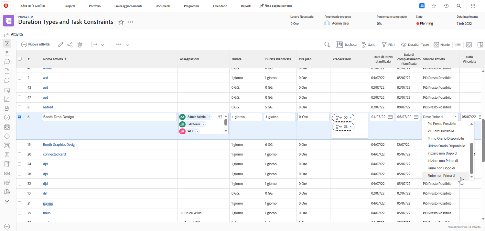
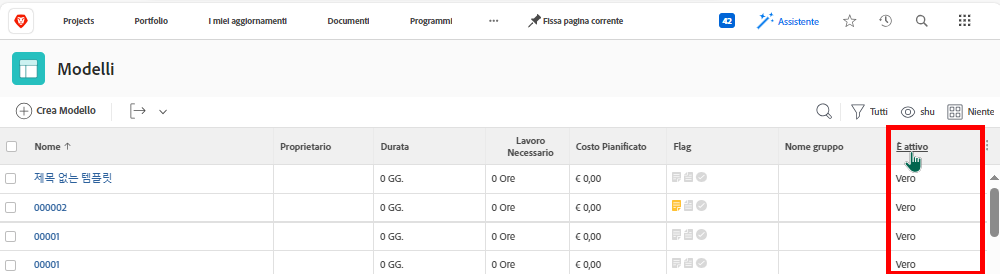

# Creare una vista di base

In questo video scoprirai:

* Cos’è una vista in Workfront
* Come creare e modificare una vista
* Come condividere una vista con altri utenti di Workfront

>[!VIDEO](https://video.tv.adobe.com/v/335148/?quality=12&learn=on&enablevpops)

## Attività 1: creare una vista dello stato dell’attività

In qualità di project manager, responsabile del team o responsabile risorse, desideri tenere traccia di come procede il lavoro delle attività. Questa vista presenta diversi indicatori di stato di un’attività tutti in una riga dell’elenco o del rapporto.

Crea una vista attività denominata “Vista con stato attività” con le seguenti colonne:

* [!UICONTROL Nome attività]
* [!UICONTROL Assegnazioni]
* [!UICONTROL Durata]
* [!UICONTROL Percentuale completato]
* [!UICONTROL Stato]
* [!UICONTROL Stato di avanzamento]
* [!UICONTROL Le icone di Stato]

## Risposta per l’attività 1

1. In un rapporto con elenco delle attività, passa al menu a discesa **[!UICONTROL Vista]** e seleziona **[!UICONTROL Nuova vista]**.
1. Assegna alla vista il nome “Vista con stato attività”.
1. Rimuovi queste colonne:[!UICONTROL Ore pian.], [!UICONTROL Predecessori],[!UICONTROL  Inizia il] e[!UICONTROL  Scade il].
1. Fai clic su **[!UICONTROL Aggiungi colonna]**.
1. Nel campo [!UICONTROL Mostra in questa colonna], digita “stato”, quindi seleziona “Stato” sotto all’origine del campo [!UICONTROL Attività].
1. Fai di nuovo clic su **[!UICONTROL Aggiungi colonna]**.
1. Nel campo[!UICONTROL  Mostra in questa colonna], digita “stato”, quindi seleziona “Stato di avanzamento” sotto all’origine del campo[!UICONTROL  Attività].
1. Fai clic di nuovo su **[!UICONTROL Aggiungi colonna]**.
1. Nel campo [!UICONTROL Mostra in questa colonna], digita “stato”, quindi seleziona “Icone di stato” sotto all’origine del campo Attività.
1. Fai clic su **[!UICONTROL Salva]**.

Passa il mouse sopra ciascuna delle icone nella colonna[!UICONTROL  Icone di stato] per vedere cosa rappresentano. Se sono disattivate (in grigio), significa che l’attività non contiene note, documenti, processi di approvazione, ecc. Se un’icona appare a colori, almeno uno di quegli elementi è associato all’attività. Facendo clic sulle icone della nota o del documento si passa a tale elemento.

## Attività 2: creare una vista Milestone

Se utilizzi le milestone, questa vista rappresenta il modo più semplice per visualizzarle per nome e aggiungerle o modificarle in linea.

Crea una vista di attività denominata “Vista Milestone” con le seguenti colonne:

* [!UICONTROL Nome attività]
* [!UICONTROL Assegnazioni]
* [!UICONTROL Durata]
* [!UICONTROL Ore pian.]
* [!UICONTROL Milestone: nome]
* [!UICONTROL Inizia il]
* [!UICONTROL Scade il]
* [!UICONTROL Percentuale completato]

## Attività 2 Risposta

1. Nell’elenco delle attività di un progetto, vai al menu a discesa **[!UICONTROL Viste]** e seleziona **[!UICONTROL Nuova vista]**.
1. Assegna alla vista il nome “Vista Milestone”.
1. Fai clic sulla colonna [!UICONTROL Predecessori] per selezionarla.
1. Nel campo [!UICONTROL Mostra in questa colonna], fai clic sull’icona X nel campo [!UICONTROL Attività >> Predecessori], quindi digita “[!UICONTROL nome milestone]” e clicca su “[!UICONTROL Nome]” nell’elenco.
1. Fai clic su **[!UICONTROL Salva]**.

## Attività 3: creare una vista dei vincoli dei tipi di durata e delle attività

Questa vista consente di esaminare e modificare tutti i tipi di durata e i vincoli delle attività nel progetto.

Crea una vista delle attività denominata “Vista dei tipi di durata e dei vincoli delle attività” con le seguenti colonne:

* [!UICONTROL Nome attività]
* [!UICONTROL Assegnazioni]
* [!UICONTROL Durata]
* [!UICONTROL Durata Pianificata]
* [!UICONTROL Ore pian.]
* [!UICONTROL Predecessori]
* [!UICONTROL Inizia il]
* [!UICONTROL Scade il]
* [!UICONTROL Tipo di Durata]
* [!UICONTROL Vincolo attività]
* [!UICONTROL Data Vincolata]

Modifica il [!UICONTROL Formato campo] delle colonne [!UICONTROL Inizio il] e [!UICONTROL Scadenza il] per visualizzare sia la data che l’ora.

## Risposta Attività 3

1. In un elenco delle attività di un progetto, vai al menu a discesa **[!UICONTROL Vista]** e seleziona **[!UICONTROL Nuova vista]**.
1. Assegna alla vista il nome “Vista tipi di durata e vincoli delle attività”.
1. Rimuovi la colonna [!UICONTROL % completo].
1. Fai clic su **[!UICONTROL Aggiungi colonna]**.
1. Nel campo [!UICONTROL Mostra in questa colonna], digita [!UICONTROL “durata”] quindi seleziona [!UICONTROL “Durata pianificata”] nell’origine del campo [!UICONTROL Attività].
1. Sposta questa colonna tra le colonne [!UICONTROL Durata] e [!UICONTROL Ore pianificazione].
1. Fai di nuovo clic su **[!UICONTROL Aggiungi colonna]**.
1. Nel campo [!UICONTROL Mostra in questa colonna], digita [!UICONTROL “tipo di durata”] quindi seleziona [!UICONTROL “Tipo di durata”] nell’origine del campo [!UICONTROL Attività].
1. Fai clic di nuovo su **[!UICONTROL Aggiungi colonna]**.
1. Nel campo [!UICONTROL Mostra in questa colonna], digita [!UICONTROL “vincolo”] quindi seleziona [!UICONTROL “Vincolo attività”] nell’origine del campo Attività.
1. Fai clic di nuovo su **[!UICONTROL Aggiungi colonna]**.
1. Nel campo [!UICONTROL Mostra in questa colonna], digita [!UICONTROL “vincolo”] quindi seleziona [!UICONTROL “Data vincolo”] nell’origine del campo Attività.
1. Seleziona la colonna [!UICONTROL Inizio il], quindi fai clic su [!UICONTROL Opzioni avanzate].
1. Nel menu a discesa [!UICONTROL Formato campo] seleziona [!UICONTROL “17/10/60 03.00”].
1. Seleziona la colonna [!UICONTROL Scadenza il], quindi fai clic su [!UICONTROL Opzioni avanzate].
1. Nel menu a discesa [!UICONTROL Formato campo] seleziona [!UICONTROL “17/10/60 03.00”].
1. Fai clic su **[!UICONTROL Salva]**.

## Attività 4: creare una vista dello stato attivo del modello di progetto

Chiunque gestisca i modelli di progetto apprezzerà la visualizzazione dello stato attivo (Vero o Falso) di ciascun modello presente in un elenco. Ancora meglio: il campo è modificabile in linea.

Crea una vista del modello di progetto denominata “Standard+stato attivo” con le seguenti colonne:

* [!UICONTROL Nome]
* [!UICONTROL Proprietario]
* [!UICONTROL Durata]
* [!UICONTROL Ore pianificate]
* [!UICONTROL Costo Pianificato]
* [!UICONTROL Contrassegni]
* [!UICONTROL Nome gruppo]
* [!UICONTROL È attivo]

## Risposta Attività 4

1. In un elenco dei modelli di progetto, passa al menu a discesa **[!UICONTROL Vista]** e seleziona **[!UICONTROL Nuova vista]**.
1. Assegna alla vista il nome “Standard + Stato attivo.”
1. Fai clic su **[!UICONTROL Aggiungi colonna]**.
1. Nel campo [!UICONTROL Mostra in questa colonna], digita “è”, quindi seleziona “È attivo” sotto all’origine del campo [!UICONTROL Attività].
1. Fai clic su **[!UICONTROL Salva vista]**.
