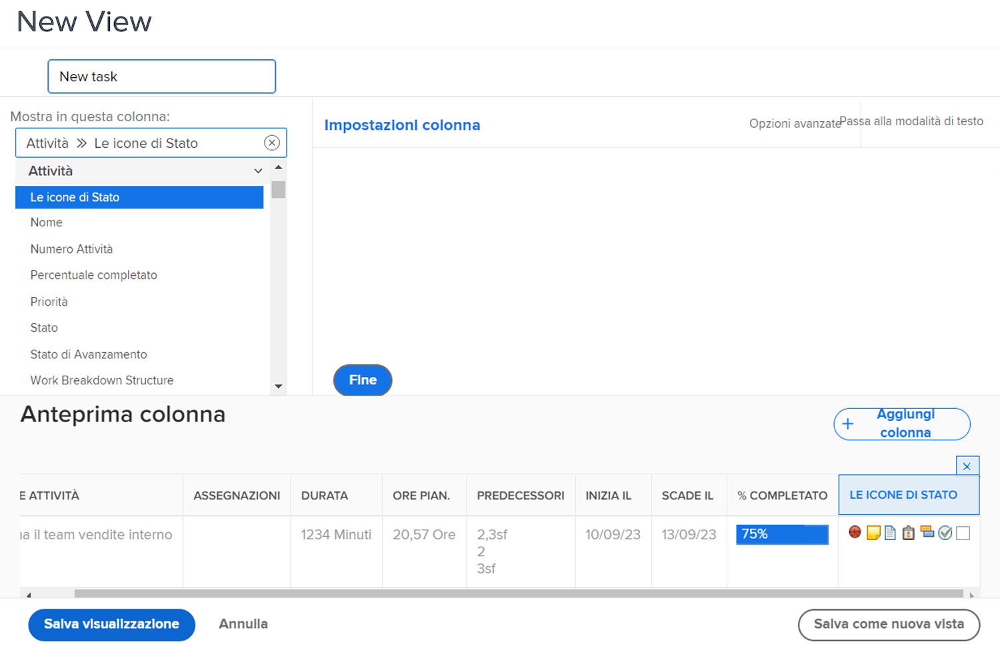

# Creare una visualizzazione di base

In questo video imparerai:

* Visualizzazione in Workfront
* Come creare e modificare una visualizzazione
* Come condividere una visualizzazione con altri utenti di Workfront

>[!VIDEO](https://video.tv.adobe.com/v/335148/?quality=12&learn=on)

## Attività: Creare una visualizzazione di base

In qualità di project manager, team lead o gestore di risorse, è necessario tenere traccia dell’avanzamento del lavoro dell’attività. In questa visualizzazione, si ottengono diversi indicatori di stato di un&#39;attività in una sola riga dell&#39;elenco o del rapporto.

Creare una visualizzazione attività denominata &quot;Visualizzazione stato attività&quot; con le colonne seguenti:

* [!UICONTROL Nome attività]
* [!UICONTROL Assegnazioni]
* [!UICONTROL Durata]
* [!UICONTROL Percentuale completato]
* [!UICONTROL Stato]
* [!UICONTROL Stato di Avanzamento]
* [!UICONTROL Le icone di Stato]

## Risposta

1. In un rapporto dell&#39;elenco delle attività, passare alla sezione **[!UICONTROL Visualizza]** menu a discesa e seleziona **[!UICONTROL Nuova vista]**.
1. Denomina la visualizzazione &quot;Visualizzazione stato attività&quot;.
1. Rimuovi le colonne seguenti: [!UICONTROL Simbolo grafico], [!UICONTROL Predecessori], [!UICONTROL Avvia]e [!UICONTROL Data di scadenza].
1. Fai clic su **[!UICONTROL Aggiungi colonna]**.
1. In [!UICONTROL Mostra in questa colonna] campo, digita &quot;status&quot;, quindi seleziona &quot;Status&quot; sotto [!UICONTROL Attività] origine del campo.
1. Fai clic su **[!UICONTROL Aggiungi colonna]** di nuovo.
1. In [!UICONTROL Mostra in questa colonna] campo, digita &quot;status&quot;, quindi seleziona &quot;Stato di avanzamento&quot; sotto [!UICONTROL Attività] origine del campo.
1. Fai clic su **[!UICONTROL Aggiungi colonna]** di nuovo.
1. In [!UICONTROL Mostra in questa colonna] campo, digitare &quot;status&quot;, quindi selezionare &quot;Icone di stato&quot; nell&#39;origine del campo Task.
1. Fai clic su **[!UICONTROL Salva]**.

Passa il puntatore del mouse su ciascuna delle icone nella [!UICONTROL Icone di stato] per vedere cosa rappresentano. Se sono in grigio, significa che l&#39;attività non ha note, documenti, processi di approvazione, ecc. Se un&#39;icona viene visualizzata a colori, almeno uno di questi è associato all&#39;attività. È possibile fare clic sulle icone della nota o del documento per passare a tale elemento.
