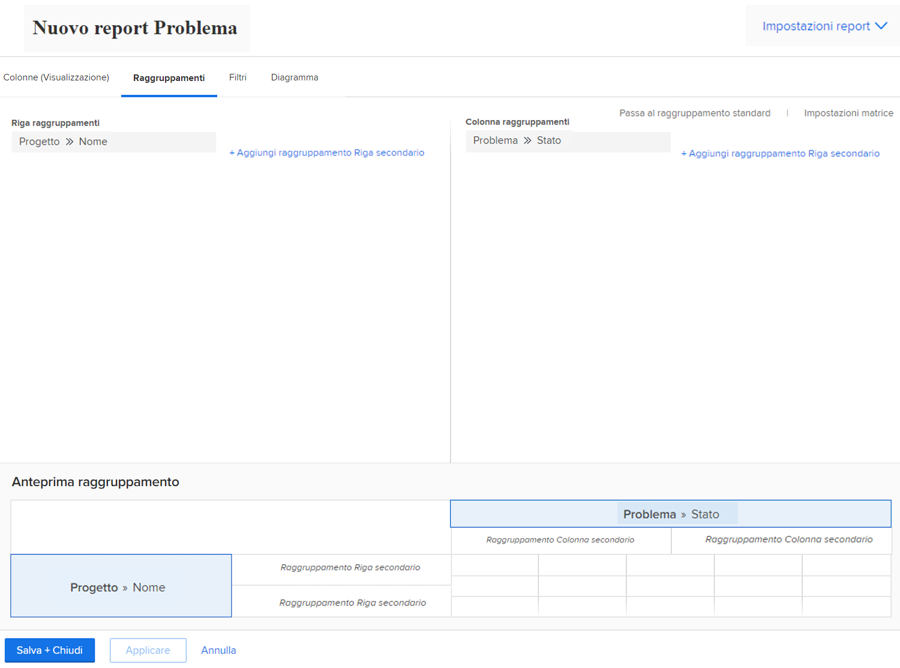
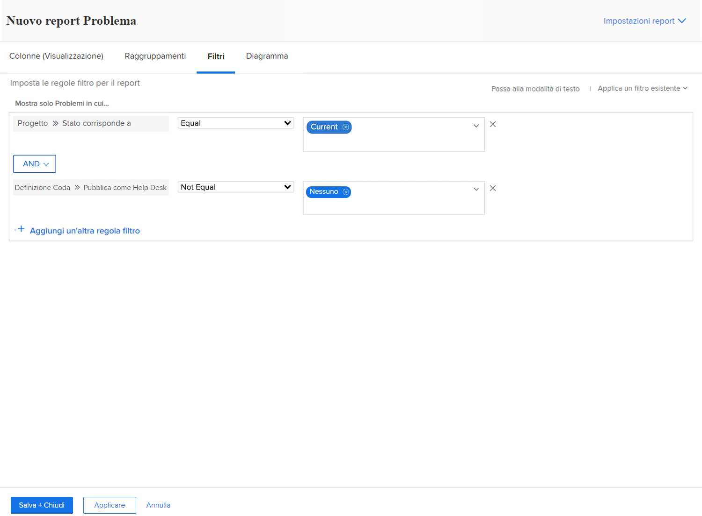

# Creare un rapporto matrice

In questo video scoprirai:

* Quando un rapporto matrice può essere utile
* E come creare un rapporto matrice

>[!VIDEO](https://video.tv.adobe.com/v/335156/?quality=12&learn=on)

## Punti chiave da eliminare

* **Struttura report matrice:** I report matrice organizzano i dati in righe e colonne, con totali automatici di righe e colonne. &#x200B; Sono ideali per il tracciamento di metriche quali ore di lavoro, costi e ricavi. &#x200B;
* **Impostazione filtri:** utilizza i filtri per concentrarti su dati specifici, ad esempio le ore lavorate durante l&#39;ultimo trimestre dagli utenti di un determinato team principale. &#x200B; Il campo &quot;owner field source&quot; (Origine campo proprietario) consente di identificare i membri del team rilevanti. &#x200B;
* **Opzioni di raggruppamento:** Nel nostro esempio, le righe sono raggruppate per &quot;nome del proprietario&quot; (persona che ha lavorato le ore), mentre le colonne sono raggruppate per &quot;data di immissione ore&quot; (per mese e settimana). &#x200B;
* **Dati riepilogati:** Per impostazione predefinita vengono riepilogate colonne quali ore, costi effettivi e ricavi, in modo che i totali vengano visualizzati nella matrice. Se necessario, queste impostazioni predefinite possono essere disattivate. &#x200B;
* **Integrazione dei grafici:** I report matrice possono essere integrati con grafici per la visualizzazione di dati alternativi, utilizzando le stesse informazioni di raggruppamento. È possibile impostare la scheda della matrice o la scheda del grafico come visualizzazione predefinita. &#x200B;

## Attività di &quot;Creazione di un rapporto matrice&quot;

### Attività 1: creare un rapporto matrice

Crea un rapporto matrice che mostri quante richieste sono presenti in ogni stato, ordinate per coda di richieste. Questo offre un’istantanea rapida della quantità di lavoro in arrivo e del modo in cui te la stai tenendo al passo.

Desideri che le code di richiesta vengano visualizzate nei raggruppamenti di righe. Lo stato viene visualizzato come raggruppamenti di colonne. Denomina il rapporto &quot;Richieste per stato e Coda richieste&quot;.

### Risposta 1

1. Seleziona **[!UICONTROL Rapporti]** dal **[!UICONTROL Menu principale]**.
1. Fai clic sull’opzione **[!UICONTROL Nuovo rapporto]** e seleziona **[!UICONTROL Problema]**.
1. Passa alla scheda **[!UICONTROL Raggruppamenti]** e fai clic su **[!UICONTROL Passa al raggruppamento di matrici]**.
1. Per [!UICONTROL Raggruppamenti righe], seleziona **[!UICONTROL Progetto]** > **[!UICONTROL Nome]**.
1. Per [!UICONTROL Raggruppamento colonne], seleziona **[!UICONTROL Problema]** > **[!UICONTROL Stato]**.

   

1. Passa alla scheda **[!UICONTROL Filtri]**.
1. Per assicurarti di visualizzare solo le richieste nelle code di richieste attive, aggiungi le seguenti regole di filtro:

   * [!UICONTROL Progetto] > [!UICONTROL Stato equivale a] > [!UICONTROL Uguale a] > [!UICONTROL Corrente]
   * [!UICONTROL Definizione coda] > [!UICONTROL È pubblico] > [!UICONTROL Non uguale a] > [!UICONTROL Nessuno] (Questo è il modo in cui sappiamo che un progetto è in realtà una coda di richieste, poiché la Definizione della coda viene assegnata a una delle opzioni pubbliche).

1. Fai clic su **[!UICONTROL Salva Chiudi]**. Quando viene richiesto il nome di un report, digitare &quot;Richieste per stato e Coda richieste&quot;.

   
