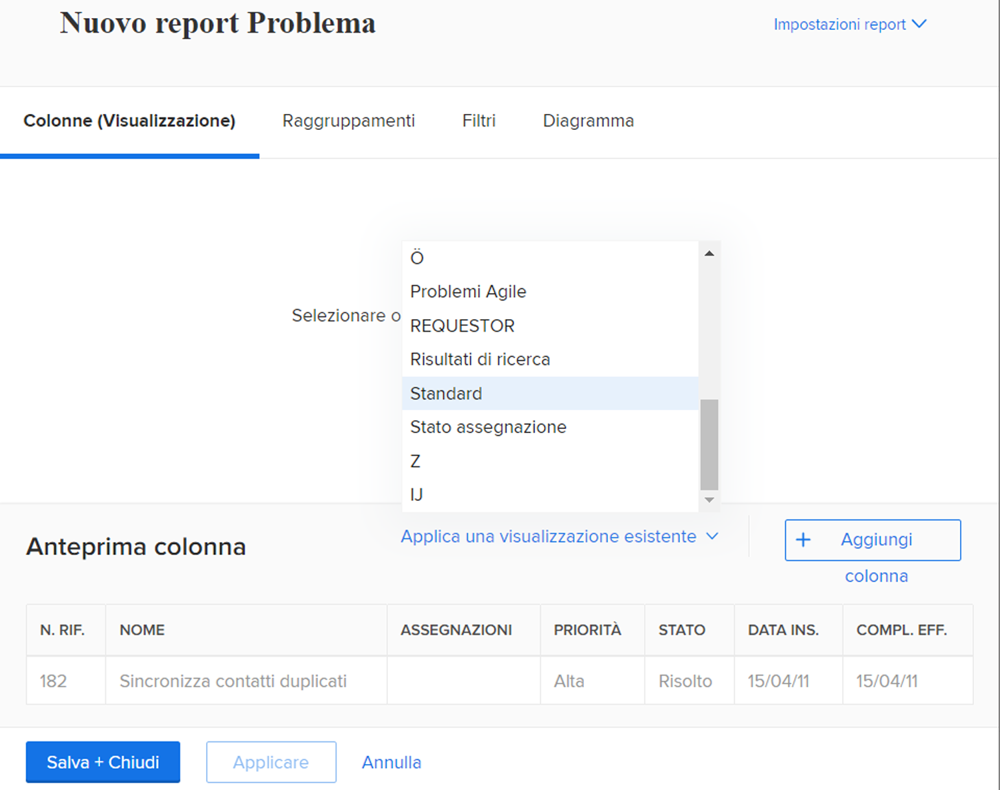
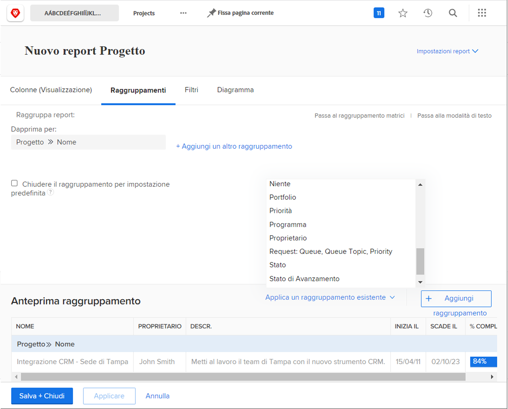
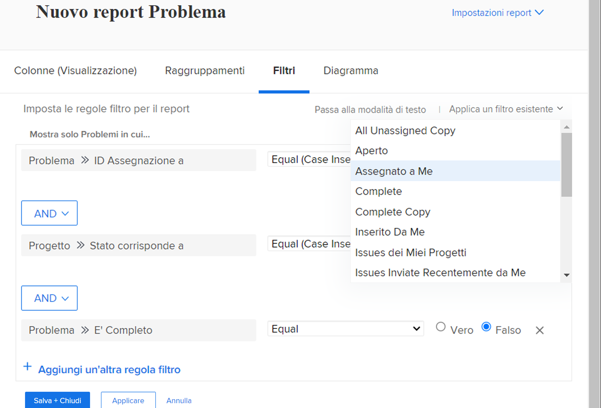
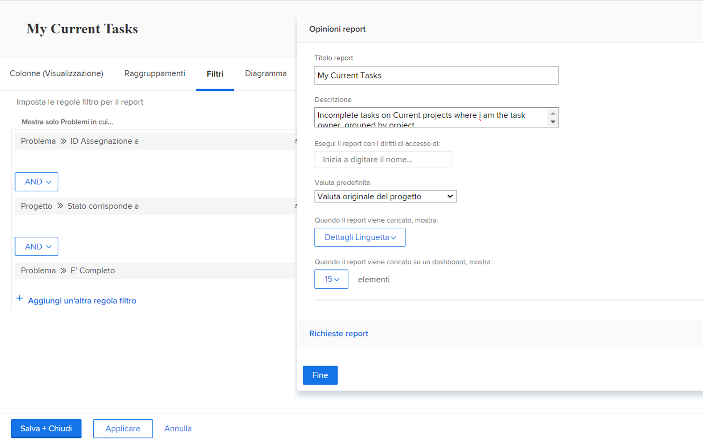

# Creare un rapporto semplice

Questo video spiega come creare e personalizzare i rapporti sui progetti per analizzare in modo efficace i dati. &#x200B; Inizia evidenziando l’importanza dei rapporti nel monitorare l’avanzamento del progetto, il completamento delle attività, il rispetto del budget e l’identificazione dei problemi. Nel video viene illustrato come iniziare con un rapporto sull’elenco dei progetti, come regolare filtri, visualizzazioni e raggruppamenti e come creare un rapporto personalizzato. &#x200B; &#x200B;

Il video evidenzia che i rapporti personalizzati mantengono le impostazioni predefinite, ma che è possibile apportare modifiche temporanee durante la visualizzazione. &#x200B; i report vengono memorizzati nella sezione &quot;I miei report&quot;, mentre i report condivisi vengono visualizzati in &quot;Condivisi con me&quot;. &#x200B; I rapporti utilizzati di frequente possono essere bloccati o contrassegnati come preferiti per un facile accesso. &#x200B;

>[!VIDEO](https://video.tv.adobe.com/v/335153/?quality=12&learn=on&enablevpops=0)

## Concetti chiave

* **Scopo dei report:** i report consentono di tenere traccia dell&#39;avanzamento del progetto, del completamento dell&#39;attività, del rispetto del budget e di identificare i problemi, rendendoli essenziali per una gestione efficace del progetto.
* **Creazione di report personalizzati:** i report personalizzati consentono di salvare filtri, visualizzazioni e raggruppamenti specifici per accedervi facilmente, eliminando la necessità di modificare ripetutamente le impostazioni. &#x200B;
* **Passaggi per creare un report:** Selezionare il tipo di oggetto appropriato, assegnare un nome al report, applicare filtri, visualizzazioni e raggruppamenti, personalizzare le colonne e salvare il report. &#x200B;
* **Impostazioni temporanee e predefinite&#x200B;:** Mentre i visualizzatori possono modificare temporaneamente filtri, visualizzazioni e raggruppamenti, il report tornerà sempre alle impostazioni predefinite alla riapertura. &#x200B;
* **Organizzazione dei report:** i report personalizzati sono archiviati in &quot;I miei report&quot;, i report condivisi in &quot;Condivisi con me&quot; e i report utilizzati di frequente possono essere bloccati o contrassegnati come preferiti per l&#39;accesso rapido. &#x200B;

## Attività &quot;Crea un rapporto semplice&quot;

### Attività 1: creare un semplice rapporto attività

Vuoi tenere traccia di tutte le tue attività attive in un unico rapporto. Creare un report di attività denominato &quot;Le mie attività correnti&quot; utilizzando quanto segue:

* Colonne (Vista) = Standard
* Raggruppamenti = Progetto
* Filtro = Le mie attività correnti
* Descrizione = Attività incomplete sui progetti correnti in cui sono proprietario dell’attività, raggruppate per progetto.

### Risposta 1

1. Vai al **[!UICONTROL Menu principale]** e seleziona **[!UICONTROL Rapporti]**.
1. Fai clic sul menu a discesa **[!UICONTROL Nuovo rapporto]** e seleziona **[!UICONTROL Rapporto attività]**.
1. In [!UICONTROL Colonne (Vista)], fai clic sul menu **[!UICONTROL Applica una vista esistente]** e seleziona **[!UICONTROL Standard]**.

   

1. Nella scheda **[!UICONTROL Raggruppamenti]**, fai clic sul menu **[!UICONTROL Applica un raggruppamento esistente]** e seleziona **[!UICONTROL Progetto]**.

   

1. Nella scheda **[!UICONTROL Filtri]**, fai clic sul menu **[!UICONTROL Applica un filtro esistente]** e seleziona Le mie attività correnti.

   

1. Apri **[!UICONTROL Impostazioni report]** e denomina il report &quot;Le mie attività correnti&quot;.
1. Nel campo Descrizione, immettere &quot;Incomplete
attività su Progetti correnti in cui sono l&#39;attività
proprietario, raggruppato per progetto.&quot;

   

1. Salva e chiudi il rapporto.
