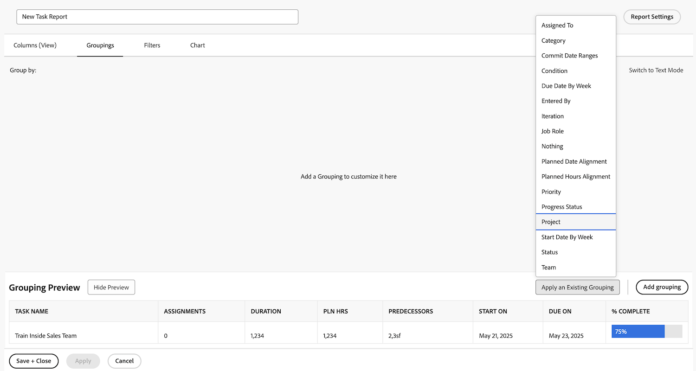

# Creare un rapporto semplice

Questo video illustra come:

* Creare un report semplice utilizzando un filtro, una visualizzazione e un raggruppamento esistenti

>[!VIDEO](https://video.tv.adobe.com/v/335153/?quality=12)

## Attività: creare un semplice rapporto attività

Si desidera tenere traccia di tutte le attività attive in un unico rapporto. Creare un report di attività denominato &quot;Le mie attività correnti&quot; utilizzando quanto segue:

* Colonne (visualizzazione) = Standard
* Raggruppamenti = Progetto
* Filter = Le Mie Attività Correnti
* Descrizione = Attività incomplete su progetti correnti di cui sono il proprietario dell&#39;attività, raggruppate per progetto.

## Risposta

1. Vai a **[!UICONTROL Menu principale]** e seleziona **[!UICONTROL Rapporti]**.
1. Fai clic su **[!UICONTROL Nuovo rapporto]** menu a discesa e selezionare **[!UICONTROL Report attività]**.
1. In entrata [!UICONTROL Colonne (visualizzazione)], fare clic su **[!UICONTROL Applicare una vista esistente]** menu e seleziona **[!UICONTROL Standard]**.

   

1. In **[!UICONTROL Raggruppamenti]** , fare clic sulla scheda **[!UICONTROL Applicare un raggruppamento esistente]** menu e seleziona **[!UICONTROL Progetto]**.

   

1. In **[!UICONTROL Filtri]** , fare clic sulla scheda **[!UICONTROL Applicare un filtro esistente]** e selezionare Le mie attività correnti.

   

1. Apri **[!UICONTROL Impostazioni dei rapporti]** e assegna al rapporto il nome &quot;Le mie attività correnti&quot;.
1. Nel campo Descrizione, immettere &quot;Attività incomplete su progetti correnti di cui sono il proprietario dell&#39;attività, raggruppate per progetto&quot;.

   

1. Salva e chiudi il report.
