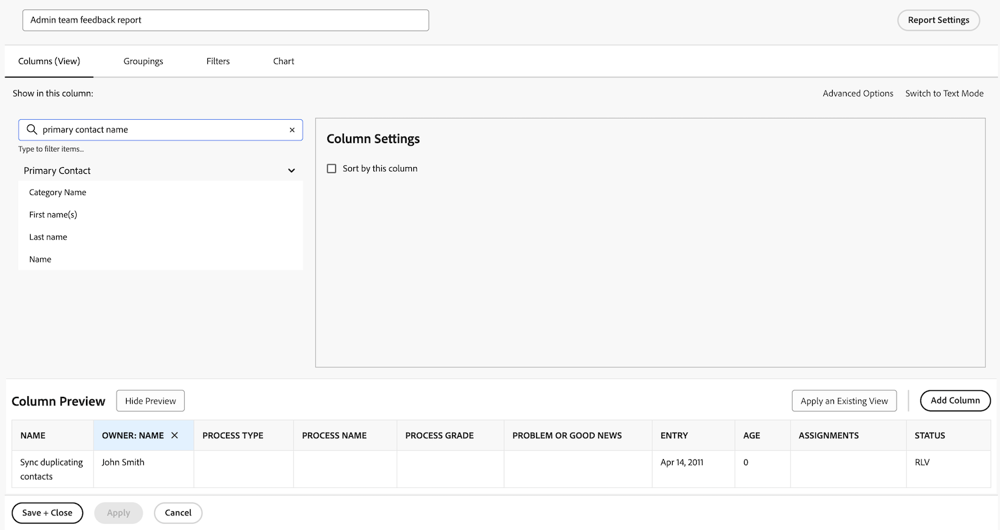

# Creare un rapporto di attività

Il video fornisce una guida dettagliata sulla creazione di un rapporto personalizzato per monitorare le attività in ritardo assegnate all’utente connesso. Spiega innanzitutto la necessità di creare rapporti personalizzati quando i filtri, le viste o i rapporti incorporati esistenti non soddisfano requisiti specifici. &#x200B; Il rapporto si chiama &quot;Late Tasks Assigned to Me&quot; (Attività in ritardo assegnate a me), con una descrizione aggiunta per chiarezza. &#x200B;

Il rapporto risultante consente agli utenti di concentrarsi sulle attività in ritardo, fornisce informazioni approfondite sulle dipendenze e semplifica la navigazione ai progetti host. &#x200B;

>[!VIDEO](https://video.tv.adobe.com/v/335154/?quality=12&learn=on)

## Punti chiave da eliminare

* **Creazione report personalizzati:** Se i filtri esistenti e i report incorporati non soddisfano le tue esigenze, puoi creare un report personalizzato da zero per concentrarti su dati specifici, ad esempio le attività in ritardo che ti vengono assegnate. &#x200B;
* **Impostazione filtro:** Utilizzare i filtri per definire i criteri dei rapporti, incluse le attività in ritardo, incomplete, i progetti correnti e le attività assegnate all&#39;utente connesso. &#x200B;
* **Colonne per il contesto:** Aggiungi colonne quali &quot;Può iniziare&quot; per identificare i problemi di dipendenza e &quot;Nome progetto&quot; con collegamenti ipertestuali per facilitare la navigazione ai progetti correlati. &#x200B;
* **Ordinamento per priorità:** Ordina le attività in base alla colonna &quot;Scadenza&quot; in ordine crescente per assegnare la priorità alle attività più scadute nella parte superiore del report. &#x200B;
* **Accessibilità:** Salvare il report, fissarlo o contrassegnarlo come preferito per accedervi rapidamente, garantendo un monitoraggio e una gestione efficienti delle attività in ritardo.

## Attività di &quot;Creazione di un rapporto attività&quot;

>[!TIP]
>
>Tira fuori spatole e ciotole per miscelare gli ingredienti e inizia a sperimentare le “ricette” presenti nel nostro [Ricettario di reportistica clienti Adobe Workfront](/help/assets/workfront-customer-reporting-cookbook.pdf). All’interno troverai istruzioni dettagliate per 10 rapporti, pronti per essere inseriti nel tuo ambiente oggi stesso.
>>Abbiamo raccolto i rapporti preferiti dalla clientela e li abbiamo inseriti in un manuale facilmente comprensibile e riconoscibile, da riportare e testare nella cucina di Workfront.
>>Questi 10 rapporti provengono da clienti che sono proprio come te. Distribuiti in vari settori, reparti, team, posizioni e tutti in diverse aziende, dobbiamo ringraziare gli incredibili clienti che hanno condiviso uno dei loro rapporti preferiti. Alcuni rapporti sono semplici (ma incredibilmente utili), mentre altri sono più complessi e possono portare la reportistica a un livello successivo.

### Attività 1: crea un rapporto Nota con prompt

Crea un rapporti sulle note che è possibile utilizzare per cercare note utente (ad esempio, commenti o aggiornamenti) o note di sistema in base al contenuto della nota, all’autore, alla data di immissione, al nome del progetto o al tipo di audit. Denomina il rapporto “Ricerca nota”.

Quando si utilizza il prompt Testo nota, questo rapporto esegue la ricerca all’interno dei thread di aggiornamento per estrarre rapidamente quelli che soddisfano i criteri specificati nei prompt. Quando esegui il rapporto, non è necessario compilare ogni prompt, solo quelli che ritieni importanti. I vuoti vengono automaticamente ignorati.

La visualizzazione deve includere colonne per:

* Testo della Nota
* Testo di controllo
* Data inserimento
* Nome del proprietario
* Tipo di Revisione
* Nome attività
* Nome Issue

Lascia vuota la scheda del filtro.

Raggruppa per nome progetto.

Includi prompt per:

* Testo di controllo
* Testo della Nota
* Nome del proprietario
* Data inserimento
* Nome progetto
* Tipo di Revisione

### Risposta 1

1. Seleziona **[!UICONTROL Rapporti]** dal **[!UICONTROL Menu principale]**.
1. Fai clic sul menu **[!UICONTROL Nuovo rapporto]** e seleziona **[!UICONTROL Nota]**.
1. Nella sezione **[!UICONTROL Colonne (visualizzazione)]** imposta le colonne in modo che includano:

   

   * [!UICONTROL Nota] > [!UICONTROL Testo nota]
   * [!UICONTROL Nota] > [!UICONTROL Testo di audit]
   * [!UICONTROL Nota] > [!UICONTROL Data di immissione]
   * [!UICONTROL Proprietario] > [!UICONTROL Nome]
   * [!UICONTROL Nota] > [!UICONTROL Tipo di audit]
   * [!UICONTROL Attività] > [!UICONTROL Nome]
   * [!UICONTROL Problema] > [!UICONTROL Nome]

1. Seleziona la colonna **[!UICONTROL Data di immissione]** e modifica l’**[!UICONTROL Ordine decrescente]**.
1. Nella scheda **[!UICONTROL Raggruppamenti]**, imposta il rapporto in base al quale eseguire il raggruppamento [!UICONTROL Progetto] > [!UICONTROL Nome].

   

1. Lascia vuoto il campo [!UICONTROL Filtri].
1. Apri **[!UICONTROL Impostazioni rapporto]** e assegna il nome “Ricerca nota” al rapporto.
1. Nel campo [!UICONTROL Descrizione], inserisci qualcosa come “Cerca le note sul sistema o sull’utente in base al Tipo di audit selezionato e ad altri prompt. Le note di sistema vengono visualizzate nella colonna Testo di audit e le note utente nella colonna Testo nota”.

   

1. Seleziona la **[!UICONTROL Scheda dettagli]** in modo che venga visualizzato il caricamento del rapporto.
1. Imposta il rapporto in modo che mostri 200 elementi quando viene incluso in una dashboard.
1. Fai clic su **[!UICONTROL Prompt dei rapporti]** e aggiungi:

   

   * [!UICONTROL Nota] > [!UICONTROL Testo di audit]
   * [!UICONTROL Nota] > [!UICONTROL Testo nota]
   * [!UICONTROL Proprietario] > [!UICONTROL Nome]
   * [!UICONTROL Nota] > [!UICONTROL Data immissione]
   * [!UICONTROL Progetto] > [!UICONTROL Nome]
   * [!UICONTROL Nota] > [!UICONTROL Tipo di audit]

1. Seleziona la casella per **[!UICONTROL Mostra i prompt nelle dashboard]**.
1. Salva e chiudi il rapporto.

### Attività 2: creare un rapporto sui feedback del team di amministrazione

Questo è un rapporto sui problemi che mostra tutti i problemi di una coda richieste di feedback creata per gli amministratori di sistema. Puoi vedere come creare questa coda richieste nel tutorial [Creare una coda richieste di feedback per l’amministratore di sistema](https://experienceleague.adobe.com/docs/workfront-learn/tutorials-workfront/manage-work/request-queues/create-a-system-admin-feedback-request-queue.html?lang=it).

Questo rapporto utilizza anche un modulo personalizzato. Per informazioni su come creare un modulo personalizzato, guarda il tutorial [Creare e condividere un modulo personalizzato](https://experienceleague.adobe.com/docs/workfront-learn/tutorials-workfront/custom-data/custom-forms/custom-forms-creating-and-sharing-a-custom-form.html?lang=it).

Questo modulo personalizzato deve utilizzare i tipi di oggetto Progetto e Problema e deve essere creato come segue:

Nome: feedback del processo di amministrazione

1. Tipo di processo (campo a discesa a selezione singola)
   * livelli di accesso
   * processo di approvazione (solo globale)
   * notifiche e-mail
   * modello di layout
   * percorso milestone
   * modello di progetto
   * notifiche di promemoria
   * coda richieste
1. Nome processo (campo di testo a riga singola)
1. Livello processo (campo a discesa a selezione singola)
   * 1 - completamente inutile
   * 2 - non molto utile
   * 3 - buono, ma potrebbe essere ulteriormente migliorato
   * 4 - eccellente
1. Problema o buone notizie (campo di testo paragrafo)

Crea un rapporto sui problemi denominato **Rapporto feedback del team di amministrazione**.

La vista deve avere le seguenti colonne:

* Problema: nome
* Contatto principale: nome
* Problema: tipo di processo
* Problema: nome del processo
* Problema: livello del processo
* Problema: problema o buone notizie
* Problema: data inserimento
* Problema: età
* Problema: assegnazioni
* Problema: stato

Raggruppa per tipo di processo.

Puoi filtrare in base all’ID del progetto della coda richieste in cui si trovano i problemi relativi al feedback.

### Risposta 2

1. Seleziona **[!UICONTROL Rapporti]** dal **[!UICONTROL Menu principale]**.
1. Fai clic sull’opzione **[!UICONTROL Nuovo rapporto]** e seleziona **[!UICONTROL Problema]**.
1. Nella sezione **[!UICONTROL Colonne (visualizzazione)]** imposta le colonne in modo che includano:

   

   * [!UICONTROL Problema] > [!UICONTROL Nome]
   * [!UICONTROL Contatto primario] > [!UICONTROL Nome]
      * Nota: viene visualizzato con &quot;Proprietario:Name&quot; come etichetta di colonna. Puoi cambiare questa impostazione in “Segnalato da”, facendo clic su Opzioni avanzate e digitando “Segnalato da” nel campo **Etichetta colonna personalizzata**.
   * [!UICONTROL Problema] > [!UICONTROL Tipo di processo]
   * [!UICONTROL Problema] > [!UICONTROL Nome processo]
   * [!UICONTROL Problema] > [!UICONTROL Livello processo]
   * [!UICONTROL Problema] > [!UICONTROL Problema o buone notizie]
   * [!UICONTROL Problema] > [!UICONTROL Data di immissione]
   * [!UICONTROL Problema] > [!UICONTROL Età]
   * [!UICONTROL Problema] > [!UICONTROL Assegnazioni]
   * [!UICONTROL Problema] > [!UICONTROL Stato]

1. Seleziona la colonna **[!UICONTROL Data di immissione]** e modifica l’**[!UICONTROL Ordine decrescente]**.
1. Nella scheda **[!UICONTROL Raggruppamenti]**, imposta il rapporto in base al quale eseguire il raggruppamento per **[!UICONTROL Problema] > [!UICONTROL Tipo di processo]**.

   

1. Nella scheda **[!UICONTROL Filtri]**, aggiungi un filtro per il **[!UICONTROL Problema] > [!UICONTROL ID Progetto]** per eguagliare il progetto della coda richieste in cui si trovano i problemi relativi al feedback.

   

1. Salva e chiudi il rapporto.
