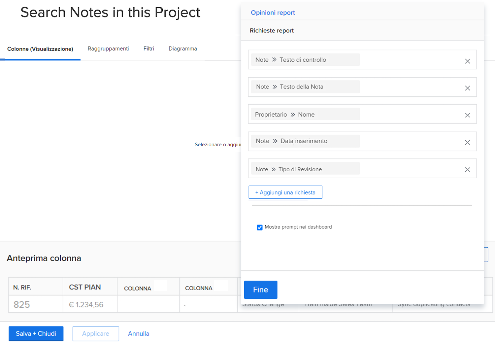
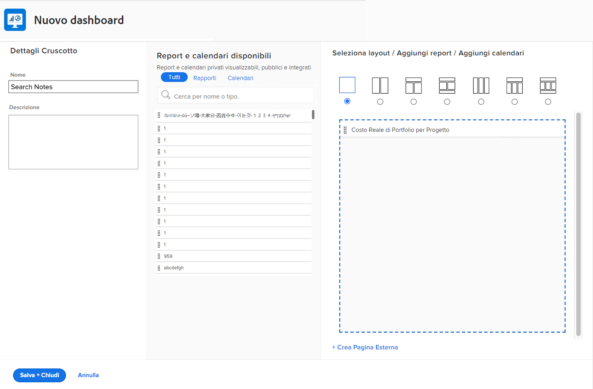
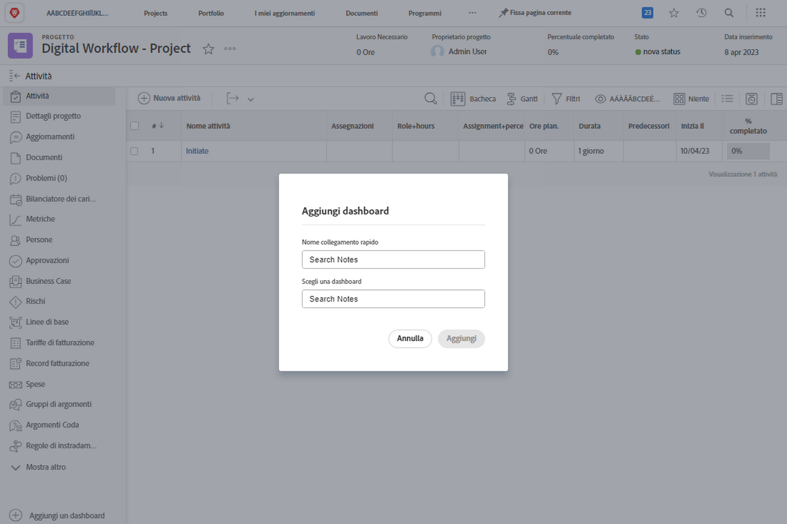

# Creare dashboard

In questo video scoprirai:

* Che cos’è una dashboard in Workfront
* Come creare una dashboard
* Come trovare e utilizzare le dashboard
* Come condividere una dashboard con altri utenti di Workfront
* Come stampare una dashboard

>[!VIDEO](https://video.tv.adobe.com/v/335157/?quality=12&learn=on)

## Attività: creare un dashboard

Crea una [!UICONTROL dashboard] con un solo rapporto al suo interno: “Cerca le note in questo progetto”. Ciò è utile per trovare rapidamente qualsiasi aggiornamento apportato a un progetto, anche tra migliaia di aggiornamenti in cui cercare. In questo modo, la ricerca viene effettuata nei thread di aggiornamento per estrarre rapidamente tutti gli aggiornamenti che soddisfano i criteri specificati nelle richieste.

Crea questo report facendo una copia del report “Cerca note” creato nell’attività “Crea un report note” (o utilizza un altro report se non hai svolto tale attività).

* Rimuovi la richiesta Nome progetto dalla copia e rinomina il report “Cerca note in questo progetto.”
* Nomina la [!UICONTROL dashboard] “Cerca note.”
* Passa alla pagina di destinazione di qualsiasi progetto e crea una sezione personalizzata per una [!UICONTROL dashboard].
* Tieni presente che quando cerchi le note nella sezione personalizzata verranno visualizzate solo le note contenute nel progetto in cui ti trovi attualmente.

## Risposta

1. Esegui il rapporto creato nell’attività “Crea un rapporto note”.
1. Fai clic su **[!UICONTROL Azioni rapporto]** e seleziona **[!UICONTROL Copia]**. [!DNL Workfront] crea un nuovo rapporto denominato “Ricerca note (copia).”
1. Passa ad **[!UICONTROL Azioni rapporto]** e seleziona **[!UICONTROL Modifica]**. Fai clic su **[!UICONTROL Impostazioni rapporto]** e cambia il nome in “Cerca note in questo progetto.”
1. Fai clic su [!UICONTROL Prompt rapporto] ed elimina il prompt [!UICONTROL Progetto] > [!UICONTROL Nome] dall’elenco.

   

1. Seleziona la casella **[!UICONTROL Mostra prompt nella dashboard]**.
1. Fai clic su **[!UICONTROL Fine]**, quindi **[!UICONTROL Salva e Chiudi]**. Ora stai esaminando la schermata [!UICONTROL Prompt] del rapporto.

   Successivamente utilizzerai una scorciatoia per creare una nuova dashboard e aggiungervi questo rapporto.

1. Fai clic su **[!UICONTROL Azioni rapporto]** e seleziona **[!UICONTROL Aggiungi alla dashboard]** > **[!UICONTROL Nuova dashboard]**.
1. Trascina il rapporto “Cerca note in questo progetto” nel pannello **[!UICONTROL Layout]**.
1. Il nome del report diventa ora il nome della dashboard. Modifica il nome solo in “Cerca note.”

   

1. Fai clic su **[!UICONTROL Salva e Chiudi]**.

   Ora aggiungi la dashboard a una pagina di progetto.

   

1. Passa a qualsiasi progetto. Dal menu del pannello a sinistra, fai clic sull’icona **[!UICONTROL Aggiungi sezione personalizzata]**.
1. Nel campo **[!UICONTROL Aggiungi dashboard]**, digita “Cerca note” e seleziona la [!UICONTROL dashboard] dall’elenco.
1. Nel campo **[!UICONTROL Titolo sezione personalizzata]**, digita “Cerca note.”
1. Fai clic su **[!UICONTROL Aggiungi nuova sezione]**.
1. Dal menu del pannello a sinistra, trova Cerca note. Fai clic sui punti a sinistra del nome della sezione e trascinalo sotto Aggiornamenti.
