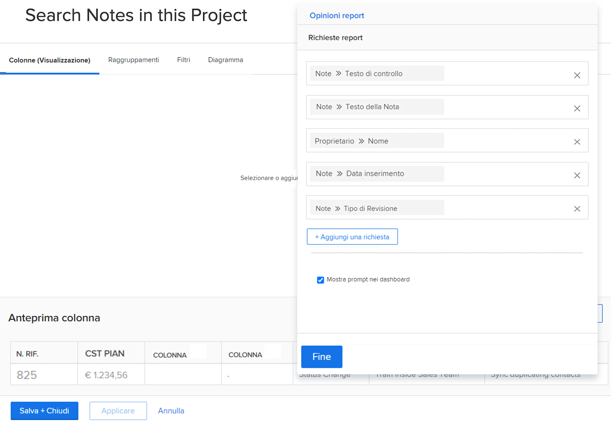
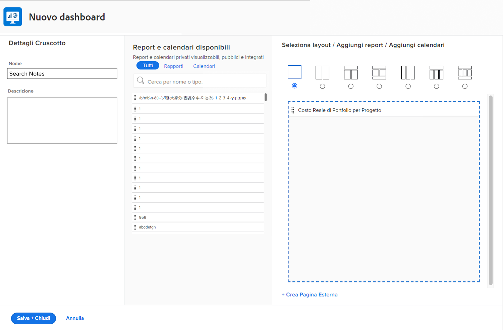
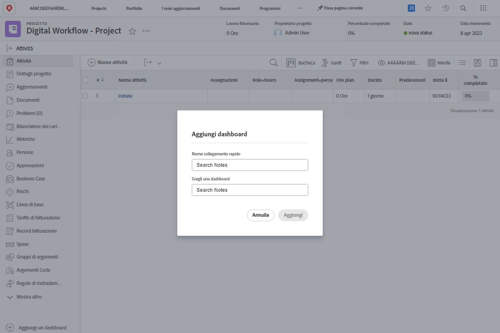

# Creare dashboard in Workfront

Il video fornisce una guida completa per comprendere e utilizzare le dashboard in Workfront.
&#x200B;Spiega che una dashboard è una raccolta di rapporti che consente agli utenti di organizzare e visualizzare i dati correlati in un’unica posizione.

>[!VIDEO](https://video.tv.adobe.com/v/335157/?quality=12&learn=on&enablevpops=0)

## Concetti chiave

* **Dashboard in Workfront:** Un dashboard è una raccolta di report che consente agli utenti di organizzare e visualizzare i dati correlati, ad esempio progetti, attività e problemi, in un&#39;unica vista centralizzata. &#x200B;
* **Creazione di dashboard:** è possibile personalizzare i dashboard selezionando un layout, aggiungendo report, calendari personalizzati o pagine esterne e disponendoli in modo da ottenere una visualizzazione ottimale. &#x200B; Gli utenti possono anche personalizzare quali colonne vengono visualizzate nei rapporti affiancati all’interno del dashboard. &#x200B;
* **Accesso alle dashboard:** le dashboard si trovano in &quot;Dashboard personali&quot;, &quot;Dashboard condivise&quot; o &quot;Tutte le dashboard&quot; nell&#39;area delle dashboard. &#x200B; dashboard utilizzati di frequente possono essere bloccati o aggiunti ai preferiti per un accesso rapido. &#x200B;
* **Condivisione di dashboard:** le dashboard possono essere condivise con altri utenti di Workfront, inclusi tutti i report nel dashboard, tramite il menu &quot;Azioni dashboard&quot;. &#x200B;
* **Stampa dashboard:** è possibile stampare dashboard direttamente dal menu &quot;Azioni dashboard&quot;, semplificando la condivisione di copie fisiche dei dati. &#x200B;

## Attività &quot;Crea dashboard&quot;

### Attività 1: creare un dashboard

Crea un [!UICONTROL dashboard] contenente un solo report:&quot;Cerca note in questo progetto&quot;. Ciò è utile per trovare rapidamente qualsiasi aggiornamento apportato a un progetto, anche tra migliaia di aggiornamenti in cui cercare. In questo modo, la ricerca viene effettuata nei thread di aggiornamento per estrarre rapidamente tutti gli aggiornamenti che soddisfano i criteri specificati nei prompt.

Crea questo rapporto effettuando una copia del rapporto &quot;Cerca note&quot; creato nell’attività &quot;Crea un rapporto di nota&quot;. Non l&#39;hai ancora creato? Fare clic qui per visualizzare l&#39;attività nell&#39;esercitazione [Creare un report attività](https://experienceleague.adobe.com/en/docs/workfront-learn/tutorials-workfront/reporting/basic-reporting/create-a-task-report#activity-1-create-a-note-report-with-prompts).

* Rimuovi il prompt Nome progetto dalla copia e rinomina il report &quot;Cerca note in questo progetto&quot;.
* Denomina [!UICONTROL Dashboard] &quot;Note di ricerca&quot;.
* Passa alla pagina di destinazione di qualsiasi progetto e crea una sezione personalizzata per una [!UICONTROL dashboard].
* Quando si cercano le note nella sezione personalizzata, vengono visualizzate solo le note contenute all&#39;interno del progetto in cui ci si trova.

### Risposta 1

1. Esegui il rapporto creato nell’attività &quot;Creare un rapporto di nota&quot;. Non l&#39;hai ancora creato? Fare clic qui per visualizzare l&#39;attività nell&#39;esercitazione [Creare un report attività](https://experienceleague.adobe.com/en/docs/workfront-learn/tutorials-workfront/reporting/basic-reporting/create-a-task-report#activity-1-create-a-note-report-with-prompts).
1. Fai clic su **[!UICONTROL Azioni rapporto]** e seleziona **[!UICONTROL Copia]**. [!DNL Workfront] crea un nuovo report denominato &quot;Ricerca nota (copia)&quot;.
1. Passa ad **[!UICONTROL Azioni rapporto]** e seleziona **[!UICONTROL Modifica]**. Fai clic su **[!UICONTROL Impostazioni report]** e cambia il nome in &quot;Cerca le note in questo progetto&quot;.
1. Fai clic su [!UICONTROL Prompt rapporto] ed elimina il prompt [!UICONTROL Progetto] > [!UICONTROL Nome] dall’elenco.

   

1. Seleziona la casella **[!UICONTROL Mostra prompt nella dashboard]**.
1. Fai clic su **[!UICONTROL Fine]**, quindi **[!UICONTROL Salva e Chiudi]**. Ora stai esaminando la schermata [!UICONTROL Prompt] del rapporto.

   Ora utilizzerai un collegamento per creare una nuova dashboard e aggiungere questo rapporto.

1. Fai clic su **[!UICONTROL Azioni report]** e seleziona **[!UICONTROL Aggiungi al dashboard classico]** > **[!UICONTROL Nuovo dashboard]**.
1. Trascina il report &quot;Cerca note in questo progetto&quot; nel pannello **[!UICONTROL Layout]**.
1. Il nome del report diventa ora il nome della dashboard. Modifica il nome in &quot;Cerca note&quot;.

   

1. Fai clic su **[!UICONTROL Salva e Chiudi]**.

   Ora aggiungi la dashboard a una pagina di progetto.

   

1. Passa a qualsiasi progetto. Dal menu del pannello sinistro, fare clic sul pulsante **[!UICONTROL Aggiungi dashboard]**.
1. Nel campo **[!UICONTROL Scegli un dashboard]**, digita &quot;Cerca note&quot; e seleziona [!UICONTROL dashboard] dall&#39;elenco.
1. Nel campo **[!UICONTROL Nome collegamento rapido]** digitare &quot;Cerca note&quot;.
1. Fai clic su **[!UICONTROL Aggiungi]**.
1. Dal menu del pannello sinistro, individua le note di ricerca accanto alla parte inferiore. Fai clic sui punti a sinistra del nome e trascinalo verso l’alto sotto Aggiornamenti.

### Attività 2: Le Attività Aperte Dei Miei Team

Crea un [!UICONTROL dashboard] contenente 3 report di &quot;attività aperte&quot;, ciascuno filtrato da un team diverso assegnato alle attività.

Utilizzare un report esistente di tipo &quot;operazione aperta&quot;, filtrato da un team, se disponibile, oppure crearne uno nuovo per questo dashboard. Copiare e modificare il report due volte per altri due team, quindi inserirli in un unico dashboard denominato **&quot;Le attività aperte dei miei team&quot;**

### Risposta 2

#### Parte 1 - Creare un rapporto di &quot;attività aperte&quot; filtrato da uno dei tuoi team

1. Seleziona **[!UICONTROL Rapporti]** dal **[!UICONTROL Menu principale]**.
1. Fai clic sul menu **[!UICONTROL Nuovo rapporto]** e seleziona **[!UICONTROL Attività]**.
1. Denomina il rapporto &quot;Attività aperte assegnate al team Creative&quot; (o a uno qualsiasi dei tuoi team).
1. Nella sezione **[!UICONTROL Colonne (visualizzazione)]** imposta le colonne in modo che includano:

   

   * [!UICONTROL Progetto] > [!UICONTROL Nome]
   * [!UICONTROL Attività] > [!UICONTROL Nome]
   * [!UICONTROL Attività] > [!UICONTROL Assegnazioni]
   * [!UICONTROL Attività] > [!UICONTROL Durata]
   * [!UICONTROL Attività] > [!UICONTROL Ore pianificate]
   * [!UICONTROL Attività] > [!UICONTROL Data Inizio Pianificata]
   * [!UICONTROL Attività] > [!UICONTROL Data di completamento Pianificata]
   * [!UICONTROL Attività] > [!UICONTROL Percentuale Completata]

1. Seleziona la colonna **[!UICONTROL Data di completamento pianificata]** e modifica l&#39;ordinamento in **Crescente**.

1. Nella scheda **[!UICONTROL Filtri]**, aggiungi le regole del filtro da includere:

   

   * [!UICONTROL Progetto] > [!UICONTROL Stato Equivale A] > [!UICONTROL Uguale] > &quot;Corrente&quot;
   * [!UICONTROL Attività] > [!UICONTROL ID team] > [!UICONTROL Uguale] > &quot;Creative&quot;
   * [!UICONTROL Attività] > [!UICONTROL Percentuale Completata] > [!UICONTROL Inferiore A] > &quot;100&quot;

1. Fai clic sul pulsante **[!UICONTROL Salva+Chiudi]** per salvare e chiudere il report.

#### Parte 2: copia il rapporto appena creato e crea un nuovo rapporto per il secondo team

1. Visualizzando il report appena creato, fai clic su **[!UICONTROL Azioni report] > [!UICONTROL Copia]**.
1. Il nuovo report verrà visualizzato con il nome **&quot;(Copia)&quot;** aggiunto al titolo.
1. Fai clic su **[!UICONTROL Azioni report] > [!UICONTROL Modifica]**. Quindi cambia il filtro e il titolo del rapporto per concentrarti sul team Orion (o su qualsiasi altro team).
1. Fai clic sulla scheda [!UICONTROL Filtri], quindi modifica la regola del filtro
   **[!UICONTROL Attività] > [!UICONTROL ID team] > [!UICONTROL Uguale] > &quot;Creative&quot;** a
   **[!UICONTROL Attività] > [!UICONTROL ID team] > [!UICONTROL Uguale] > &quot;Orione&quot;**
1. Nel campo Titolo report, modificare la parola **[!UICONTROL &quot;Creative&quot;]** in **[!UICONTROL &quot;Orion&quot;]** ed eliminare la parola **&quot;(Copia)&quot;**.
1. Fai clic sul pulsante **[!UICONTROL Salva+Chiudi]** per salvare e chiudere il report.

#### Parte 3 - Copia nuovamente il rapporto e crea un nuovo rapporto per il tuo terzo team

1. Visualizzando il report appena creato, fai clic di nuovo su **[!UICONTROL Azioni report] > [!UICONTROL Copia]**. Questa volta cambia il nome del team nel titolo e il filtro in &quot;Digital Marketing&quot; (o qualsiasi altro team).

#### Parte 4 - Crea un dashboard che mostri le attività aperte su ciascun team

1. Dal menu principale, fai clic su **[!UICONTROL Dashboard]**.
1. Quindi fai clic su **[!UICONTROL Nuovo dashboard]**.

   

1. Denomina il dashboard **&quot;Le attività aperte dei miei team&quot;**.
1. Inizia a digitare il nome dei report nel campo **[!UICONTROL Cerca per nome]**.
1. Poiché i nomi dei report iniziano tutti con le stesse parole, potresti vederli tutti così:

   

1. Trascinateli uno sull&#39;altro nell&#39;area di layout, quindi fate clic su Salva + Chiudi.

   

1. Ecco la dashboard finale:

   
