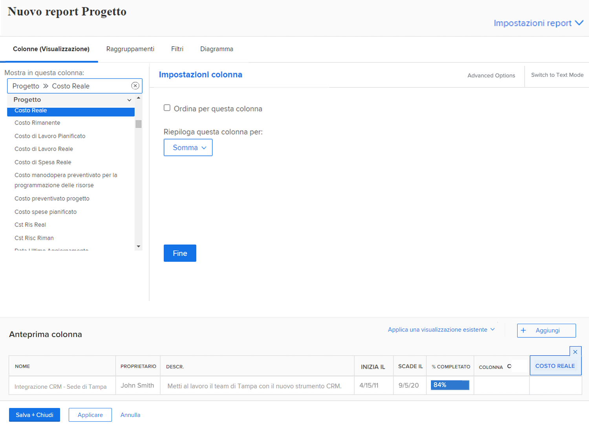
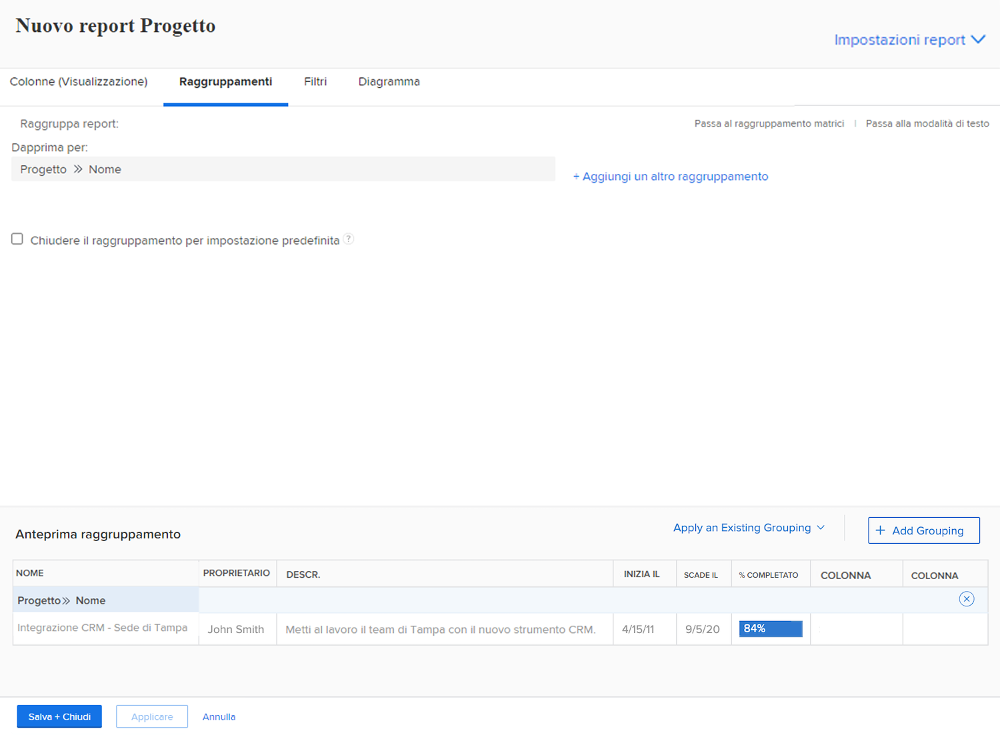
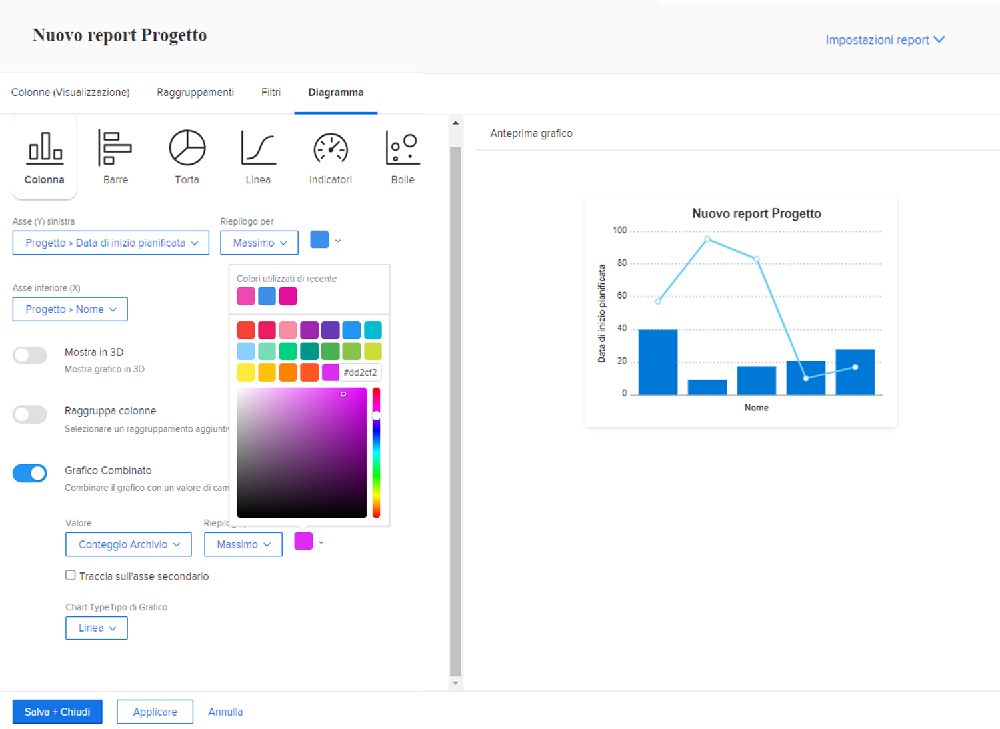

# Creare rapporti con grafici

Il video spiega come utilizzare i grafici per visualizzare i dati in modo efficace, in particolare per tenere traccia delle attività dei progetti. &#x200B; Viene illustrata la creazione di due tipi di rapporti in Workfront:

**Report attività in ritardo per progetto:**

* Inizia con un rapporto elenco e applica i filtri per mostrare solo le attività incomplete e in ritardo nei progetti correnti. &#x200B;
* Raggruppa le attività per nome progetto e crea un grafico a torta per visualizzare la distribuzione delle attività in ritardo tra i progetti. &#x200B;
* Impostare il grafico come scheda predefinita per un facile accesso. &#x200B;

**Attività per progetto e relazione sullo stato di avanzamento:**

* Copiare il primo report e aggiungere un altro raggruppamento per lo stato di avanzamento dell&#39;attività.
* Rimuovere i filtri per includere tutte le attività, mostrando il loro avanzamento durante l&#39;esecuzione del progetto.
* Utilizzare un istogramma in pila per visualizzare il numero totale di attività per progetto, con pile che rappresentano diversi stati di avanzamento.
* Se necessario, personalizza i colori e salva il rapporto.

Il video evidenzia come grafici a torta e istogrammi sovrapposti possono fornire informazioni approfondite sulla distribuzione delle attività e sulle prestazioni del progetto, aiutando gli utenti a confrontare i progetti e a comprendere visivamente l’avanzamento delle attività. &#x200B;

>[!VIDEO](https://video.tv.adobe.com/v/3450022/?quality=12&learn=on&captions=ita)

## Punti chiave da eliminare

* **I grafici migliorano la chiarezza dei dati**: la visualizzazione dei dati con grafici, ad esempio a torta o a colonne, semplifica la comprensione della distribuzione delle attività e dell&#39;avanzamento del progetto rispetto ai report elenco. &#x200B;
* **Filtro per approfondimenti specifici**: l&#39;applicazione di filtri (ad esempio, attività incomplete e in ritardo nei progetti correnti) consente di concentrarsi sui dati rilevanti per l&#39;analisi mirata. &#x200B;
* **Raggruppamento per una migliore organizzazione**: il raggruppamento delle attività per nome di progetto o stato di avanzamento consente di organizzare i dati in modo efficace, consentendo confronti significativi tra i progetti. &#x200B;
* **Opzioni di personalizzazione grafico**: gli utenti possono selezionare i tipi di grafico (ad esempio a torta, a colonne, a barre) e personalizzare i colori in base alle preferenze o al marchio. &#x200B;
* **Grafici a colonne in pila per approfondimenti dettagliati**: i grafici a colonne in pila forniscono una visualizzazione completa dell&#39;avanzamento delle attività all&#39;interno dei progetti, mostrando sia le attività totali che i relativi stati in un&#39;unica visualizzazione.

## Attività &quot;Crea rapporti con grafici&quot;

### Attività 1: aggiungere un grafico a un rapporto

La fine del trimestre è vicina e desideri vedere se è stato rispettato il budget dei progetti completati di recente. Crea un report che mostri il costo pianificato rispetto al costo effettivo dei progetti. Desideri visualizzare solo i progetti completati nell’ultimo trimestre. Aggiungi un istogramma combinato utilizzando colori personalizzati.

### Risposta 1

1. Seleziona **[!UICONTROL Rapporti]** dal **[!UICONTROL Menu principale]**.
1. Fai clic sul menu **[!UICONTROL Nuovo rapporto]** e seleziona **[!UICONTROL Progetto]**.
1. Nella scheda **[!UICONTROL Colonne (Visualizzazione)]**, fai clic su **[!UICONTROL Aggiungi colonna]**.
1. Seleziona [!UICONTROL Progetto] > [!UICONTROL Costo pianificato] e riepiloga questa colonna per **[!UICONTROL Somma]**.
1. Fai di nuovo clic su **[!UICONTROL Aggiungi colonna]**.
1. Seleziona [!UICONTROL Progetto] > [!UICONTROL Costo effettivo] e riepiloga questa colonna per **[!UICONTROL Somma]**.

   

1. Nella scheda **[!UICONTROL Raggruppamenti]**, imposta il rapporto in base al quale eseguire il raggruppamento per [!UICONTROL Progetto] > [!UICONTROL Nome].

   

1. Nella scheda **[!UICONTROL Filtri]**, aggiungi due regole di filtro:

   * [!UICONTROL Progetto] > [!UICONTROL Stato equivale a] > [!UICONTROL Completato]
   * [!UICONTROL Progetto] > [!UICONTROL &#x200B; Data di completamento effettiva] > [!UICONTROL Ultimo Trimestre]

   

1. Nella scheda **[!UICONTROL Grafico]**, scegli **[!UICONTROL Colonna]** per il tipo di grafico.
1. Per l&#39;asse [!UICONTROL Sinistra], scegliere [!UICONTROL Costo pianificato].
1. Per l&#39;asse [!UICONTROL inferiore (X)], scegliere [!UICONTROL Nome].
1. Fare clic sul pulsante **[!UICONTROL Grafico combinato]** e selezionare [!UICONTROL Costo effettivo] nel campo **[!UICONTROL Valore]**.
1. Nel campo **[!UICONTROL Tipo di grafico]** selezionare Riga.
1. Fare clic sulla casella del colore per modificare il colore [!UICONTROL Costo effettivo]. Selezionare un colore.
1. Fai clic su **[!UICONTROL Salva Chiudi]**. Quando viene richiesto il nome di un rapporto, chiamarlo &quot;Costo pianificato vs. Costo effettivo per progetto completato l’ultimo trimestre&quot;.

   
