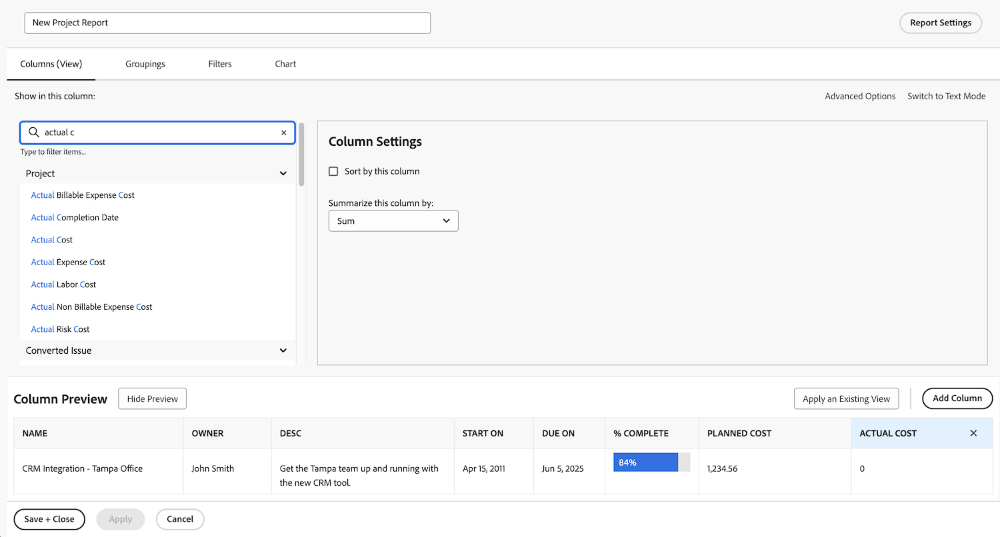

# Creare rapporti con grafici

In questo video scoprirai:

* Come i grafici possono migliorare la visualizzazione dei dati
* Come utilizzare gli strumenti per grafici di Workfront

>[!VIDEO](https://video.tv.adobe.com/v/335155/?quality=12&learn=on)

## Attività &quot;Crea rapporti con grafici&quot;

### Attività 1: aggiungere un grafico a un rapporto

La fine del trimestre è vicina e desideri vedere se è stato rispettato il budget dei progetti completati di recente. Crea un report che mostri il costo pianificato rispetto al costo effettivo dei progetti. Desideri visualizzare solo i progetti completati nell’ultimo trimestre. Aggiungi un istogramma combinato utilizzando colori personalizzati.

### Risposta 1

1. Seleziona **[!UICONTROL Rapporti]** dal **[!UICONTROL Menu principale]**.
1. Fai clic sul menu **[!UICONTROL Nuovo rapporto]** e seleziona **[!UICONTROL Progetto]**.
1. Nella scheda **[!UICONTROL Colonne (Visualizzazione)]**, fai clic su **[!UICONTROL Aggiungi colonna]**.
1. Seleziona [!UICONTROL Progetto] > [!UICONTROL Costo pianificato] e riepiloga questa colonna per **[!UICONTROL Somma]**.
1. Fai di nuovo clic su **[!UICONTROL Aggiungi colonna]**.
1. Seleziona [!UICONTROL Progetto] > [!UICONTROL Costo effettivo] e riepiloga questa colonna per **[!UICONTROL Somma]**.

   

1. Nella scheda **[!UICONTROL Raggruppamenti]**, imposta il rapporto in base al quale eseguire il raggruppamento per [!UICONTROL Progetto] > [!UICONTROL Nome].

   

1. Nella scheda **[!UICONTROL Filtri]**, aggiungi due regole di filtro:

   * [!UICONTROL Progetto] > [!UICONTROL Stato equivale a] > [!UICONTROL Completato]
   * [!UICONTROL Progetto] > [!UICONTROL  Data di completamento effettiva] > [!UICONTROL Ultimo Trimestre]

   

1. Nella scheda **[!UICONTROL Grafico]**, scegli **[!UICONTROL Colonna]** per il tipo di grafico.
1. Per [!UICONTROL Asse sinistro (Y)], scegli [!UICONTROL Progetto] > [!UICONTROL Costo pianificato].
1. Per [!UICONTROL Asse inferiore (X)], scegli [!UICONTROL Progetto] > [!UICONTROL Nome].
1. Fai clic sul pulsante **[!UICONTROL Grafico combinato]** e seleziona [!UICONTROL Progetto] > [!UICONTROL Costo effettivo] nel campo **[!UICONTROL Valore]**.
1. Fai clic sulla freccia accanto alla casella del colore per cambiare il colore di [!UICONTROL Costo effettivo]. Seleziona uno dei colori visualizzati o fai clic sulla casella nell’angolo in basso a destra per visualizzare la tavolozza dei colori.
1. Fai clic su **[!UICONTROL Salva + Chiudi]**. Quando viene richiesto il nome di un rapporto, chiamarlo &quot;Costo pianificato vs. Costo effettivo per progetto completato l’ultimo trimestre&quot;.

   
