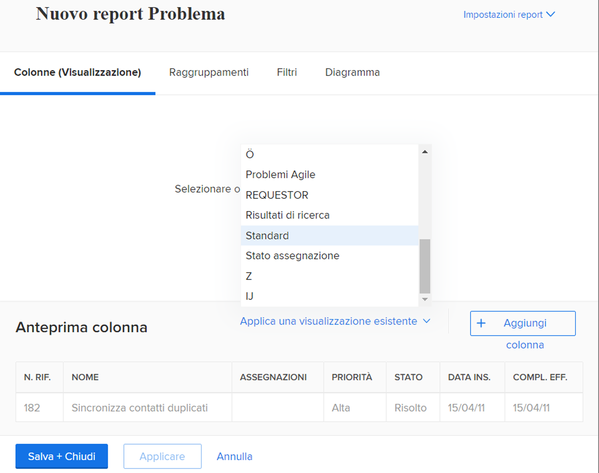
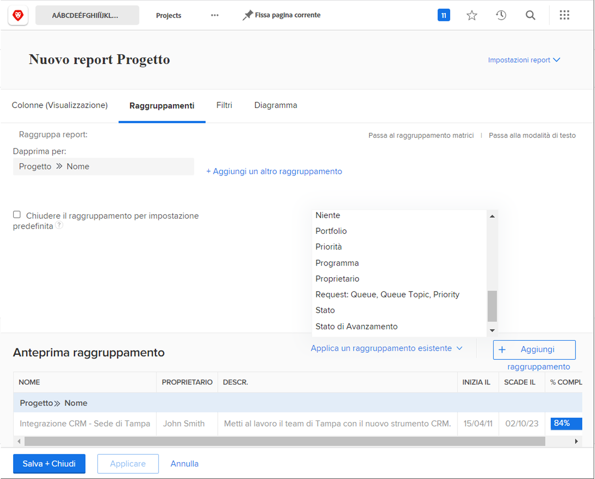
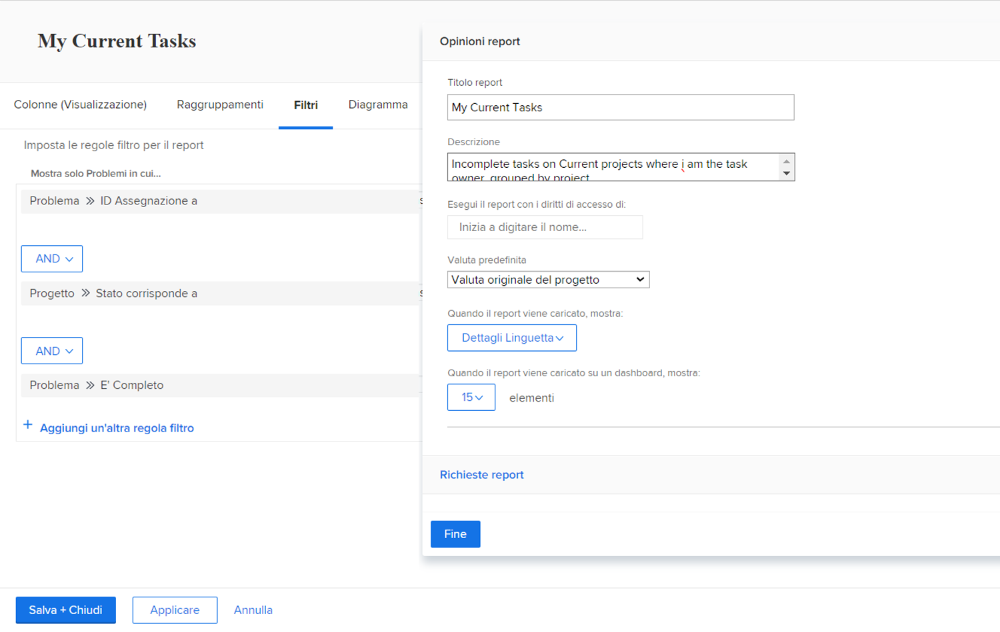

# Creare semplici attività di rapporto

Esercitazione nella creazione di rapporti semplici, con istruzioni dettagliate.

## Attività 1: creare un semplice rapporto attività

Vuoi tenere traccia di tutte le tue attività attive in un unico rapporto. Creare un report di attività denominato &quot;Le mie attività correnti&quot; utilizzando quanto segue:

* Colonne (Vista) = Standard
* Raggruppamenti = Progetto
* Filtro = Le mie attività correnti
* Descrizione = Attività incomplete sui progetti correnti in cui sono proprietario dell’attività, raggruppate per progetto.

## Risposta 1

1. Vai al **[!UICONTROL Menu principale]** e seleziona **[!UICONTROL Rapporti]**.
1. Fai clic sul menu a discesa **[!UICONTROL Nuovo rapporto]** e seleziona **[!UICONTROL Rapporto attività]**.
1. In [!UICONTROL Colonne (Vista)], fai clic sul menu **[!UICONTROL Applica una vista esistente]** e seleziona **[!UICONTROL Standard]**.

   

1. Nella scheda **[!UICONTROL Raggruppamenti]**, fai clic sul menu **[!UICONTROL Applica un raggruppamento esistente]** e seleziona **[!UICONTROL Progetto]**.

   

1. Nella scheda **[!UICONTROL Filtri]**, fai clic sul menu **[!UICONTROL Applica un filtro esistente]** e seleziona Le mie attività correnti.

   

1. Apri **[!UICONTROL Impostazioni report]** e denomina il report &quot;Le mie attività correnti&quot;.
1. Nel campo Descrizione, immettere &quot;Incomplete
attività su Progetti correnti in cui sono l&#39;attività
proprietario, raggruppato per progetto.&quot;

   

1. Salva e chiudi il rapporto.
