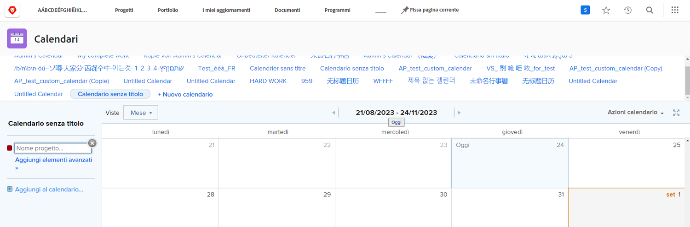
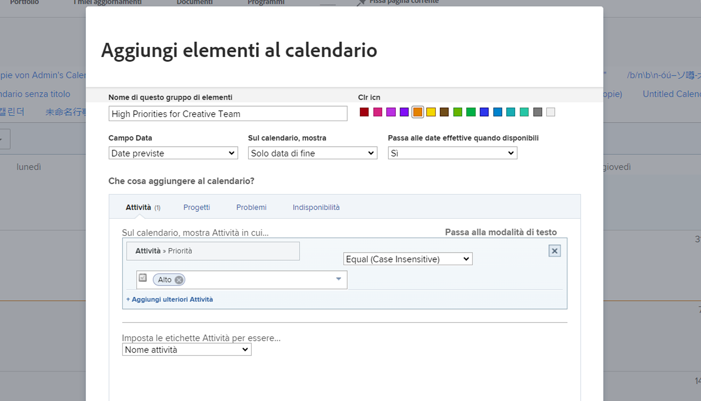
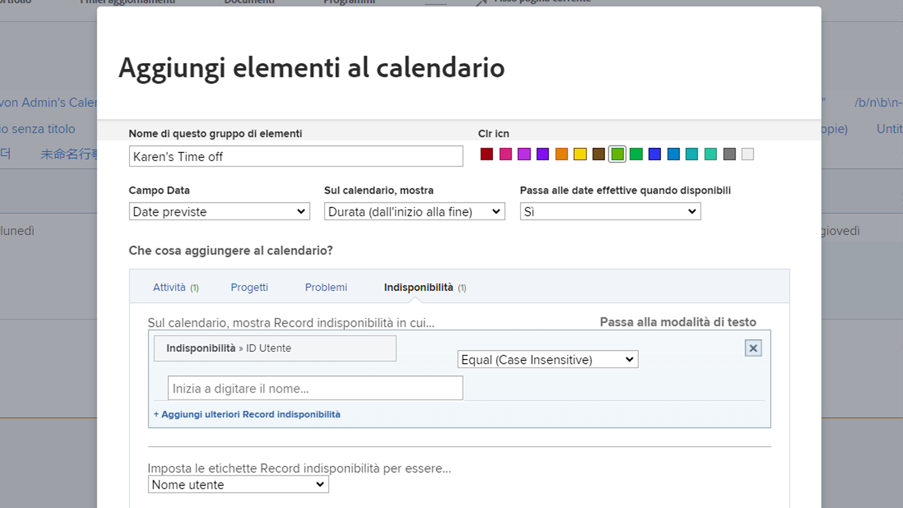

# Crea un calendario personalizzato

In questa sezione imparerai come:

* Crea un nuovo calendario
* Creare un raggruppamento di calendari
* Aggiungi elementi di lavoro al raggruppamento del calendario
* Crea un calendario a tempo indeterminato

Ecco come creare un calendario personalizzato.

## Aggiungi un nuovo calendario

1. Da **[!UICONTROL Menu principale]**, seleziona **[!UICONTROL Calendari]** area.
1. Fai clic sul pulsante **[!UICONTROL Nuovo calendario]** opzione .
1. Digitare un nome per il calendario e premere **[!UICONTROL Ritorno]**.

## In secondo luogo, aggiungi un raggruppamento di calendario

1. Per visualizzare gli elementi relativi a un progetto specifico, immetti il nome del progetto nel [!UICONTROL raggruppamento] (vengono visualizzate tutte le attività correlate al progetto).
1. Oppure fai clic su **[!UICONTROL Aggiungi elementi avanzati]** opzione per includere elementi di lavoro provenienti da diversi progetti nel sistema.

## Terzo, aggiungere elementi di lavoro al raggruppamento del calendario

1. Denomina il raggruppamento per riflettere ciò che verrà visualizzato.
1. Selezionare una designazione di colore per il gruppo.
1. Selezionare il tipo di data da utilizzare:[!UICONTROL Date previste], [!UICONTROL Date previste]oppure [!UICONTROL Personalizzato]. ([!UICONTROL Personalizzato] date sono campi data inclusi in [!UICONTROL moduli personalizzati].)
1. Selezionare le date da visualizzare nel calendario:[!UICONTROL Solo data di fine], [!UICONTROL Solo data di inizio]oppure [!UICONTROL Durata (inizio alla fine)].
1. Per visualizzare [!UICONTROL Date effettive] quando tali informazioni sono disponibili, selezionare Sì dal menu. Selezionare No se si desidera sempre il tipo di data selezionato ([!UICONTROL Proiettato], [!UICONTROL Pianificato]oppure [!UICONTROL Personalizzato]) da visualizzare.
1. Selezionare il tipo di informazioni da visualizzare sul calendario.[!UICONTROL Attività], [!UICONTROL Progetti], [!UICONTROL Problemi]oppure [!UICONTROL Time Off].
1. Imposta i filtri per visualizzare le informazioni desiderate.
1. Fai clic su **[!UICONTROL Salva]**.

>[!NOTE]
>
>È possibile aggiungere altri raggruppamenti a un calendario esistente utilizzando l’opzione Aggiungi al calendario .

## Crea un calendario che mostra l&#39;ora personale spenta

[!DNL Workfront] fornisce un modo per specificare il tempo di riposo con la funzione di tempo di inattività personale nel profilo utente. Questo avvisa i project manager che non sei disponibile e consente di regolare automaticamente o manualmente le date di completamento pianificate, in base alle esigenze.

Nell&#39;area Calendario è possibile creare una visualizzazione calendario in cui sono visualizzate le voci relative al tempo libero.

Per creare un calendario per una persona specifica:

1. Fai clic su **[!UICONTROL Aggiungi al calendario]** nel pannello a sinistra.
1. Fai clic su **[!UICONTROL Aggiungi elementi avanzati]**.
1. Denomina il raggruppamento per riflettere ciò che verrà visualizzato.
1. Selezionare una designazione di colore per il raggruppamento.
1. Imposta la [!UICONTROL Campo data] a [!UICONTROL Date previste].
1. Selezionare le date da visualizzare nel calendario:[!UICONTROL Durata].
1. Ignora come verranno visualizzate le informazioni se le date effettive non sono disponibili. Questo non si applica.
1. Seleziona [!UICONTROL Time Off] per il tipo di informazioni che si desidera visualizzare.
1. Per il filtro , imposta l’ID utente sul nome del membro del team.
1. Fai clic su **[!UICONTROL Salva]**.

