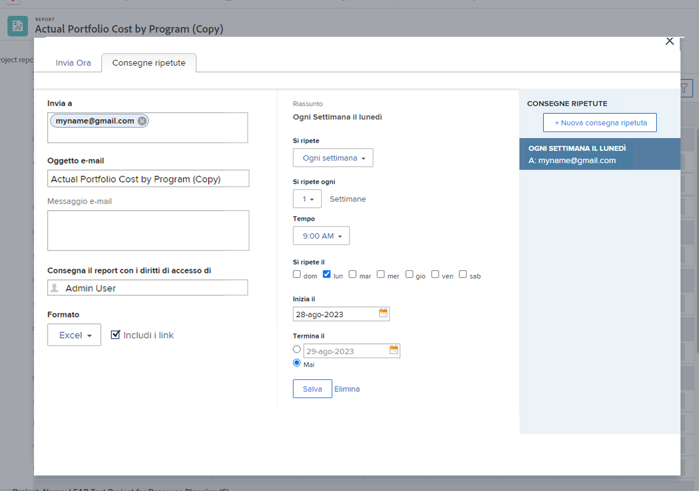

# Inviare e condividere i rapporti in modo efficace

In questo video scoprirai:

* come inviare i rapporti a utenti, team o qualsiasi indirizzo e-mail
* Come condividere i rapporti con chiunque
* Cosa possono visualizzare e fare i destinatari con un rapporto di Workfront

>[!VIDEO](https://video.tv.adobe.com/v/335158/?quality=12&learn=on&enablevpops=0)

## Concetti chiave

* **Invio di report a utenti esterni:** Puoi inviare report a utenti non Workfront immettendo i loro indirizzi e-mail, semplificando la condivisione di dati all&#39;esterno della tua organizzazione. &#x200B;
* **Visibilità controllo diritti di accesso:** La visualizzazione del report da parte del destinatario dipende dai diritti di accesso impostati, che garantiscono la sicurezza dei dati e la visibilità appropriata. &#x200B;
* **Consegna ripetuta per istantanee:** le consegne pianificate forniscono istantanee congelate dei dati in momenti specifici, utili per tenere traccia delle tendenze e mantenere una cronologia dei dati del progetto. &#x200B;
* **Condivisione di report con i team:** i report possono essere condivisi con singoli utenti, team o mansioni, concedendo diritti di visualizzazione o gestione. &#x200B; report condivisi vengono visualizzati nella sezione &quot;Condivisi con me&quot; degli utenti. &#x200B;
* **Condivisione pubblica e a livello di sistema:** i report possono essere condivisi tramite collegamenti pubblici per utenti esterni o resi visibili a livello di sistema per tutti gli utenti di Workfront, offrendo flessibilità nella condivisione dei dati.

## Attività &quot;Send and share reports&quot; (Invia e condividi rapporti)

### Attività 1: inviare un rapporto

Invia a te stesso un rapporto ogni lunedì alle 5.00 come foglio di calcolo Excel. Questo è un ottimo modo per raccogliere automaticamente i rapporti settimanali che potrai utilizzare per scoprire le tendenze.

### Risposta 1

1. Visualizza qualsiasi rapporto che hai creato e scegli **[!UICONTROL Invia rapporto]** dal menu **[!UICONTROL Azioni del rapporto]**.
1. Fai clic sulla scheda **[!UICONTROL Consegne ripetute]**.
1. Inserisci il tuo indirizzo e-mail nel campo **[!UICONTROL Invia a]**.
1. Specifica l’oggetto dell’e-mail.
1. Cambia il formato in Excel.
1. Imposta **[!UICONTROL Si ripete]** su [!UICONTROL Ogni settimana].
1. Imposta l’[!UICONTROL orario] alle 5.00.
1. Imposta [!UICONTROL Si ripete il] su lunedì.
1. Fai clic su **[!UICONTROL Salva]**.

>[!NOTE]
>
>La nuova consegna ripetuta è elencata nel pannello [!UICONTROL Consegne ripetute] a destra. Puoi impostare più consegne per un rapporto e tutte verranno visualizzate qui.

**ELIMINARE UNA CONSEGNA**

Seleziona la consegna appena creata e fai clic su Elimina (accanto al pulsante **[!UICONTROL Salva]**).
