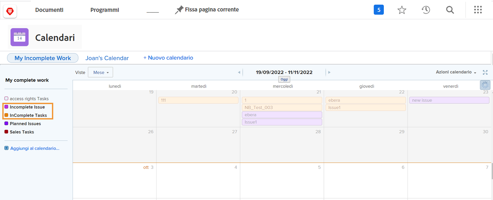
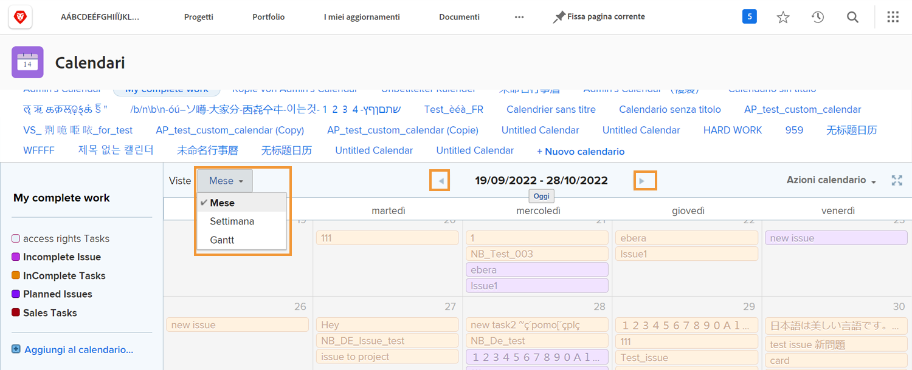
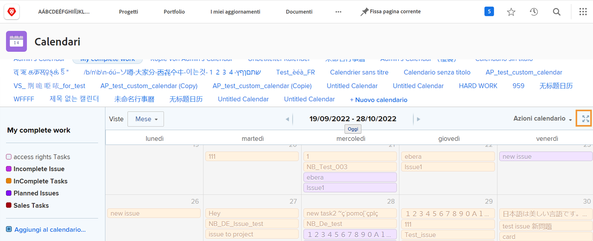
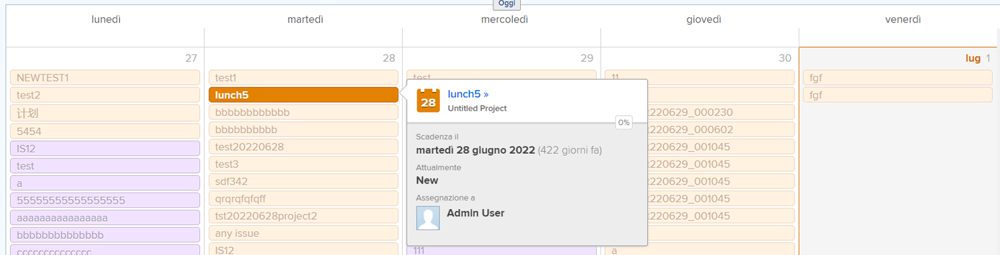
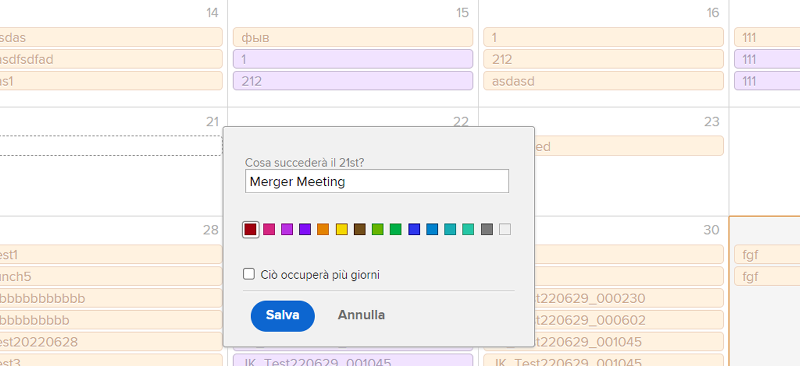

# Comprendere l’interfaccia del calendario

In questa sezione imparerai:

* Raggruppamenti di calendario
* Visualizzazioni calendario
* Menu Azioni calendario
* E come creare un elemento calendario ad hoc

Prima di creare calendari personalizzati, offriamo una panoramica delle funzioni di base disponibili nei calendari personalizzati.

## Raggruppamenti di calendario

Un singolo calendario può essere organizzato in raggruppamenti distinti di elementi di lavoro. Ogni raggruppamento può essere attivato o disattivato, consentendo agli utenti di concentrarsi sugli elementi di lavoro più importanti in qualsiasi momento.

## Visualizzazioni calendario

Il calendario può essere visualizzato in mese, settimana o [!UICONTROL Gantt] formato. Utilizza la barra di scorrimento sul lato o le frecce nella parte superiore per spostarsi nel calendario. La [!UICONTROL Gantt] visualizza il lavoro da una prospettiva diversa. Trova la vista che funziona meglio per te.

![Immagine della schermata del calendario nel [!UICONTROL Gantt] visualizzare](assets/calendar-1-1bb.png)

## [!UICONTROL Azioni calendario] menu

Come altri oggetti di lavoro, i calendari hanno un [!UICONTROL Azioni] menu, che consente di visualizzare i fine settimana su un calendario; eliminare o copiare un calendario; condividere un calendario con singoli utenti Workfront, a livello di sistema o con utenti esterni; e aggiungi il calendario al tuo [!UICONTROL Preferiti] menu.

![Un&#39;immagine del [!UICONTROL Azioni calendario] screen](assets/calendar-1-1c.png)

## Modalità a schermo intero

Per visualizzare il calendario in modalità a tutto schermo, fai clic sull’icona a schermo intero . Fai di nuovo clic su per tornare alla dimensione originale.

## Informazioni di riepilogo

Selezionare un elemento nel calendario per visualizzare i dettagli di riepilogo dell&#39;elemento, inclusi nome, progetto di origine, stato, assegnazione, stato di avanzamento e data di scadenza.

## Eventi ad hoc

Fare doppio clic per creare eventi ad hoc in un calendario per rappresentare la pianificazione o altri elementi di lavoro.

>[!NOTE]
>
>La creazione di un evento ad hoc NON crea un&#39;attività in Workfront.

